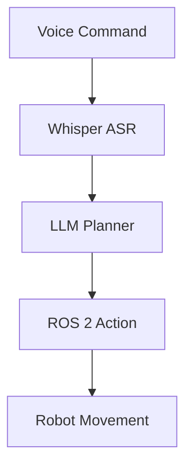
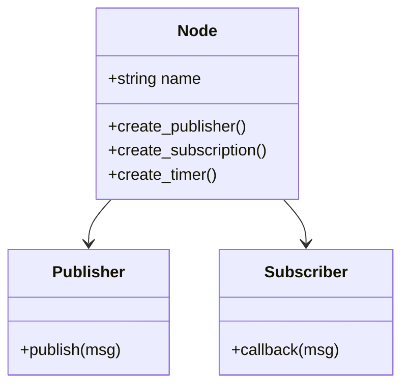
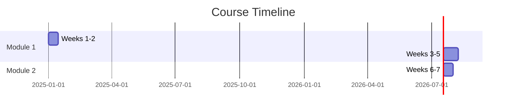

# Visual Assets Skill

## Instructions

### 1. Diagram Types

| Type | Use Case | Tool |
|------|----------|------|
| Architecture | System overviews, ROS 2 node graphs | Mermaid |
| Flowcharts | Algorithms, decision trees | Mermaid |
| Sequence | API calls, message passing | Mermaid |
| Hardware | Robot components, sensors | SVG/PNG |
| Math | Equations, formulas | KaTeX |

### 2. Mermaid Diagrams in MDX

```mdx

```

### 3. ROS 2 Node Graph Standard

```mermaid
graph LR
    subgraph Nodes
        PUB[publisher_node]
        SUB[subscriber_node]
    end
    
    subgraph Topics
        T1[/sensor_data]
        T2[/cmd_vel]
    end
    
    PUB -->|publishes| T1
    T1 -->|subscribes| SUB
    SUB -->|publishes| T2
```

### 4. Hardware Tables

Use consistent format for hardware specs:

```mdx
| Component | Model | Purpose | Est. Cost |
|-----------|-------|---------|-----------|
| **Brain** | Jetson Orin Nano | Edge AI inference | $249 |
| **Eyes** | RealSense D435i | RGB + Depth sensing | $349 |
| **Ears** | ReSpeaker USB | Voice input | $69 |
```

### 5. Code Architecture Diagrams



### 6. Image Guidelines

- **Location**: Store in `static/img/module-X/`
- **Naming**: `module-1-ros2-architecture.png`
- **Format**: SVG preferred, PNG for photos
- **Size**: Max 1200px width, optimize for web
- **Alt text**: Always include descriptive alt text

```mdx

```

### 7. Math Equations (KaTeX)

Inline: `$v = \omega \times r$`

Block:
```mdx
$$
\begin{aligned}
\text{Forward Kinematics: } & \mathbf{T} = \prod_{i=1}^{n} A_i(\theta_i) \\
\text{Inverse Kinematics: } & \theta = f^{-1}(\mathbf{x})
\end{aligned}
$$
```

### 8. Callout Components

Create reusable MDX components:

```mdx
:::tip Pro Tip
Use `ros2 topic echo` to debug message flow.
:::

:::warning Hardware Required
This section requires a physical Jetson device.
:::

:::danger Safety First
Never run untested code on physical robots without simulation first.
:::

:::info Definition
**URDF** (Unified Robot Description Format) defines robot geometry.
:::
```

### 9. Comparison Tables

```mdx
| Feature | Gazebo | Unity | Isaac Sim |
|---------|--------|-------|-----------|
| Physics | ODE/Bullet | PhysX | PhysX |
| Rendering | Basic | High-fidelity | Photorealistic |
| ROS 2 | Native | Plugin | Native |
| Cost | Free | Free/Paid | Free |
| **Best For** | Prototyping | Visualization | Production |
```

### 10. Timeline/Roadmap



## File Organization

```
static/
└── img/
    ├── module-1/
    │   ├── ros2-architecture.svg
    │   ├── node-graph.png
    │   └── urdf-example.svg
    ├── module-2/
    │   ├── gazebo-ui.png
    │   └── unity-scene.png
    ├── hardware/
    │   ├── jetson-orin.png
    │   └── realsense-d435.png
    └── diagrams/
        └── system-overview.svg
```

## Definition of Done

- All diagrams render correctly in Docusaurus
- Images are optimized (<500KB each)
- Alt text provided for accessibility
- Mermaid diagrams have consistent styling
- Hardware tables include all required columns
- Math equations render properly
