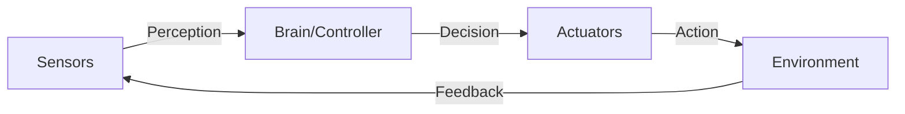

# 1.1.1 — What is Physical AI?

> **Summary**: Understand the core principles of Physical AI and how embodied intelligence differs from traditional software-based AI systems.

## 🎯 Learning Objectives

By the end of this section, you will be able to:
- Define Physical AI and explain its key characteristics
- Distinguish between traditional AI and embodied AI systems
- Understand the sensorimotor loop in robotic systems
- Identify real-world constraints that Physical AI must handle
- Explain how Physical AI systems learn from interaction

## 📋 Prerequisites

- [Week 1-2 Overview](./index) - Introduction to module structure
- Basic understanding of artificial intelligence concepts
- No programming experience required for this section

## 📖 Content

### Definition

**Physical AI** (also called **Embodied AI**) refers to artificial intelligence systems that:

1. **Possess a physical form** — Robot, drone, autonomous vehicle, or humanoid system
2. **Perceive the world through sensors** — Cameras, lidar, IMUs, force/torque sensors
3. **Interact with the environment** — Motors, grippers, wheels, actuators
4. **Learn from real-world experiences** — Adapt behavior based on physical feedback

Unlike traditional AI that operates on abstract data in computers, Physical AI must contend with the **messiness of reality**: sensor noise, unpredictable environments, real-time constraints, and physical limitations.

:::tip Key Insight
Physical AI is about **embodied cognition** — intelligence that emerges from the interaction between a physical body, its sensors, and the environment.
:::

### Key Characteristics

#### 1. Embodiment

The robot's physical form shapes its capabilities and constraints. A humanoid robot can climb stairs and open doors designed for humans, while a wheeled robot cannot.

**Example:** Boston Dynamics' Atlas robot uses its humanoid form to perform parkour, leveraging bipedal locomotion that mimics human movement patterns.

| Form Factor | Advantages | Limitations |
|-------------|------------|-------------|
| **Humanoid** | Human environment compatibility, tool use | Complex control, stability challenges |
| **Wheeled** | Simple, efficient, stable | Limited terrain, no stair climbing |
| **Quadruped** | Stable, rough terrain capable | Limited manipulation, no bipedal tasks |
| **Aerial (Drone)** | 3D mobility, aerial view | Limited payload, battery constraints |

#### 2. Sensorimotor Integration

Physical AI systems continuously loop between sensing, reasoning, and acting:



**The Sensorimotor Loop:**

```python
# Simplified sensorimotor loop in a Physical AI system
class PhysicalAIAgent:
    def __init__(self):
        self.sensors = SensorArray()
        self.actuators = ActuatorArray()
        self.brain = AIController()
    
    def run(self):
        while self.is_active():
            # SENSE: Gather sensory data
            sensor_data = self.sensors.read_all()
            
            # REASON: Process data and make decisions
            action = self.brain.decide_action(sensor_data)
            
            # ACT: Execute motor commands
            self.actuators.execute(action)
            
            # Loop continues with feedback from environment
```

#### 3. Real-World Constraints

Physical AI must respect fundamental limitations:

**Physical Laws:**
- ⚖️ **Gravity** — Affects balance, locomotion, manipulation
- 🔄 **Momentum** — Cannot instantly stop or change direction
- 💥 **Collisions** — Must avoid obstacles and self-collisions
- 🎯 **Friction** — Affects grip, locomotion, energy efficiency

**Hardware Constraints:**
- ⚡ **Power limits** — Battery life constrains operation time
- 💪 **Torque limits** — Motors have maximum force output
- 📏 **Sensor range** — Limited field of view and detection distance
- 🖥️ **Compute limits** — Real-time processing requires fast decisions

**Real-Time Requirements:**
- ⏱️ **Control loops** — Typically 100-1000 Hz for stable control
- 🚨 **Safety-critical** — Collision avoidance in milliseconds
- 🎮 **Reactive behavior** — Immediate response to environment changes

:::warning Safety First
Physical AI systems operating in human environments must have **fail-safe mechanisms** to prevent harm. This includes emergency stops, force limits, and collision detection.
:::

#### 4. Learning from Interaction

Physical AI systems improve through:

1. **Reinforcement Learning** — Learn from trial-and-error in the real world
2. **Imitation Learning** — Observe and replicate human demonstrations
3. **Transfer Learning** — Apply knowledge from simulation to reality
4. **Online Adaptation** — Continuously update models based on sensor feedback

**Example: Learning to Grasp**

A robot learning to pick up objects must:
- Try different grasp configurations
- Measure success/failure through force sensors
- Update its grasp policy based on outcomes
- Generalize to new object shapes and materials

### Examples of Physical AI Systems

| Category | Example System | Key Features |
|----------|----------------|--------------|
| **Humanoid** | Tesla Optimus | Bipedal locomotion, dexterous hands, general-purpose |
| **Humanoid** | Boston Dynamics Atlas | Advanced parkour, dynamic balance, research platform |
| **Industrial** | Universal Robots UR series | Collaborative, safe for human proximity, easy programming |
| **Mobile** | Amazon Astro | Home navigation, object recognition, telepresence |
| **Autonomous Vehicle** | Waymo | Full self-driving, sensor fusion, HD mapping |
| **Drone** | Skydio | Autonomous navigation, obstacle avoidance, tracking |

### The Embodiment Hypothesis

The **embodiment hypothesis** in cognitive science suggests that:

> Intelligence cannot be fully understood or developed without considering the physical body and its interactions with the environment.

**Key principles:**
- **Morphological computation** — Body structure performs some "computation" through physics
- **Environmental coupling** — Intelligence emerges from body-environment interaction  
- **Sensorimotor grounding** — Abstract concepts are grounded in physical experiences

**Implications for AI:**
- Pure software AI may be limited in certain cognitive tasks
- Physical interaction provides richer learning signals
- The design of the robot body matters for intelligence

## 💻 Hands-On Exercise

### Exercise 1.1.1: Identifying Physical AI

**Difficulty**: ⭐ Beginner  
**Time**: 20 minutes

**Task**: Classify the following AI systems as "Physical AI", "Traditional AI", or "Hybrid":

1. **GPT-4** (Large language model)
2. **iRobot Roomba** (Robotic vacuum)
3. **Tesla Autopilot** (Self-driving car software)
4. **Amazon Alexa** (Voice assistant)
5. **Boston Dynamics Spot** (Quadruped robot)
6. **DeepMind AlphaGo** (Game-playing AI)

For each system, identify:
- ✅ Does it have a physical embodiment?
- ✅ Does it interact with the physical world?
- ✅ Does it use sensors to perceive the environment?
- ✅ Does it use actuators to modify the environment?

<details>
<summary>💡 Hints</summary>

- Consider whether removing the physical body would fundamentally change the system's function
- Think about whether the AI's intelligence depends on physical interaction
- Some systems may be "Hybrid" if they combine cloud-based AI with physical interfaces

</details>

<details>
<summary>✅ Solutions</summary>

1. **GPT-4**: **Traditional AI** 
   - No physical body, operates purely in software
   - No sensors beyond text input, no actuators
   - Could theoretically control a robot, but isn't inherently physical

2. **iRobot Roomba**: **Physical AI**
   - ✅ Physical body (wheeled vacuum robot)
   - ✅ Sensors (cliff detection, collision, dirt detection)
   - ✅ Actuators (wheels, vacuum motor, brushes)
   - ✅ Interacts with environment (navigates, cleans floors)

3. **Tesla Autopilot**: **Physical AI**
   - ✅ Embodied in vehicle
   - ✅ Sensors (cameras, radar, ultrasonic)
   - ✅ Actuators (steering, throttle, brakes)
   - ✅ Must handle real-world driving physics

4. **Amazon Alexa**: **Hybrid**
   - Core AI is cloud-based (Traditional AI)
   - Physical interface (speaker/microphone) but minimal physical interaction
   - Doesn't modify environment through actuators
   - Could be classified as Traditional AI with physical interface

5. **Boston Dynamics Spot**: **Physical AI**
   - ✅ Quadruped physical form
   - ✅ Extensive sensors (cameras, lidar, IMU, proprioception)
   - ✅ Leg actuators, arm attachment
   - ✅ Navigates rough terrain, manipulates objects

6. **DeepMind AlphaGo**: **Traditional AI**
   - Operates in purely digital game environment
   - No physical sensors or actuators
   - Could control a robot arm to move pieces, but core AI is not physical

</details>

### Exercise 1.1.2: Real-World Constraints Analysis

**Difficulty**: ⭐⭐ Intermediate  
**Time**: 15 minutes

**Scenario**: A humanoid robot needs to pick up a cup of hot coffee from a table and hand it to a human without spilling.

**Task**: List 5 real-world constraints the Physical AI system must handle:

<details>
<summary>✅ Example Constraints</summary>

1. **Force control** — Grip force must be sufficient to hold cup but not crush it
2. **Balance** — Reaching forward shifts center of mass, requires compensation
3. **Thermal sensing** — Detect hot temperature, adjust grip accordingly
4. **Collision avoidance** — Path planning to avoid hitting human or other objects
5. **Real-time control** — Continuous adjustment to prevent spilling during motion
6. **Human safety** — Detect human proximity, slow movements near people
7. **Sensor noise** — Handle imperfect vision data for cup localization

</details>

## 🔑 Key Takeaways

- **Physical AI** combines artificial intelligence with physical embodiment through sensors and actuators
- The **sensorimotor loop** (sense → reason → act) is fundamental to all Physical AI systems
- **Real-world constraints** (physics, hardware limits, timing) make Physical AI more challenging than pure software AI
- The **embodiment hypothesis** suggests physical interaction is essential for certain types of intelligence
- Physical AI spans many domains: humanoids, industrial robots, autonomous vehicles, drones

## 📚 Further Reading

- [The Embodied Mind](https://mitpress.mit.edu/9780262529365/) — Varela, Thompson, & Rosch (classic cognitive science text)
- [Boston Dynamics Research](https://www.bostondynamics.com/resources) — State-of-the-art humanoid and quadruped robots
- [Physical Intelligence (π) Company](https://www.physicalintelligence.company/) — Cutting-edge Physical AI research
- [Moravec's Paradox](https://en.wikipedia.org/wiki/Moravec%27s_paradox) — Why physical skills are harder for AI than abstract reasoning

## ➡️ Next Steps

Continue to [1.1.2 — Humanoid Robotics Overview](./02-humanoid-overview) to explore the specific challenges and design principles of humanoid robots.
