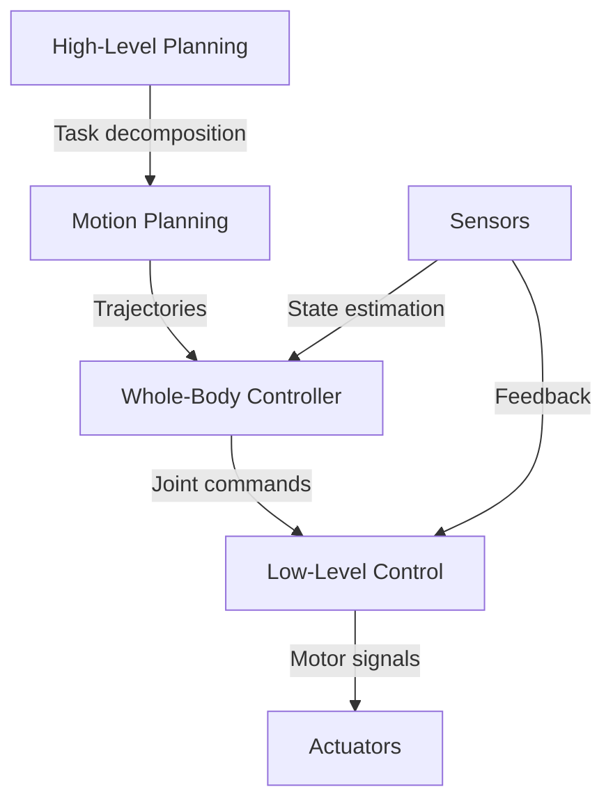

# 1.1.2 — Humanoid Robotics Overview

<DifficultyBadge level="beginner" />

> **Summary**: Understand what makes a robot "humanoid", explore design tradeoffs, and learn about the key subsystems that enable humanoid functionality.

## 🎯 Learning Objectives

By the end of this section, you will be able to:
- Define what constitutes a humanoid robot
- Explain why the humanoid form factor is chosen despite its complexity
- Identify the key subsystems in humanoid robots (actuation, sensing, control)
- Compare different actuator technologies used in humanoids
- Understand the design tradeoffs between human-likeness and engineering practicality

## 📋 Prerequisites

- [1.1.1 — What is Physical AI?](/docs/module-1/week-1-2/what-is-physical-ai) - Understanding of Physical AI concepts
- Basic familiarity with mechanical systems (helpful but not required)

## 📖 Content

### What is a Humanoid Robot?

A **humanoid robot** is a robot with a body shape built to resemble the human form. Key characteristics include:

**Structural Components:**
- 🧠 **Head** — Vision systems (cameras, depth sensors), audio sensors
- 💪 **Torso** — Main computer, power systems, central connectivity
- 🤚 **Two Arms** — Manipulators with hands/grippers for object interaction
- 🦵 **Two Legs** — Bipedal locomotion system
- 🎯 **Degrees of Freedom (DOF)** — Typically 30-50+ actuated joints

:::info Degrees of Freedom
A **degree of freedom (DOF)** is an independent motion that a joint can make. Humans have ~244 DOF total, but humanoid robots typically implement 30-50 for practical reasons.
:::

### Why Humanoid Form?

The humanoid form factor is not the most efficient engineering solution, but offers unique advantages:

#### ✅ Advantages

**1. Human-Centered Environment Compatibility**

Our world is built for human proportions and capabilities:
- 🚶 **Stairs and elevators** — Designed for bipedal locomotion
- 🚪 **Doorknobs and handles** — Positioned for human reach
- 🪑 **Furniture and workspaces** — Human-height tables, chairs
- 🔧 **Tools and interfaces** — Human-hand-sized controls

**2. Tool and Infrastructure Use**

Humanoid robots can:
- Use existing human tools without modification (hammers, screwdrivers, keyboards)
- Operate machinery designed for human operators
- No need for specialized robotic infrastructure

**3. Social Acceptance and Interaction**

- 👤 Human-like appearance reduces psychological barriers
- 🤝 Gestures and body language enable intuitive communication
- 😊 Facial expressions convey intent (in advanced humanoids)
- 🏥 Better acceptance in healthcare, service, and social roles

**4. Versatility and Generalization**

- Single platform for diverse tasks (cleaning, cooking, manufacturing)
- Adaptable to novel environments and tasks
- General-purpose design vs. task-specific robots

#### ❌ Challenges and Tradeoffs

| Aspect | Challenge | Engineering Impact |
|--------|-----------|-------------------|
| **Balance** | Bipedal walking is dynamically unstable | Requires sophisticated control algorithms (ZMP, MPC) |
| **Energy** | Maintaining balance consumes significant power | Limited battery life compared to wheeled robots |
| **Complexity** | 30-50+ actuators and sensors | High cost, maintenance burden |
| **Computation** | Real-time control of many DOF | Powerful onboard computers required |
| **Reliability** | Many failure points | Reduced uptime, complex diagnostics |

**Efficiency Comparison:**

```
Energy Efficiency (Distance per kWh):
🚗 Wheeled robot: 10-20 km/kWh
🐕 Quadruped robot: 3-8 km/kWh  
🚶 Humanoid robot: 0.5-2 km/kWh
👤 Human walking: ~1-1.5 km/kWh
```

:::tip Design Philosophy
Humanoid robots trade **efficiency** for **versatility**. They excel in human environments but are not optimal for single-purpose tasks where specialized robots perform better.
:::

### Key Subsystems

#### 1. Actuation Systems

Actuators convert electrical/hydraulic energy into mechanical motion:

**Electric Motors** (Most Common)

- ⚡ **DC Brushless Motors** with harmonic/cycloidal gearboxes
  - High torque density
  - Precise position control
  - Used in: Tesla Optimus, ASIMO, NAO

- 🔄 **Series Elastic Actuators (SEA)**
  - Spring element between motor and output
  - Provides compliance (shock absorption)
  - Safer human interaction
  - Used in: Baxter, Atlas (some joints)

**Hydraulic Actuators**

- 💧 High power-to-weight ratio
- ⚡ Very high force output
- ❌ Complex (pumps, valves, sealing)
- 🏭 Used in: Boston Dynamics Atlas

**Pneumatic Actuators**

- 💨 Compliant, lightweight
- 🎯 Difficult to control precisely
- 🧪 Research platforms (soft robotics)

**Comparison Table:**

| Type | Power Density | Precision | Compliance | Cost | Examples |
|------|---------------|-----------|------------|------|----------|
| **Electric** | ⭐⭐⭐ | ⭐⭐⭐⭐⭐ | ⭐⭐ | $$ | Optimus, ASIMO |
| **Hydraulic** | ⭐⭐⭐⭐⭐ | ⭐⭐⭐ | ⭐⭐⭐ | $$$$ | Atlas |
| **Pneumatic** | ⭐⭐ | ⭐⭐ | ⭐⭐⭐⭐⭐ | $$ | Soft robots |
| **SEA** | ⭐⭐⭐ | ⭐⭐⭐⭐ | ⭐⭐⭐⭐⭐ | $$$ | Baxter |

#### 2. Sensing Systems

Humanoid robots need multiple sensor modalities:

**Exteroceptive Sensors** (External environment)
- 📷 **Cameras** (RGB, stereo, depth) — Vision, object recognition
- 🎯 **Lidar** — 3D environment mapping, obstacle detection
- 🔊 **Microphones** — Audio processing, voice commands
- 🌡️ **Thermal sensors** — Heat detection

**Proprioceptive Sensors** (Internal state)
- 📐 **Encoders** — Joint angle measurement
- 💪 **Torque sensors** — Force/torque at joints
- 🎢 **IMU** (Inertial Measurement Unit) — Acceleration, orientation
- 🦶 **Force/pressure sensors** — Foot contact, grip force

**Sensor Fusion Example:**

```python
class HumanoidSensorSystem:
    def get_robot_state(self):
        """Fuse multiple sensors for complete state estimate"""
        # Visual perception
        objects = self.camera.detect_objects()
        depth_map = self.depth_camera.get_depth()
        
        # Balance and orientation
        orientation = self.imu.get_orientation()
        acceleration = self.imu.get_accel()
        
        # Joint states
        joint_angles = self.encoders.read_all()
        joint_torques = self.torque_sensors.read_all()
        
        # Ground contact
        foot_forces = self.force_sensors.get_foot_contact()
        
        return RobotState(
            objects=objects,
            orientation=orientation,
            joint_angles=joint_angles,
            foot_contact=foot_forces
        )
```

#### 3. Control Architecture

Typical hierarchical control structure:



**Control Layers:**

1. **High-Level Planning** (1-10 Hz)
   - Task reasoning: "Pick up cup, hand to human"
   - Path planning, obstacle avoidance
   
2. **Motion Planning** (10-100 Hz)
   - Inverse kinematics
   - Trajectory generation
   
3. **Whole-Body Controller** (100-1000 Hz)
   - Balance control (ZMP, centroidal dynamics)
   - Contact force optimization
   
4. **Low-Level Control** (1000+ Hz)
   - Motor PID control
   - Current/torque regulation

### Notable Humanoid Platforms

| Robot | Organization | Key Features | Year |
|-------|--------------|--------------|------|
| **ASIMO** | Honda | First advanced humanoid, stair climbing, running | 2000-2022 |
| **Atlas** | Boston Dynamics | Hydraulic, parkour capable, most dynamic | 2013-Present |
| **Optimus** | Tesla | Electric, mass production goal, AI-driven | 2021-Present |
| **Digit** | Agility Robotics | Logistics focus, practical deployment | 2019-Present |
| **NAO** | Aldebaran/SoftBank | Education, programming, affordable | 2006-Present |
| **Sophia** | Hanson Robotics | Social interaction, facial expressions | 2016-Present |

## 💻 Hands-On Exercise

### Exercise 1.1.2: Design Tradeoffs Analysis

**Difficulty**: ⭐⭐ Intermediate  
**Time**: 25 minutes

**Scenario**: You're designing a robot for a warehouse that needs to:
1. Move boxes from shelves to packing stations
2. Navigate narrow aisles between shelves
3. Operate for 8-hour shifts
4. Interact safely with human workers

**Task**: Compare three robot form factors and choose the best design:

**Option A: Humanoid Robot**
- Height: 1.7m, bipedal walking
- Arms: 2 with 7-DOF each
- Battery: 2 kWh, 2-hour runtime

**Option B: Mobile Manipulator**
- Wheeled base (4 wheels, omnidirectional)
- Single arm: 6-DOF manipulator
- Battery: 5 kWh, 8-hour runtime

**Option C: Specialized AGV (Automated Guided Vehicle)**
- Wheeled, fixed shelving attachment
- No manipulation capability
- Battery: 10 kWh, 12-hour runtime

<details>
<summary>💡 Analysis Framework</summary>

Consider:
1. **Task requirements** — Can it perform all required tasks?
2. **Efficiency** — Energy use, speed, throughput
3. **Cost** — Initial cost, maintenance, scalability
4. **Safety** — Human interaction safety
5. **Flexibility** — Adaptability to changing tasks

</details>

<details>
<summary>✅ Recommended Solution</summary>

**Best Choice: Option B (Mobile Manipulator)**

**Rationale:**
- ✅ **Task capable**: Can pick boxes and navigate aisles
- ✅ **Efficient**: Wheeled base is energy-efficient, meets 8-hour requirement
- ✅ **Cost-effective**: Simpler than humanoid, fewer DOF = lower cost
- ✅ **Practical**: No need for bipedal walking in flat warehouse
- ⚠️ **Limitation**: Cannot climb ladders (not required for this task)

**Why not Humanoid (Option A)?**
- ❌ Short battery life (2 hours insufficient)
- ❌ Higher cost and complexity
- ❌ Bipedal walking unnecessary in flat warehouse
- ❌ Over-engineered for this specific task

**Why not AGV (Option C)?**
- ❌ Cannot manipulate boxes (lacks arm)
- ❌ Inflexible — cannot adapt to new tasks
- ✅ Most efficient but too specialized

**Key Lesson**: Choose humanoid form when versatility in human environments is essential, not when task-specific designs suffice.

</details>

## 🔑 Key Takeaways

- **Humanoid robots** sacrifice efficiency for versatility in human-designed environments
- The **humanoid form** enables use of human tools, infrastructure, and natural social interaction
- **Trade offs** exist between human-likeness, complexity, cost, and efficiency
- **Actuation** technologies vary: electric (most common), hydraulic (high power), pneumatic (compliant)
- **Hierarchical control** combines high-level planning with low-level motor control
- **Design choice** should match application: don't use humanoids when simpler forms suffice

## 📚 Further Reading

- [Boston Dynamics Atlas](https://www.bostondynamics.com/atlas) — Most advanced dynamic humanoid
- [Tesla Bot (Optimus) Reveal](https://www.youtube.com/watch?v=XiQkeWOFwmk) — AI-first humanoid approach
- [Agility Robotics Digit](https://agilityrobotics.com/digit) — Practical logistics humanoid
- [Humanoid Robotics: A Reference](https://link.springer.com/book/10.1007/978-94-007-7194-9) — Comprehensive textbook

## ➡️ Next Steps

Continue to [Week 3-5: Historical Development](/docs/module-1/week-3-5/) to explore the evolution of humanoid robotics from early systems to modern platforms.

---

<ChatbotPlaceholder />
