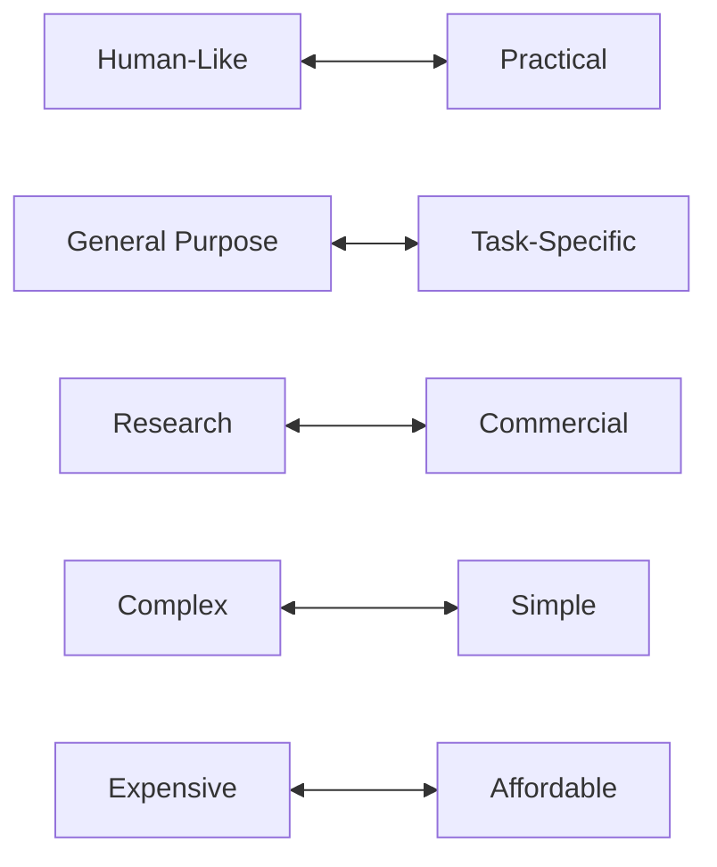
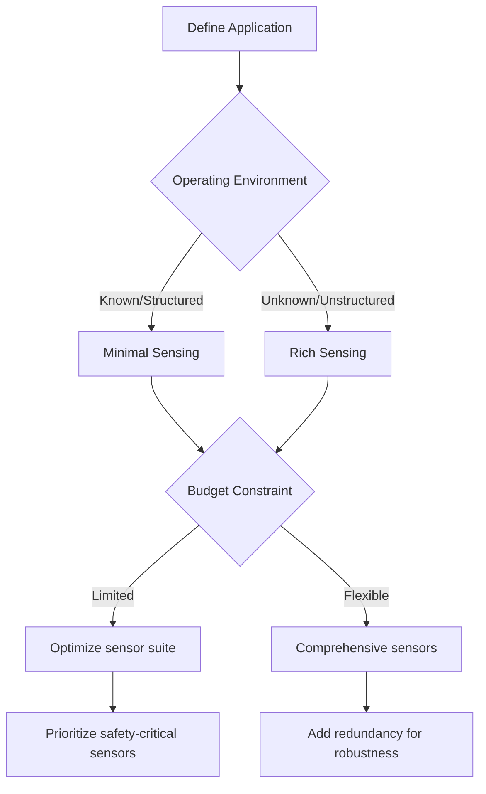

# 1.1.3 — Design Principles and Tradeoffs

<DifficultyBadge level="beginner" />

> **Summary**: Explore the fundamental engineering decisions in humanoid robot design and learn how to balance competing requirements like cost, capability, and complexity.

## 🎯 Learning Objectives

By the end of this section, you will be able to:
- Analyze engineering tradeoffs in humanoid robot design
- Apply decision frameworks to robot development choices
- Evaluate cost vs. capability tradeoffs for different applications
- Understand the modularity vs. integration spectrum
- Make informed design decisions based on application requirements

## 📋 Prerequisites

- [1.1.1 — What is Physical AI?](/docs/module-1/week-1-2/what-is-physical-ai) - Physical AI fundamentals
- [1.1.2 — Humanoid Overview](/docs/module-1/week-1-2/humanoid-overview) - Robot subsystems knowledge

## 📖 Content

### The Design Philosophy Spectrum

Humanoid robot design exists on multiple spectrums. Understanding where your design sits helps make consistent decisions:



### Core Design Tradeoffs

#### 1. Degrees of Freedom (DOF) vs. Complexity

**The Challenge**: More DOF = More capability BUT more complexity

| DOF Count | Capability | Control Complexity | Cost | Examples |
|-----------|------------|-------------------|------|----------|
| **6-10** | Basic manipulation, limited mobility | Low | $ | Educational robots (NAO) |
| **20-30** | Good mobility, moderate manipulation | Medium | $$ | Service robots |
| **40-60** | Advanced mobility, dexterous manipulation | High | $$$ | Research humanoids (ASIMO) |
| **60+** | Human-level dexterity | Very High | $$$$ | Advanced research (some hands alone have 20+ DOF) |

**Decision Framework:**

```python
def calculate_required_dof(task_requirements):
    """Framework for determining necessary DOF count"""
    dof_needed = 0
    
    # Locomotion requirements
    if task_requirements.needs_walking:
        dof_needed += 12  # Basic leg DOF (6 per leg)
    if task_requirements.needs_rough_terrain:
        dof_needed += 6   # Additional ankle/hip complexity
    
    # Manipulation requirements
    if task_requirements.needs_manipulation:
        dof_needed += 14  # Basic arms (7 per arm)
    if task_requirements.needs_dexterous_manipulation:
        dof_needed += 30  # Advanced hands (15 per hand)
    
    # Balance and orientation
    dof_needed += 3  # Torso/waist articulation
    dof_needed += 2  # Head pan/tilt
    
    return dof_needed

# Example: Warehouse picking robot
warehouse_requirements = TaskRequirements(
    needs_walking=True,
    needs_rough_terrain=False,
    needs_manipulation=True,
    needs_dexterous_manipulation=False
)

print(f"Recommended DOF: {calculate_required_dof(warehouse_requirements)}")
# Output: Recommended DOF: 31
```

**Real-World Example: Tesla Optimus Gen 2**
- **Total DOF**: 52
- **Breakdown**:
  - Legs: 12 (6 per leg)
  - Arms: 14 (7 per arm)
  - Hands: 22 (11 per hand - dexterous!)
  - Torso: 2 (waist articulation)
  - Head: 2 (pan/tilt)
- **Rationale**: General-purpose design requires high dexterity

#### 2. Actuation Technology: Electric vs. Hydraulic

**Electric Actuators (Most Common)**

✅ **Advantages:**
- Precise position control (encoder feedback)
- Clean operation (no fluid leaks)
- Easier maintenance
- Quiet operation
- Lower infrastructure cost

❌ **Disadvantages:**
- Lower power-to-weight ratio
- Heat dissipation challenges
- Limited peak torque
- Requires gearing (adds backlash)

**Hydraulic Actuators (High Performance)**

✅ **Advantages:**
- Extremely high power-to-weight ratio (5-10x electric)
- High force output
- Natural compliance (fluid compression)
- Rapid response times

❌ **Disadvantages:**
- Complex system (pumps, valves, accumulator)
- Fluid leaks (maintenance burden)
- Noisy operation
- Heavy support equipment
- Expensive (2-5x electric)

**Cost-Benefit Analysis:**

| Application | Best Choice | Rationale |
|-------------|-------------|-----------|
| **Warehouse logistics** | Electric | Clean, reliable, sufficient power |
| **Construction work** | Hydraulic | High force needed, outdoor use |
| **Home assistance** | Electric | Safety, noise, cleanliness critical |
| **Disaster response** | Hydraulic | Peak power for debris clearing |
| **Manufacturing** | Electric | Precision, repeatability needed |

**Hybrid Approach: Atlas**
- Uses hydraulic for legs (high power for jumping)
- Electric for upper body (precision manipulation)
- Best of both worlds, but adds complexity

#### 3. Sensing Strategy: Rich vs. Minimal

**Rich Sensing Approach**

**Philosophy**: "Sense everything, decide in software"

**Sensor Suite Example (High-End Humanoid):**
```
Vision:
  - 4x RGB cameras (stereo pairs front/back)
  - 2x depth cameras (time-of-flight)
  - 1x lidar (360° environment mapping)

Proprioception:
  - Encoders at every joint (position feedback)
  - Torque sensors at every joint (force feedback)
  - 6-axis IMU in torso (orientation/acceleration)
  - Force/pressure sensors in feet (4-8 per foot)
  - Tactile sensors in fingertips

Audio:
  - 4x microphones (spatial audio)

Total Sensors: 50-80+ individual sensors
Cost: $50K-$100K+ in sensors alone
```

**Advantages:**
- Rich data for ML training
- Robust to sensor failures (redundancy)
- Enables advanced behaviors
- Future-proof (can add capabilities in software)

**Disadvantages:**
- High cost
- Complex sensor fusion required
- High computational demands
- More failure points

**Minimal Sensing Approach**

**Philosophy**: "Sense what's necessary, design around limitations"

**Sensor Suite Example (Cost-Optimized):**
```
Vision:
  - 2x RGB cameras (stereo front)
  - Optional: 1x depth camera

Proprioception:
  - Encoders at every joint
  - IMU in torso
  - Basic foot contact switches (binary)

Total Sensors: 20-30 sensors
Cost: $5K-$15K in sensors
```

**Advantages:**
- Lower cost
- Simpler software stack
- Faster processing
- Higher reliability (fewer failure points)

**Disadvantages:**
- Limited situational awareness
- Less robust to unexpected scenarios
- Harder to add new capabilities
- Requires better mechanical design

**Design Decision Tree:**



#### 4. Compute Architecture: Onboard vs. Offboard

**Onboard Computing**

**Approach**: All processing on the robot

**Hardware Example:**
```
- Primary: NVIDIA Jetson AGX Orin (275 TOPS AI)
- Secondary: ARM Cortex-A78 (real-time control)
- Motor Controllers: 30-50x microcontrollers
Total Power: 50-100W
Cost: $2K-$5K
```

✅ **Advantages:**
- No latency from network
- Works without connectivity
- Data privacy (no cloud)
- No ongoing service costs

❌ **Disadvantages:**
- Limited compute power
- Higher robot cost
- Difficult to upgrade
- Power/heat constraints

**Offboard Computing (Cloud/Edge)**

**Approach**: Heavy processing in data center, robot runs lightweight client

✅ **Advantages:**
- Access to massive compute (10,000x+ onboard)
- Easy software updates
- Lower robot cost
- Better cooling (not constrained by robot size)

❌ **Disadvantages:**
- Network latency (50-200ms typical)
- Requires connectivity
- Ongoing service costs
- Privacy concerns
- Single point of failure

**Hybrid Architecture (Common in Practice):**

| Task | Location | Latency Requirement |
|------|----------|-------------------|
| **Balance control** | Onboard | &lt;1ms (critical) |
| **Collision avoidance** | Onboard | &lt;10ms (safety) |
| **Object recognition** | Edge/Cloud | &lt;100ms (acceptable) |
| **Task planning** | Edge/Cloud | &lt;1s (non-critical) |
| **Learning updates** | Cloud | Async (offline) |

**Real Example: Tesla Optimus**
- Onboard: Tesla FSD chip (144 TOPS) for real-time vision/control
- Cloud: Training massive neural networks on Dojo supercomputer
- Updates: Download new models periodically (like car updates)

### 5. Cost Optimization Strategies

#### Bill of Materials (BOM) Breakdown

Typical humanoid robot cost structure:

```
High-End Research Humanoid ($500K+):
├─ Actuators (40-60 units): $200K (40%)
├─ Sensors: $100K (20%)
├─ Compute/Electronics: $50K (10%)
├─ Structure/Materials: $75K (15%)
├─ Assembly/Labor: $50K (10%)
└─ R&D Amortization: $25K (5%)

Cost-Optimized Commercial ($20K target):
├─ Actuators (30-40 units): $8K (40%)
├─ Sensors: $2K (10%)
├─ Compute/Electronics: $2K (10%)
├─ Structure/Materials: $3K (15%)
├─ Assembly (automated): $2K (10%)
└─ Margin/Support: $3K (15%)
```

**Cost Reduction Strategies:**

1. **Reduce DOF Count**
   - Tesla Optimus: 52 DOF
   - Cost-optimized version: Could reduce to 35 DOF
   - Savings: ~30% on actuators ($60K → $40K)

2. **Use Standard Components**
   - Custom actuators: $2K-$5K each
   - Modified industrial servos: $200-$500 each
   - Savings: 80-90% per actuator

3. **Minimize Custom Parts**
   - CNC machined parts: $500-$2K each
   - 3D printed parts: $5-$50 each
   - Injection molded (at scale): $2-$10 each

4. **Sensor Optimization**
   - Replace lidar ($5K-$10K) with stereo cameras ($500)
   - Use sensor fusion to compensate for lower-cost sensors

## 💻 Hands-On Exercise

### Exercise 1.1.3: Design Decision Matrix

**Difficulty**: ⭐⭐ Intermediate  
**Time**: 45 minutes

**Scenario**: You're designing a humanoid robot for **restaurant service** (taking orders, delivering food, clearing tables).

**Requirements:**
- Navigate dining room (flat floor, narrow aisles)
- Carry trays with 10kg load
- Interact with customers (voice, gestures)
- Work 8-hour shifts
- Target cost: &lt;$50K

**Task**: Make design decisions across 5 dimensions:

1. **DOF Count**: How many? Which joints are critical?
2. **Actuation**: Electric, hydraulic, or hybrid?
3. **Sensing**: What sensors are necessary vs. nice-to-have?
4. **Compute**: Onboard, cloud, or hybrid?
5. **Form Factor**: Full humanoid, mobile manipulator, or simplified?

<details>
<summary>💡 Analysis Framework</summary>

For each decision, consider:
- **Must-have vs. Nice-to-have**
- **Cost impact** (% of budget)
- **Reliability impact** (failure modes)
- **Performance impact** (task completion time)

Create a scoring matrix (1-5 scale):
- Functionality (does it meet requirements?)
- Cost (within budget?)
- Reliability (acceptable failure rate?)
- Performance (fast enough?)

</details>

<details>
<summary>✅ Recommended Design</summary>

**1. DOF Count: 25-30 DOF** (Simplified humanoid)

**Breakdown:**
- Legs: 10 DOF (5 per leg - reduced from typical 6)
  - Hip: 3 DOF (pitch, roll, yaw)
  - Knee: 1 DOF (pitch only)
  - Ankle: 1 DOF (pitch only, passive roll)
- Arms: 10 DOF (5 per arm)
  - Shoulder: 2 DOF (pitch, roll)
  - Elbow: 1 DOF
  - Wrist: 1 DOF
  - Gripper: 1 DOF (simple parallel)
- Torso: 2 DOF (waist pitch, yaw)
- Head: 2 DOF (pan, tilt)
- **Total: 24 DOF**

**Rationale:**
- Removed unnecessary DOF (ankle roll can be passive)
- Simple grippers sufficient (not handling delicate items)
- Reduced complexity = higher reliability

**2. Actuation: 100% Electric**

**Rationale:**
- ✅ Indoor use (noise matters)
- ✅ Clean operation (near food)
- ✅ Sufficient power for 10kg loads
- ✅ Lower maintenance
- ❌ No need for high peak forces

**Motor Selection:**
- 24x brushless DC motors with harmonic drives
- Cost: ~$15K total (in volume)

**3. Sensing: Moderate Suite**

**Required:**
- 2x RGB cameras (stereo vision): $500
- 1x depth camera (ToF): $300
- IMU (balance): $50
- Joint encoders (×24): $2,400
- Foot force sensors (×8 total): $800
- Microphone array (4x): $200

**Optional (deferred to v2):**
- Lidar: Skip (use computer vision instead)
- Joint torque sensors: Skip (cost/complexity)

**Total Sensor Cost: $4,250**

**4. Compute: Hybrid (Onboard + Edge)**

**Onboard (Critical Tasks):**
- Balance control: ARM Cortex-A78
- Collision avoidance: Jetson Nano
- Motor control: Microcontrollers (×24)
- **Cost: $800**

**Edge Server (Shared across fleet):**
- Object recognition (food items, dishes)
- Natural language processing
- Task planning
- **Cost: Amortized across 10 robots = $500/robot**

**5. Form Factor: Simplified Humanoid**

**Design Choices:**
- Human-height (1.6m) for natural interaction
- Narrow base (40cm) for aisle navigation  
- Simple hands (parallel grippers)
- No facial expressions (use screen for emotes)

**Cost Breakdown:**
```
Actuators:        $15,000 (30%)
Sensors:          $4,250  (8.5%)
Compute:          $1,300  (2.6%)
Structure:        $8,000  (16%)
Battery:          $3,000  (6%)
Assembly:         $5,000  (10%)
Electronics:      $3,450  (6.9%)
Margin/Support:   $10,000 (20%)
TOTAL:            $50,000 ✅
```

**Key Tradeoffs Accepted:**
- Reduced DOF → Slightly less graceful motion (acceptable)
- No torque sensing → Cannot detect collisions as sensitively (mitigate with vision)
- Simple grippers → Can't handle every dish shape (train on standard dishes)
- Edge compute → Requires WiFi (acceptable in restaurant)

</details>

## 🔑 Key Takeaways

- **No perfect design exists** — every choice involves tradeoffs
- **Application requirements drive design** — don't over-engineer
- **Cost, capability, and complexity** form an iron triangle (can't optimize all three)
- **Modularity enables iteration** — start simple, add complexity as needed
- **Real-world constraints matter** — environment, budget, timeline shape decisions
- **Actuator and sensor choices** dominate both cost and capability
- **Hybrid architectures** often provide best balance (e.g., onboard + cloud compute)

## 📚 Further Reading

- [Robot Design Optimization](https://www.robotics.org/content-detail.cfm/Industrial-Robotics-Industry-Insights/Robot-Design-Optimization/content_id/8471) — Industry best practices
- [Cost-Effective Humanoid Design](https://ieeexplore.ieee.org/document/9561231) — Academic paper on affordable humanoids
- [Tesla Bot Engineering Analysis](https://www.youtube.com/watch?v=cpraXaw7dyc) — Detailed breakdown of Optimus design choices
- [ROI Calculator for Service Robots](https://www.roboticsbusinessreview.com/roi-calculator/) — Business case analysis tool

## ➡️ Next Steps

Continue to [Week 3-5: Historical Development](/docs/module-1/week-3-5/) to see how these design principles evolved through real humanoid robot projects over the past 50 years.

---

<ChatbotPlaceholder />
