# 1.2.2 — Case Study: Tesla Optimus

<DifficultyBadge level="beginner" />

> **Summary**: Explore Tesla's revolutionary approach to humanoid robotics — AI-first design, aggressive cost targets, and leveraging automotive manufacturing at scale.

## 🎯 Learning Objectives

By the end of this section, you will be able to:
- Understand Tesla's AI-first design philosophy for humanoids
- Analyze cost optimization strategies for mass production
- Compare vertical integration vs. traditional robotics supply chains
- Evaluate the role of simulation and data collection in robot development
- Assess the business model for general-purpose humanoid robots

## 📋 Prerequisites

- [1.1.3 — Design Principles and Tradeoffs](/docs/module-1/week-1-2/design-principles) — Cost optimization frameworks
- [1.2.1 — Case Study: Boston Dynamics Atlas](/docs/module-1/week-3-5/case-study-boston-dynamics) — Alternative approach for comparison
- [1.2 — Historical Development](/docs/module-1/week-3-5/) — Context of humanoid evolution

## 📖 Content

### The Tesla Approach: Radical Differences


### Timeline: From Concept to Gen 2

```mermaid
timeline
    title Tesla Optimus Evolution
    2021 Aug : AI Day 1 — Concept announced
               : "Person in suit" reveal
               : Elon announces humanoid robot
    2022 Sep : AI Day 2 — Bumble C prototype
               : First working prototype
               : 73 kg, 28 DOF
               : Basic walking demo
    2023 May : Optimus Gen 1 
               : Improved dexterity
               : 161 kg → 73 kg
               : Factory floor testing
    2023 Dec : Optimus Gen 2
               : 30% faster walking
               : 11-DOF hands
               : Weight: ~60 kg
               : Cost target: &lt;$20K
```



### Design Philosophy: Three Pillars

#### 1. AI-First Design

**Traditional Robotics**:
```
Hardware → Control → Add AI Later
```

**Tesla Optimus**:
```
AI Architecture → Hardware to Support AI → Integrated System
```

**Key Differences:**

| Aspect | Traditional | Tesla Optimus |
|--------|-------------|---------------|
| **Control** | Model-based (physics) | Neural network-based (learned) |
| **Planning** | Algorithmic (A*, RRT) | Vision language models (VLM) |
| **Perception** | Classical CV + ML | End-to-end deep learning |
| **Adaptation** | Manual tuning | Continuous learning from fleet |

**Example: Walking Controller**

Traditional approach:
```python
def walking_controller_traditional(robot_state):
    """Model-based walking controller."""
    # 1. Compute ZMP from physics model
    zmp = compute_zero_moment_point(robot_state)
    
    # 2. Plan footsteps using geometric algorithm
    footsteps = plan_footsteps(zmp, terrain_map)
    
    # 3. Generate trajectory from kinematic model
    trajectory = generate_com_trajectory(footsteps, robot_model)
    
    # 4. Inverse dynamics for joint torques
    torques = inverse_dynamics(trajectory, robot_model)
    
    return torques
```

Tesla approach:
```python
def walking_controller_tesla(visual_observations):
    """End-to-end learned walking controller."""
    # 1. Vision encoder (trained on millions of images)
    features = vision_encoder(visual_observations)
    
    # 2. Policy network (trained in simulation + real world)
    actions = policy_network(features, proprioception)
    
    # 3. Direct motor commands (no explicit planning)
    motor_commands = actions  # Already in action space
    
    return motor_commands
    
# Benefits:
# - Handles unexpected situations (not in physics model)
# - Improves with more data automatically
# - Adapts to hardware variations
# - Faster inference (single forward pass)
```

**Training Pipeline:**


#### 2. Aggressive Cost Optimization

**Target**: $20,000 per unit (in volume)  
**Comparison**: Research humanoids cost $200K-$2M+

**Cost Breakdown Strategy:**

| Component | Traditional Cost | Tesla Target | How? |
|-----------|------------------|--------------|------|
| **Actuators** | $100K (50%) | $8K (40%) | Custom design, automotive supply chain |
| **Sensors** | $40K (20%) | $2K (10%) | Cameras only (no lidar), FSD computer reuse |
| **Compute** | $20K (10%) | $2K (10%) | FSD chip (amortized R&D) |
| **Structure** | $20K (10%) | $3K (15%) | Die-cast parts, mass production |
| **Battery** | $10K (5%) | $2K (10%) | Tesla 4680 cells, high volume |
| **Assembly** | $10K (5%) | $1K (5%) | Automated assembly lines |
| **TOTAL** | **$200K** | **$18K** | **11x reduction** |

**Key Cost Innovations:**

**A. Vertical Integration**

Traditional robotics:
```
Buy motors ($2K each) → Buy sensors ($5K) → Buy computer ($10K)
                ↓
        High margins at each step
```

Tesla approach:
```
Design motor in-house → Manufacture → No middleman markup
        ↓
   Cost: $400 per motor (5x cheaper)
```

**B. Automotive Supply Chain**

```python
# Cost scaling example
def unit_cost(volume, fixed_cost, variable_cost):
    """Calculate unit cost with economies of scale."""
    total_cost = fixed_cost + (variable_cost * volume)
    return total_cost / volume

# Traditional robotics (low volume)
trad_cost = unit_cost(
    volume=100,           # units per year
    fixed_cost=1_000_000, # R&D, tooling
    variable_cost=50_000   # parts, assembly
)
print(f"Traditional cost: ${trad_cost:,.0f}")  # $60,000

# Tesla (automotive scale)
tesla_cost = unit_cost(
    volume=100_000,        # units per year (target)
    fixed_cost=50_000_000, # Higher upfront (automated lines)
    variable_cost=10_000    # Parts at scale
)
print(f"Tesla cost: ${tesla_cost:,.0f}")  # $10,500

# Cost drops 83% due to volume!
```

**C. Part Count Reduction**

Traditional humanoid:
- 50-60 different actuator types
- 30-40 sensor modules
- Custom PCBs for each subsystem
- **Total unique parts: 200-300**

Tesla Optimus Gen 2:
- **6 actuator variants** (shoulder, elbow, wrist, hip, knee, ankle)
- **Shared sensors** (cameras + IMU + encoders only)
- **Centralized compute** (1-2 boards)
- **Total unique parts: &lt;100**

**Benefits:**
- Simpler supply chain
- Lower inventory costs
- Easier maintenance
- Faster assembly

#### 3. Mass Production DNA

**Tesla's Advantage**: Experience building 2M+ cars/year

**Manufacturing Innovations Applied to Optimus:**

**A. Giga Casting**

Traditional robot leg:
```
20-30 parts → Weld together → Machine surfaces
Time: 2-3 hours per leg
Cost: $5K in labor + parts
```

Tesla Giga Press (die-cast aluminum):
```
Single cast → Minimal machining → Ready
Time: 3 minutes per leg
Cost: $500 in materials
```

**B. Automated Assembly**


**Assembly Time:**
- Traditional: 40-80 hours (manual labor)
- Tesla Target: &lt;2 hours (90%+ automated)

**C. Continuous Improvement**

Tesla applies automotive production mindset:

| Month | Units/Week | Cost/Unit | Key Changes |
|-------|------------|-----------|-------------|
| **Month 1** | 10 | $50K | Manual assembly, learning |
| **Month 6** | 50 | $35K | Automated wire harness |
| **Month 12** | 200 | $25K | Giga casting introduced |
| **Month 24** | 1000 | $18K | Full automation, supplier optimization |

### Technical Specifications: Optimus Gen 2

#### Hardware Architecture

**Physical Specs:**

| Specification | Value | Rationale |
|---------------|-------|-----------|
| **Height** | 1.73 m (5'8") | Average human height (global) |
| **Weight** | ~60 kg (132 lbs) | Lighter than Gen 1 (73 kg), safer for human interaction |
| **DOF Total** | 52 | More than Atlas (28), enables dexterity |
| **Hand DOF** | 11 per hand (22 total) | Human-like grasping (5 fingers) |
| **Walking Speed** | 0.8 m/s (1.8 mph) | 30% faster than Gen 1, human walking ~1.4 m/s |
| **Payload** | 20 kg (44 lbs) | Sufficient for most household/industrial tasks |
| **Battery** | 2.3 kWh | 4-8 hours operation (task dependent) |
| **Operating Time** | 8+ hours | Full work shift target |

**Actuation Breakdown:**

```
Optimus Gen 2 (52 DOF):
├─ Legs: 12 DOF (6 per leg)
│  ├─ Hip: 3 DOF (pitch, roll, yaw)
│  ├─ Knee: 1 DOF
│  └─ Ankle: 2 DOF (pitch, roll)
├─ Arms: 14 DOF (7 per arm)
│  ├─ Shoulder: 3 DOF
│  ├─ Elbow: 1 DOF
│  ├─ Wrist: 3 DOF
├─ Hands: 22 DOF (11 per hand)
│  ├─ Thumb: 3 DOF
│  ├─ Index: 2 DOF
│  ├─ Middle: 2 DOF
│  ├─ Ring: 2 DOF
│  └─ Pinky: 2 DOF
├─ Torso: 2 DOF (waist pitch, yaw)
└─ Head: 2 DOF (pan, tilt)
```

**Sensor Suite (Minimal but Sufficient):**

```
Vision (Primary Sensing):
├─ 2x RGB cameras (stereo pair, front)
├─ 1x RGB camera (rear, for obstacle detection)
└─ Camera specs: 1280×960, 36 Hz

Proprioception:
├─ Encoders: 52 (one per joint)
├─ IMU: 1 (torso, 6-axis)
└─ Force sensors: 12 (in feet, 6 per foot)

NO LIDAR, NO DEPTH CAMERAS
(Rely on FSD-trained vision algorithms)
```

**Why No Lidar?**

Tesla's Reasoning:
1. **Cost**: Lidar adds $5K-$10K
2. **Vision is sufficient**: If humans can navigate with eyes, robots can too
3. **Training data**: Tesla has billions of miles of camera data from cars
4. **Transfer learning**: FSD algorithms transfer to humanoid

**Compute Architecture:**

```mermaid
graph TB
    A[FSD Computer<br/>144 TOPS AI] --> B[Vision Processing<br/>Object detection, depth]
    A --> C[Policy Network<br/>Motor commands]
    A --> D[VLM<br/>Task understanding]
    
    E[Microcontrollers<br/>×52] --> F[Motor Control<br/>Real-time loops]
    
    B --> C
    C --> F
    
    style A fill:#fff4e1
    style F fill:#e1f5ff
```



**Compute Specs:**
- **Main**: Tesla FSD chip (144 TOPS, 72W)
- **Motor controllers**: Custom ARM Cortex-M7 (×52, distributed)
- **Total compute power**: 150 TOPS
- **Power consumption**: 100W average, 200W peak

#### Software Stack

**Three-Layer Architecture:**

```python
class OptimusControlStack:
    """Tesla Optimus software architecture (simplified)."""
    
    def __init__(self):
        # Layer 1: Perception (Vision)
        self.vision_model = TeslaVisionModel()  # From FSD
        self.depth_estimation = MonocularDepth()  # Learned
        self.object_detection = FSDDetector()  # Reused from cars
        
        # Layer 2: Planning (VLM + Policy)
        self.vlm = VisionLanguageModel()  # Task understanding
        self.policy_network = LearnedPolicy()  # RL-trained
        
        # Layer 3: Control (Low-level)
        self.motor_controllers = [MotorController() for _ in range(52)]
    
    def control_loop(self, camera_images, voice_command):
        """Main control loop running at 36 Hz."""
        
        # Perception: What do I see?
        scene_understanding = self.vision_model(camera_images)
        depth_map = self.depth_estimation(camera_images)
        objects = self.object_detection(camera_images)
        
        # Planning: What should I do?
        task = self.vlm.understand_command(voice_command, scene_understanding)
        
        # Policy: How do I do it?
        actions = self.policy_network(
            visual_features=scene_understanding,
            task_embedding=task,
            proprioception=self.get_joint_states()
        )
        
        # Control: Execute motor commands
        for motor, action in zip(self.motor_controllers, actions):
            motor.set_target(action)
        
        return actions
```

**Key Software Innovations:**

1. **Foundation Models**: Tesla trains massive models on fleet data
   - Vision backbone: Trained on 10B+ images from Tesla cars
   - Depth network: Learned from stereo + structure-from-motion
   - Object models: Cars, pedestrians, obstacles

2. **Sim-to-Real**: Heavy use of Isaac Gym (NVIDIA GPU simulator)
   - Train policies on 4000+ parallel robots in simulation
   - Domain randomization: Vary physics, appearance, lighting
   - Transfer learning: Fine-tune on real robot data

3. **Continuous Learning**: Fleet learning approach
   - Each Optimus collects experience
   - Data uploaded to Tesla servers
   - New models trained overnight
   - Updates pushed to entire fleet
   - **Example**: If one Optimus learns to open a new door type, all benefit

### Business Model: The Long Game

#### Unit Economics (Projected, at 100K+ units/year)

**Cost per Robot**: $18,000  
**Selling Price**: $20,000-$30,000 (depending on market)  
**Gross Margin**: 10-40%

**Comparison to Labor:**

```python
def robot_roi_analysis(task, hours_per_day=8):
    """Compare robot cost to human labor."""
    
    # Human labor cost
    human_hourly_wage = 25  # USD (US manufacturing average)
    human_annual_cost = human_hourly_wage * hours_per_day * 365
    
    # Robot cost (5-year amortization)
    robot_purchase_price = 25_000
    robot_annual_operating_cost = 2_000  # Electricity, maintenance
    robot_lifespan_years = 5
    robot_annual_cost = (robot_purchase_price / robot_lifespan_years) + robot_annual_operating_cost
    
    # Calculate payback period
    annual_savings = human_annual_cost - robot_annual_cost
    payback_months = (robot_purchase_price / annual_savings) * 12
    
    return {
        "human_annual_cost": human_annual_cost,
        "robot_annual_cost": robot_annual_cost,
        "annual_savings": annual_savings,
        "payback_months": payback_months,
        "5yr_total_savings": annual_savings * 5
    }

# Example: Factory assembly task
result = robot_roi_analysis("assembly", hours_per_day=8)

print("=== Robot vs. Human Labor Economics ===")
print(f"Human annual cost: ${result['human_annual_cost']:,}")
print(f"Robot annual cost: ${result['robot_annual_cost']:,}")
print(f"Annual savings: ${result['annual_savings']:,}")
print(f"Payback period: {result['payback_months']:.1f} months")
print(f"5-year savings: ${result['5yr_total_savings']:,}")
```

**Output:**
```
=== Robot vs. Human Labor Economics ===
Human annual cost: $73,000
Robot annual cost: $7,000
Annual savings: $66,000
Payback period: 4.5 months
5-year savings: $330,000
```

**Market Opportunity:**

| Market Segment | Addressable Robots | Timeframe | Tesla Priority |
|----------------|-------------------|-----------|----------------|
| **Tesla Factories** | 10,000-20,000 | 2024-2026 | High (internal testing) |
| **Manufacturing** | 5-10 million | 2026-2030 | High (proven ROI) |
| **Logistics/Warehouses** | 2-5 million | 2027-2031 | Medium (Amazon, etc.) |
| **Healthcare** | 1-3 million | 2028-2032 | Medium (elder care) |
| **Households** | 100+ million | 2030+ | Long-term vision |

**Tesla's Strategy:**
1. **Phase 1 (2024-2025)**: Deploy in own factories (validation)
2. **Phase 2 (2026-2028)**: Sell to manufacturing partners (scale production)
3. **Phase 3 (2028-2030)**: Expand to logistics, healthcare
4. **Phase 4 (2030+)**: Consumer market (households)

## 💻 Hands-On Exercise

### Exercise 1.2.2: Cost-Optimized Humanoid Design

**Difficulty**: ⭐⭐⭐ Advanced  
**Time**: 90 minutes

**Scenario**: You're leading a startup competing with Tesla Optimus. Your investors demand:
- **Target price**: $30K (allows 50% margin at $20K production cost)
- **Capability**: 80% of Optimus performance
- **Time to market**: 18 months
- **Volume**: 1,000 units in Year 1, 10,000 in Year 2

**Your Challenge**: Design a cost-optimized humanoid that can compete.

**Constraints:**
- Cannot use Tesla's FSD chip or automotive supply chain
- Must work with existing robotics suppliers
- Limited R&D budget: $10M total

**Tasks:**

1. **Reduce DOF**: Which joints can you eliminate or simplify?
2. **Sensor Strategy**: What's the minimal viable sensor suite?
3. **Compute Architecture**: What chip can match FSD performance at lower cost?
4. **Manufacturing**: How do you achieve scale without Tesla's infrastructure?
5. **Software**: Can you leverage open-source AI models?

<details>
<summary>💡 Strategic Hints</summary>

**Hint 1: DOF Reduction**
- Optimus has 52 DOF (including 11 per hand)
- Most tasks don't need full dexterity
- Could you use 3-finger hands (6 DOF) instead of 5-finger (11 DOF)?
- Reduce arm DOF from 7 to 5 (eliminate some wrist motion)?

**Hint 2: Sensor Cost**
- Lidar: $5K (too expensive)
- Depth cameras: $200-500 (affordable)
- Optimus uses cameras only, but requires massive training data
- Could depth cameras compensate for less training data?

**Hint 3: Compute**
- Tesla FSD chip: Not available, proprietary
- NVIDIA Jetson AGX Orin: 275 TOPS, $1K (available!)
- Could match Tesla's 144 TOPS performance

**Hint 4: Manufacturing**
- Can't build giga press (too expensive for startup)
- But: Contract manufacturers in China can do aluminum casting
- Trade-off: Higher per-unit cost, but zero upfront capex

**Hint 5: Software**
- Open-source foundation models (CLIP, SAM, YOLO)
- Simulation: Free Isaac Gym
- But: Need to collect your own training data (expensive!)

</details>

<details>
<summary>✅ Example Solution</summary>

### Cost-Optimized Competitor Design

#### 1. DOF Reduction (52 → 36 DOF)

**Strategy**: Reduce hand complexity, simplify arms

```
Optimized DOF (36 total):
├─ Legs: 12 DOF (same as Optimus)
│  └─ Rationale: Can't compromise on mobility
├─ Arms: 10 DOF (5 per arm, reduced from 7)
│  ├─ Shoulder: 2 DOF (remove one rotation axis)
│  ├─ Elbow: 1 DOF
│  └─ Wrist: 2 DOF (remove one axis)
├─ Hands: 10 DOF (5 per hand, reduced from 11)
│  ├─ 3-finger design (thumb + 2 fingers)
│  └─ Thumb: 3 DOF, Fingers: 1 DOF each
├─ Torso: 2 DOF (same)
└─ Head: 2 DOF (same)

Savings: 16 fewer actuators × $400 = $6,400
```

#### 2. Sensor Strategy: Hybrid Vision + Depth

**Rationale**: Don't have Tesla's training data, so use depth cameras to compensate

```
Sensors:
├─ Vision:
│  ├─ 2× RGB cameras (stereo): $200
│  └─ 1× Depth camera (Intel RealSense D455): $300
├─ Proprioception:
│  ├─ 36× Encoders: $1,800
│  ├─ 1× IMU: $50
│  └─ 8× Foot force sensors: $400
└─ Total: $2,750

Optimus equivalent: ~$2,000
Difference: +$750 (but depth camera enables faster development)
```

#### 3. Compute: NVIDIA Jetson Orin

```
Main Compute:
- Jetson AGX Orin: 275 TOPS, $1,000
- (vs. Tesla FSD: 144 TOPS, but not available)
- More compute headroom for less-optimized models

Motor Controllers:
- 36× STM32H7 microcontrollers: $360
- (vs. Tesla custom ARM controllers)

Total Compute Cost: $1,360
Optimus equivalent: ~$2,000
Savings: $640
```

#### 4. Manufacturing Strategy: Hybrid Approach

**Year 1 (1,000 units):**
- Manual assembly with jigs: $20 per labor-hour
- Assembly time: 20 hours per robot
- Labor cost: $400/robot
- Parts from suppliers (higher cost, but no capex)

**Year 2 (10,000 units):**
- Invest in semi-automated assembly ($2M)
- Assembly time: 5 hours per robot
- Labor cost: $100/robot
- Negotiate volume discounts on parts (20% savings)

```python
def manufacturing_cost_trajectory():
    """Project manufacturing costs over 2 years."""
    
    # Year 1 (low volume, manual)
    y1_units = 1_000
    y1_parts_cost = 15_000  # High cost, low volume
    y1_labor_cost = 400
    y1_total = y1_units * (y1_parts_cost + y1_labor_cost)
    
    # Year 2 (medium volume, semi-auto)
    y2_units = 10_000
    y2_parts_cost = 12_000  # 20% discount
    y2_labor_cost = 100     # Automation savings
    y2_capex = 2_000_000    # Assembly line investment
    y2_total = y2_capex + (y2_units * (y2_parts_cost + y2_labor_cost))
    
    print("=== Manufacturing Cost Projection ===")
    print(f"\nYear 1 ({y1_units:,} units):")
    print(f"  Unit cost: ${y1_parts_cost + y1_labor_cost:,}")
    print(f"  Total: ${y1_total:,.0f}")
    
    print(f"\nYear 2 ({y2_units:,} units):")
    print(f"  Unit cost: ${y2_parts_cost + y2_labor_cost:,}")
    print(f"  Capex: ${y2_capex:,}")
    print(f"  Total: ${y2_total:,.0f}")
    print(f"  Amortized unit cost: ${y2_total/y2_units:,.0f}")

manufacturing_cost_trajectory()
```

**Output:**
```
=== Manufacturing Cost Projection ===

Year 1 (1,000 units):
  Unit cost: $15,400
  Total: $15,400,000

Year 2 (10,000 units):
  Unit cost: $12,100
  Capex: $2,000,000
  Total: $123,000,000
  Amortized unit cost: $12,300
```

#### 5. Software: Open-Source Foundation + Custom Training

**Leverage Open Source:**
```python
# Example software stack using open-source models

import torch
from transformers import CLIPModel  # Vision-language
from ultralytics import YOLO        # Object detection
import stable_baselines3 as sb3   # RL training

class CompetitorSoftwareStack:
    """Open-source alternative to Tesla's proprietary stack."""
    
    def __init__(self):
        # Use pre-trained models from Hugging Face
        self.vision_backbone = CLIPModel.from_pretrained("openai/clip-vit-base-patch32")
        self.object_detector = YOLO("yolov8x.pt")
        
        # Depth from RealSense (hardware-accelerated)
        self.depth_from_hardware = True  # No need to predict!
        
        # Train custom policy with open-source RL
        self.policy = sb3.PPO("MlpPolicy", env, verbose=1)
    
    def perception_pipeline(self, rgb_image, depth_image):
        """Process camera inputs."""
        # Object detection
        detections = self.object_detector(rgb_image)
        
        # Visual features
        features = self.vision_backbone.encode_image(rgb_image)
        
        # Combine with depth
        scene_3d = self.reconstruct_3d(depth_image, detections)
        
        return scene_3d, features
    
    # Train policy in Isaac Gym (free!)
    def train_in_simulation(self, num_envs=4096):
        """Parallelize training on GPUs."""
        for episode in range(10_000):
            obs = self.reset_envs(num_envs)
            actions = self.policy.predict(obs)
            obs, rewards = self.step_envs(actions)
            self.policy.learn(rewards)
```

**Cost Analysis:**
- Open-source models: $0 (free!)
- Custom training data collection: $500K (hire 10 operators for 6 months)
- Simulation compute (AWS GPUs): $100K/year
- **Total software cost**: $600K (vs. Tesla's billions in FSD R&D)

#### 6. Final Cost Breakdown

| Component | Units | Unit Cost | Total |
|-----------|-------|-----------|-------|
| **Actuators** | 36 | $400 | $14,400 |
| **Sensors** | - | - | $2,750 |
| **Compute** | - | - | $1,360 |
| **Structure** | - | - | $5,000 |
| **Battery** | - | - | $2,500 |
| **Electronics** | - | - | $2,000 |
| **Assembly** (Y1) | - | - | $400 |
| **TOTAL (Year 1)** | - | - | **$28,410** |
| **Assembly** (Y2) | - | - | $100 |
| **Parts discount** (Y2) | - | -20% | -$2,880 |
| **TOTAL (Year 2)** | - | - | **$22,630** |

**Pricing Strategy:**
- **Year 1**: Sell at $40K (premium for early adopters, 41% margin)
- **Year 2**: Sell at $30K (competitive with Optimus, 33% margin)

**Business Outcome:**
- Year 1 revenue: $40M (1,000 units × $40K)
- Year 2 revenue: $300M (10,000 units × $30K)
- Cumulative profit: ~$90M (after $10M R&D)
- **Viable business!** ✅

</details>

## 🔑 Key Takeaways

- **Tesla's approach is fundamentally different**: AI-first, cost-first, mass-production DNA
- **Vertical integration** enables 10x cost reduction compared to traditional robotics
- **Automotive supply chain** at scale drives economics that research labs can't match
- **AI replaces complexity**: Learned policies replace hand-engineered control algorithms
- **Foundation models transfer**: FSD computer vision transfers from cars to humanoids
- **Fleet learning** enables continuous improvement across all deployed robots
- **Long-term vision**: Tesla is building for millions of units, not hundreds

## 📚 Further Reading

- **Tesla AI Days**:
  - [AI Day 2021](https://www.youtube.com/watch?v=j0z4FweCy4M) — Optimus announcement
  - [AI Day 2022](https://www.youtube.com/watch?v=ODSJsviD_SU) — Bumble C prototype
- **Elon Musk Interviews**:
  - Lex Fridman Podcast #252 (Optimus discussion)
- **Technical Analysis**:
  - [Optimus Gen 2 Teardown](https://www.youtube.com/watch?v=cpraXaw7dyc) — Engineering breakdown
- **Business Context**:
  - Tesla's Master Plan Part 3 (Optimus role in sustainable future)

## ➡️ Comparison

| Dimension | Boston Dynamics Atlas | Tesla Optimus |
|-----------|----------------------|---------------|
| **Philosophy** | Performance-first | Cost-first |
| **Actuation** | Hydraulic → Electric | All-electric from start |
| **Control** | Model-based | AI/learning-based |
| **Target market** | Research, specialized | Mass market, general-purpose |
| **Cost** | $150K-$500K | $20K-$30K target |
| **Production** | Hundreds | Millions (planned) |
| **Development** | 10+ years R&D | Fast iteration (2 years to Gen 2) |

**Conclusion**: Atlas pushed the boundaries of what's possible. Optimus is making it affordable and scalable.

---

## ➡️ Next Module

You've completed Module 1! Continue to:

**[Module 2: Humanoid Robotics Fundamentals →](../../module-2/)**

Dive deep into the mathematics of robot motion — kinematics, dynamics, and control.

---

<ChatbotPlaceholder />
