# 2.1.1 — Forward Kinematics

> **Summary**: Master the mathematical tools to compute where a robot's parts are located given its joint angles — the foundation of all robot control.

## 🎯 Learning Objectives

By the end of this section, you will be able to:
- Define coordinate frames for robot joints using standard conventions
- Apply homogeneous transformations to compute poses
- Derive Denavit-Hartenberg (DH) parameters for serial manipulators
- Implement forward kinematics for multi-DOF robot arms and legs
- Validate kinematic models using simulation
- Understand singularities and workspace limitations

## 📋 Prerequisites

- [2.1 — Kinematics & Dynamics Overview](./index) — Mathematical background
- Linear algebra: matrices, matrix multiplication, inverse
- Trigonometry: sin, cos, tan and their identities
- Python with NumPy for implementation

## 📖 Content

### What is Forward Kinematics?

**Forward Kinematics (FK)** answers the question:  
*"Given the joint angles, where is the end-effector?"*

```mermaid
graph LR
    A[Joint Angles<br/>θ₁, θ₂, ..., θₙ] -->|Forward<br/>Kinematics| B[End-Effector Pose<br/>position + orientation]
    
    style A fill:#e1f5ff
    style B fill:#fff4e1
```



**Example**: For a 2-link planar arm:
- Input: shoulder angle = 30°, elbow angle = 45°
- Output: hand position = (x, y) and orientation

### Why FK Matters

Forward kinematics is essential for:
- **Motion planning**: Know where the robot will be
- **Collision detection**: Check if robot will hit obstacles
- **Task execution**: Verify if hand reached the target
- **Visualization**: Render robot in simulation/VR
- **Sensor integration**: Transform sensor data to world coordinates

### Coordinate Frames and Transformations

#### Homogeneous Coordinates

We represent 3D points using 4D homogeneous coordinates:

$$
\mathbf{p} = \begin{bmatrix} x \\ y \\ z \\ 1 \end{bmatrix}
$$

This allows us to combine rotation and translation in a single 4×4 matrix.

#### Homogeneous Transformation Matrix

$$
T = \begin{bmatrix}
r_{11} & r_{12} & r_{13} & p_x \\
r_{21} & r_{22} & r_{23} & p_y \\
r_{31} & r_{32} & r_{33} & p_z \\
0 & 0 & 0 & 1
\end{bmatrix} = \begin{bmatrix}
R_{3×3} & \mathbf{p}_{3×1} \\
\mathbf{0}_{1×3} & 1
\end{bmatrix}
$$

Where:
- $R$ = rotation matrix (orientation)
- $\mathbf{p}$ = translation vector (position)

**Key Property**: Transformations can be chained by matrix multiplication:
$$
T_0^n = T_0^1 \cdot T_1^2 \cdot T_2^3 \cdots T_{n-1}^n
$$

#### Basic Rotation Matrices

**Rotation about X-axis** by angle $\alpha$:
$$
R_x(\alpha) = \begin{bmatrix}
1 & 0 & 0 \\
0 & \cos\alpha & -\sin\alpha \\
0 & \sin\alpha & \cos\alpha
\end{bmatrix}
$$

**Rotation about Y-axis** by angle $\beta$:
$$
R_y(\beta) = \begin{bmatrix}
\cos\beta & 0 & \sin\beta \\
0 & 1 & 0 \\
-\sin\beta & 0 & \cos\beta
\end{bmatrix}
$$

**Rotation about Z-axis** by angle $\gamma$:
$$
R_z(\gamma) = \begin{bmatrix}
\cos\gamma & -\sin\gamma & 0 \\
\sin\gamma & \cos\gamma & 0 \\
0 & 0 & 1
\end{bmatrix}
$$

**Python Implementation**:

```python
import numpy as np

def rotation_x(alpha):
    """Rotation matrix about X-axis."""
    c, s = np.cos(alpha), np.sin(alpha)
    return np.array([
        [1,  0, 0],
        [0,  c, -s],
        [0,  s,  c]
    ])

def rotation_y(beta):
    """Rotation matrix about Y-axis."""
    c, s = np.cos(beta), np.sin(beta)
    return np.array([
        [ c, 0, s],
        [ 0, 1, 0],
        [-s, 0, c]
    ])

def rotation_z(gamma):
    """Rotation matrix about Z-axis."""
    c, s = np.cos(gamma), np.sin(gamma)
    return np.array([
        [c, -s, 0],
        [s,  c, 0],
        [0,  0, 1]
    ])

def homogeneous_transform(R, p):
    """
    Create 4x4 homogeneous transformation matrix.
    
    Args:
        R: 3x3 rotation matrix
        p: 3x1 translation vector
    
    Returns:
        4x4 transformation matrix
    """
    T = np.eye(4)
    T[:3, :3] = R
    T[:3, 3] = p
    return T
```

### Example: 2-Link Planar Arm

Let's derive FK for a simple 2-link arm in the XY plane:

```
        Joint 2 (Elbow)
             ●
            /
           / L2
          /
         ● Joint 1 (Shoulder)
         |
         | L1
         |
    ●────● Base (Origin)
```

**Parameters**:
- $L_1$ = length of link 1
- $L_2$ = length of link 2
- $\theta_1$ = shoulder angle (from X-axis)
- $\theta_2$ = elbow angle (relative to link 1)

**Forward Kinematics Equations**:

Position of elbow (joint 2):
$$
\begin{aligned}
x_1 &= L_1 \cos\theta_1 \\
y_1 &= L_1 \sin\theta_1
\end{aligned}
$$

Position of end-effector:
$$
\begin{aligned}
x_2 &= L_1 \cos\theta_1 + L_2 \cos(\theta_1 + \theta_2) \\
y_2 &= L_1 \sin\theta_1 + L_2 \sin(\theta_1 + \theta_2)
\end{aligned}
$$

**Python Implementation**:

```python
def fk_2link_planar(theta1, theta2, L1=1.0, L2=1.0):
    """
    Forward kinematics for 2-link planar arm.
    
    Args:
        theta1: Shoulder angle (radians)
        theta2: Elbow angle (radians)
        L1: Length of link 1 (meters)
        L2: Length of link 2 (meters)
    
    Returns:
        (x, y): End-effector position
        phi: End-effector orientation (radians)
    """
    # End-effector position
    x = L1 * np.cos(theta1) + L2 * np.cos(theta1 + theta2)
    y = L1 * np.sin(theta1) + L2 * np.sin(theta1 + theta2)
    
    # End-effector orientation
    phi = theta1 + theta2
    
    return x, y, phi

# Test cases
print("=== 2-Link Planar Arm FK ===")
print(f"θ₁=0°, θ₂=0° → {fk_2link_planar(0, 0)}")  # Both straight
print(f"θ₁=90°, θ₂=0° → {fk_2link_planar(np.pi/2, 0)}")  # Shoulder up
print(f"θ₁=45°, θ₂=45° → {fk_2link_planar(np.pi/4, np.pi/4)}")  # Both 45°
```

**Output**:
```
=== 2-Link Planar Arm FK ===
θ₁=0°, θ₂=0° → (2.000, 0.000, 0.000)
θ₁=90°, θ₂=0° → (0.000, 2.000, 1.571)
θ₁=45°, θ₂=45° → (1.414, 1.414, 1.571)
```

### Denavit-Hartenberg (DH) Convention

For complex robots, we need a systematic way to define frames. The **Denavit-Hartenberg (DH) convention** provides a standard method.

#### DH Parameters

Each link is described by 4 parameters:

| Parameter | Symbol | Description | Type |
|-----------|--------|-------------|------|
| **Link length** | $a_i$ | Distance along $x_i$ from $z_{i-1}$ to $z_i$ | Fixed |
| **Link twist** | $\alpha_i$ | Angle about $x_i$ from $z_{i-1}$ to $z_i$ | Fixed |
| **Link offset** | $d_i$ | Distance along $z_{i-1}$ from $x_{i-1}$ to $x_i$ | Variable (prismatic) |
| **Joint angle** | $\theta_i$ | Angle about $z_{i-1}$ from $x_{i-1}$ to $x_i$ | Variable (revolute) |

#### DH Transformation Matrix

The transformation from frame $i-1$ to frame $i$:

$$
T_i^{i-1} = \text{Rot}_{z}(\theta_i) \cdot \text{Trans}_{z}(d_i) \cdot \text{Trans}_{x}(a_i) \cdot \text{Rot}_{x}(\alpha_i)
$$

Expanded form:

$$
T_i^{i-1} = \begin{bmatrix}
\cos\theta_i & -\sin\theta_i\cos\alpha_i & \sin\theta_i\sin\alpha_i & a_i\cos\theta_i \\
\sin\theta_i & \cos\theta_i\cos\alpha_i & -\cos\theta_i\sin\alpha_i & a_i\sin\theta_i \\
0 & \sin\alpha_i & \cos\alpha_i & d_i \\
0 & 0 & 0 & 1
\end{bmatrix}
$$

**Python Implementation**:

```python
def dh_transform(theta, d, a, alpha):
    """
    Compute DH transformation matrix.
    
    Args:
        theta: Joint angle (radians)
        d: Link offset (meters)
        a: Link length (meters)
        alpha: Link twist (radians)
    
    Returns:
        4x4 transformation matrix
    """
    ct, st = np.cos(theta), np.sin(theta)
    ca, sa = np.cos(alpha), np.sin(alpha)
    
    return np.array([
        [ct, -st*ca,  st*sa, a*ct],
        [st,  ct*ca, -ct*sa, a*st],
        [ 0,     sa,     ca,    d],
        [ 0,      0,      0,    1]
    ])

def forward_kinematics_dh(dh_params, joint_angles):
    """
    Compute forward kinematics using DH parameters.
    
    Args:
        dh_params: List of (a, alpha, d) for each link
        joint_angles: List of joint angles θᵢ
    
    Returns:
        4x4 transformation matrix from base to end-effector
    """
    T = np.eye(4)
    
    for (a, alpha, d), theta in zip(dh_params, joint_angles):
        T_i = dh_transform(theta, d, a, alpha)
        T = T @ T_i  # Accumulate transformations
    
    return T

# Extract position and orientation from transformation matrix
def extract_pose(T):
    """Extract position and orientation from transformation matrix."""
    position = T[:3, 3]
    # Orientation as rotation matrix
    orientation = T[:3, :3]
    return position, orientation
```

### Example: 3-DOF Robot Arm

Let's apply DH to a 3-DOF robot arm (shoulder, elbow, wrist):

```
              ● End-effector
             /
        L3  /
           /
          ● Wrist (θ₃)
         /
    L2  /
       /
      ● Elbow (θ₂)
      |
  L1  |
      |
      ● Shoulder (θ₁)
      |
    ──●── Base
```

**DH Parameter Table**:

| Link | $a_i$ | $\alpha_i$ | $d_i$ | $\theta_i$ |
|------|-------|------------|-------|------------|
| 1 | 0 | 90° | $L_1$ | $\theta_1^*$ |
| 2 | $L_2$ | 0° | 0 | $\theta_2^*$ |
| 3 | $L_3$ | 0° | 0 | $\theta_3^*$ |

($^*$ = variable)

**Implementation**:

```python
# Define robot geometry
L1, L2, L3 = 0.5, 0.4, 0.3  # meters

# DH parameters: (a, alpha, d)
dh_params_3dof = [
    (0,  np.pi/2, L1),  # Link 1
    (L2, 0,       0),   # Link 2
    (L3, 0,       0),   # Link 3
]

# Test configuration: all joints at 45°
joint_angles = [np.pi/4, np.pi/4, np.pi/4]

# Compute FK
T_end = forward_kinematics_dh(dh_params_3dof, joint_angles)
pos, rot = extract_pose(T_end)

print("=== 3-DOF Robot Arm FK ===")
print(f"Joint angles: {np.rad2deg(joint_angles)}°")
print(f"End-effector position: {pos}")
print(f"End-effector orientation:\n{rot}")
```

**Output**:
```
=== 3-DOF Robot Arm FK ===
Joint angles: [45.0, 45.0, 45.0]°
End-effector position: [0.354 0.354 0.924]
End-effector orientation:
[[ 0.5  -0.5   0.707]
 [ 0.5   0.5  -0.707]
 [ 0.707 0.707 0.  ]]
```

### Humanoid Leg Example: 6-DOF

A humanoid leg typically has 6 DOF:
- Hip: 3 DOF (pitch, roll, yaw)
- Knee: 1 DOF (pitch)
- Ankle: 2 DOF (pitch, roll)

**Simplified DH Parameters** (actual robots vary):

| Joint | Description | $a_i$ | $\alpha_i$ | $d_i$ | $\theta_i$ |
|-------|-------------|-------|------------|-------|------------|
| 1 | Hip yaw | 0 | 90° | 0 | $\theta_1^*$ |
| 2 | Hip roll | 0 | 90° | 0 | $\theta_2^*$ |
| 3 | Hip pitch | 0 | 0° | $L_{thigh}$ | $\theta_3^*$ |
| 4 | Knee pitch | 0 | 0° | $L_{shin}$ | $\theta_4^*$ |
| 5 | Ankle pitch | 0 | 90° | 0 | $\theta_5^*$ |
| 6 | Ankle roll | 0 | 0° | $L_{foot}$ | $\theta_6^*$ |

**Typical Dimensions** (for 1.7m humanoid):
- $L_{thigh}$ ≈ 0.4 m
- $L_{shin}$ ≈ 0.4 m
- $L_{foot}$ ≈ 0.1 m

```python
# Humanoid leg DH parameters
L_thigh, L_shin, L_foot = 0.4, 0.4, 0.1

dh_params_leg = [
    (0, np.pi/2, 0),        # Hip yaw
    (0, np.pi/2, 0),        # Hip roll
    (0, 0,       L_thigh),  # Hip pitch
    (0, 0,       L_shin),   # Knee pitch
    (0, np.pi/2, 0),        # Ankle pitch
    (0, 0,       L_foot),   # Ankle roll
]

# Standing configuration (all joints at 0)
joint_angles_standing = [0, 0, 0, 0, 0, 0]

T_foot = forward_kinematics_dh(dh_params_leg, joint_angles_standing)
foot_pos, _ = extract_pose(T_foot)

print("=== Humanoid Leg FK (Standing) ===")
print(f"Foot position: {foot_pos}")
print(f"Total leg length: {foot_pos[2]:.3f} m")
```

## 💻 Hands-On Exercise

### Exercise 2.1.1: Implement FK for Your Robot

**Difficulty**: ⭐⭐ Intermediate  
**Time**: 60 minutes

**Task**: Implement forward kinematics for a 4-DOF SCARA robot arm.

**Robot Specifications**:
```
SCARA (Selective Compliance Assembly Robot Arm)
- 2 revolute joints in horizontal plane (θ₁, θ₂)
- 1 prismatic joint vertical (d₃)
- 1 revolute joint wrist rotation (θ₄)
```

**DH Parameters**:

| Joint | Type | $a_i$ | $\alpha_i$ | $d_i$ | $\theta_i$ |
|-------|------|-------|------------|-------|------------|
| 1 | R | $L_1$ | 0° | 0 | $\theta_1^*$ |
| 2 | R | $L_2$ | 180° | 0 | $\theta_2^*$ |
| 3 | P | 0 | 0° | $d_3^*$ | 0° |
| 4 | R | 0 | 0° | 0 | $\theta_4^*$ |

Where $L_1 = 0.3$ m, $L_2 = 0.25$ m.

**Your Tasks**:

1. Implement `fk_scara(theta1, theta2, d3, theta4)` function
2. Compute end-effector position for:
   - All joints at 0
   - $\theta_1 = 30°$, $\theta_2 = -30°$, $d_3 = 0.1$ m, $\theta_4 = 0°$
3. Plot the robot configuration (2D top view)
4. Determine the workspace boundaries (max reach)

<details>
<summary>💡 Hints</summary>

**Hint 1**: For prismatic joints, $d_i$ is variable, $\theta_i$ is fixed  
**Hint 2**: Use matplotlib to plot the arm configuration  
**Hint 3**: Workspace is defined by $d_3$ limits and arm reach

</details>

<details>
<summary>✅ Solution</summary>

```python
import numpy as np
import matplotlib.pyplot as plt

def dh_transform(theta, d, a, alpha):
    """DH transformation matrix."""
    ct, st = np.cos(theta), np.sin(theta)
    ca, sa = np.cos(alpha), np.sin(alpha)
    return np.array([
        [ct, -st*ca,  st*sa, a*ct],
        [st,  ct*ca, -ct*sa, a*st],
        [ 0,     sa,     ca,    d],
        [ 0,      0,      0,    1]
    ])

def fk_scara(theta1, theta2, d3, theta4, L1=0.3, L2=0.25):
    """
    Forward kinematics for SCARA robot.
    
    Returns:
        position: (x, y, z) of end-effector
        orientation: rotation matrix
        joint_positions: list of (x, y, z) for each joint (for plotting)
    """
    # DH parameters
    T = np.eye(4)
    joint_positions = [T[:3, 3].copy()]  # Base position
    
    # Joint 1
    T1 = dh_transform(theta1, 0, L1, 0)
    T = T @ T1
    joint_positions.append(T[:3, 3].copy())
    
    # Joint 2
    T2 = dh_transform(theta2, 0, L2, np.pi)
    T = T @ T2
    joint_positions.append(T[:3, 3].copy())
    
    # Joint 3 (prismatic)
    T3 = dh_transform(0, d3, 0, 0)
    T = T @ T3
    joint_positions.append(T[:3, 3].copy())
    
    # Joint 4
    T4 = dh_transform(theta4, 0, 0, 0)
    T = T @ T4
    joint_positions.append(T[:3, 3].copy())
    
    position = T[:3, 3]
    orientation = T[:3, :3]
    
    return position, orientation, joint_positions

# Test configurations
print("=== SCARA Robot FK ===\n")

# Config 1: All zeros
pos1, _, joints1 = fk_scara(0, 0, 0, 0)
print(f"Config 1 (all zeros):")
print(f"  End-effector: {pos1}")
print(f"  Max reach: {np.linalg.norm(pos1[:2]):.3f} m\n")

# Config 2: θ₁=30°, θ₂=-30°, d₃=0.1m
pos2, _, joints2 = fk_scara(np.deg2rad(30), np.deg2rad(-30), 0.1, 0)
print(f"Config 2 (θ₁=30°, θ₂=-30°, d₃=0.1m):")
print(f"  End-effector: {pos2}")
print(f"  Reach: {np.linalg.norm(pos2[:2]):.3f} m\n")

# Plot top view
fig, ax = plt.subplots(1, 2, figsize=(12, 5))

for idx, (joints, config_name) in enumerate([(joints1, "Config 1"), (joints2, "Config 2")]):
    joints_array = np.array(joints)
    
    ax[idx].plot(joints_array[:, 0], joints_array[:, 1], 'o-', linewidth=2, markersize=8)
    ax[idx].plot(0, 0, 'ro', markersize=10, label='Base')
    ax[idx].plot(joints_array[-1, 0], joints_array[-1, 1], 'go', markersize=10, label='End-effector')
    
    ax[idx].set_xlabel('X (m)')
    ax[idx].set_ylabel('Y (m)')
    ax[idx].set_title(f'SCARA Top View - {config_name}')
    ax[idx].grid(True)
    ax[idx].axis('equal')
    ax[idx].legend()

plt.tight_layout()
plt.savefig('scara_fk.png', dpi=150)
print("Plot saved as 'scara_fk.png'")

# Workspace analysis
print("\n=== Workspace Analysis ===")
L1, L2 = 0.3, 0.25
print(f"Maximum reach: {L1 + L2:.3f} m")
print(f"Minimum reach: {abs(L1 - L2):.3f} m")
print(f"Vertical range: 0 to d₃_max (typically 0.2-0.3 m)")
```

**Output**:
```
=== SCARA Robot FK ===

Config 1 (all zeros):
  End-effector: [0.55 0.   0.  ]
  Max reach: 0.550 m

Config 2 (θ₁=30°, θ₂=-30°, d₃=0.1m):
  End-effector: [ 0.476  0.275 -0.1  ]
  Reach: 0.550 m

=== Workspace Analysis ===
Maximum reach: 0.550 m
Minimum reach: 0.050 m
Vertical range: 0 to d₃_max (typically 0.2-0.3 m)
```

</details>

## 🔑 Key Takeaways

- **Forward kinematics** computes end-effector pose from joint angles
- **Homogeneous transformations** combine rotation and translation elegantly
- **DH parameters** provide a standard way to model serial manipulators
- **Matrix multiplication** chains transformations from base to end-effector
- **Implementation** requires careful attention to frame definitions and angles
- **Validation** through simulation is essential before deploying to real robots

## 📚 Further Reading

- **Textbook**: *Introduction to Robotics* by John J. Craig (Chapter 3)
- **Video**: [Modern Robotics Chapter 3](https://www.youtube.com/watch?v=fJC5fEwLzEs) (Northwestern)
- **Tool**: [Peter Corke Robotics Toolbox](https://github.com/petercorke/robotics-toolbox-python)
- **Interactive**: [DH Parameter Visualizer](https://dh-visualizer.com/)

## ➡️ Next Steps

Continue to [2.1.2 — Inverse Kinematics](./02-inverse-kinematics) to learn how to compute joint angles needed to reach a desired position (the reverse problem).
