# 2.1 — Kinematics & Dynamics

> **Summary**: Master the mathematical tools that describe how robots move — from coordinate transformations to force analysis.

## 🎯 Learning Objectives

By the end of this section, you will be able to:
- Apply homogeneous transformations to compute robot poses
- Use Denavit-Hartenberg (DH) parameters for kinematic modeling
- Solve forward kinematics analytically
- Implement inverse kinematics using geometric and numerical methods
- Compute Jacobian matrices for velocity and force mapping
- Apply Newton-Euler or Lagrangian dynamics formulations
- Calculate Zero Moment Point (ZMP) for balance assessment

## 📋 Prerequisites

- Linear algebra (matrices, vectors, transformations)
- Trigonometry and 3D geometry
- Basic physics (forces, torques, Newton's laws)
- Python programming (NumPy experience helpful)

## 📚 This Week's Content

1. **[2.1.1 — Forward Kinematics](./01-forward-kinematics)** (3-4 hours)  
   Coordinate frames, DH parameters, and computing end-effector positions

2. **[2.1.2 — Inverse Kinematics](./02-inverse-kinematics)** (3-4 hours)  
   Analytical and numerical solutions for joint angles from desired poses

3. **[2.1.3 — Robot Dynamics](./03-dynamics)** (3-4 hours)  
   Forces, torques, and equations of motion for multi-body systems

4. **[2.1.4 — Balance and ZMP](./04-balance-zmp)** (3-4 hours)  
   Zero Moment Point criterion and stability analysis

## 📖 Overview

### The Kinematics Challenge

**Problem**: Given a robot with N joints, where is the end-effector (hand, foot, etc.)?

```mermaid
graph LR
    A[Joint Angles θ₁...θₙ] -->|Forward Kinematics| B[End-Effector Position x,y,z]
    B -->|Inverse Kinematics| A
```



### The Dynamics Challenge

**Problem**: What forces/torques are needed to achieve desired motion?

```mermaid
graph LR
    A[Desired Trajectory] -->|Inverse Dynamics| B[Required Torques τ₁...τₙ]
    C[Applied Torques] -->|Forward Dynamics| D[Resulting Motion]
```



## 🔧 Mathematical Toolbox

### 1. Homogeneous Transformations

Represent position + orientation in 4×4 matrix:

$$
T = \begin{bmatrix}
R_{3×3} & p_{3×1} \\
0_{1×3} & 1
\end{bmatrix}
$$

Where:
- $R$ = rotation matrix (orientation)
- $p$ = position vector (translation)

**Example**: Rotation about Z-axis by angle θ, then translate by (x, y, z):

$$
T = \begin{bmatrix}
\cos\theta & -\sin\theta & 0 & x \\
\sin\theta & \cos\theta & 0 & y \\
0 & 0 & 1 & z \\
0 & 0 & 0 & 1
\end{bmatrix}
$$

### 2. Denavit-Hartenberg (DH) Parameters

Standard convention for defining joint frames:

| Parameter | Symbol | Description |
|-----------|--------|-------------|
| **Link length** | $a_i$ | Distance along $x_i$ from $z_{i-1}$ to $z_i$ |
| **Link twist** | $\alpha_i$ | Angle about $x_i$ from $z_{i-1}$ to $z_i$ |
| **Link offset** | $d_i$ | Distance along $z_{i-1}$ from $x_{i-1}$ to $x_i$ |
| **Joint angle** | $\theta_i$ | Angle about $z_{i-1}$ from $x_{i-1}$ to $x_i$ |

**DH Transformation**:

$$
T_i = \begin{bmatrix}
\cos\theta_i & -\sin\theta_i\cos\alpha_i & \sin\theta_i\sin\alpha_i & a_i\cos\theta_i \\
\sin\theta_i & \cos\theta_i\cos\alpha_i & -\cos\theta_i\sin\alpha_i & a_i\sin\theta_i \\
0 & \sin\alpha_i & \cos\alpha_i & d_i \\
0 & 0 & 0 & 1
\end{bmatrix}
$$

### 3. Jacobian Matrix

Maps joint velocities to end-effector velocities:

$$
\begin{bmatrix}
\dot{x} \\
\omega
\end{bmatrix} = J(q) \dot{q}
$$

Where:
- $\dot{x}$ = linear velocity (3×1)
- $\omega$ = angular velocity (3×1)
- $J(q)$ = Jacobian matrix (6×N)
- $\dot{q}$ = joint velocities (N×1)

**Uses**:
- Velocity control
- Force/torque mapping: $\tau = J^T F$
- Singularity analysis (det(J) = 0)

### 4. Newton-Euler Dynamics

Recursive algorithm for computing dynamics:

**Forward recursion** (velocities and accelerations):
$$
\omega_i = R_{i-1}^i \omega_{i-1} + \dot{\theta}_i z_i
$$

**Backward recursion** (forces and torques):
$$
\tau_i = f_i^T R_i^{i-1} p_{i,i-1} + n_i^T z_i
$$

### 5. Zero Moment Point (ZMP)

Point on the ground where net moment = 0:

$$
x_{ZMP} = \frac{\sum m_i (\ddot{z}_i + g) x_i}{\sum m_i (\ddot{z}_i + g)}
$$

**Stability Criterion**:
- ZMP inside support polygon → Stable
- ZMP on boundary → Marginally stable
- ZMP outside → Falling (must take recovery action)

## 💻 Hands-On Preview

### Simple 2-Link Arm Example

```python
import numpy as np

def forward_kinematics_2link(theta1, theta2, l1=1.0, l2=1.0):
    """
    Compute end-effector position for 2-link planar arm.
    
    Args:
        theta1: Shoulder joint angle (radians)
        theta2: Elbow joint angle (radians)
        l1: Length of first link (m)
        l2: Length of second link (m)
    
    Returns:
        (x, y): End-effector position
    """
    x = l1 * np.cos(theta1) + l2 * np.cos(theta1 + theta2)
    y = l1 * np.sin(theta1) + l2 * np.sin(theta1 + theta2)
    return x, y

# Example: Both joints at 45 degrees
x, y = forward_kinematics_2link(np.pi/4, np.pi/4)
print(f"End-effector at: ({x:.3f}, {y:.3f})")
# Output: End-effector at: (1.848, 1.848)
```

You'll expand this to 6-DOF legs and 7-DOF arms in the exercises!

## 🎓 Learning Strategy

**Week 6**: Forward kinematics fundamentals
- Understand coordinate frames
- Master DH parameters
- Implement FK for simple chains

**Week 7**: Inverse kinematics techniques
- Geometric solutions (2R, 3R arms)
- Numerical methods (Jacobian pseudo-inverse, optimization)
- Handle singularities and multiple solutions

**Week 8**: Dynamics and balance
- Derive equations of motion
- Implement inverse dynamics controller
- Apply ZMP for stability analysis

## 🔑 Key Takeaways

- **Forward kinematics** is straightforward: multiply transformation matrices
- **Inverse kinematics** is harder: may have multiple solutions, singularities, or no solution
- **Jacobian** is crucial: relates joint space to task space
- **Dynamics** explains forces: necessary for control and simulation
- **ZMP** predicts balance: inside support polygon = stable

## ➡️ Get Started

Begin with forward kinematics:

**[2.1.1 — Forward Kinematics →](./01-forward-kinematics)**

Learn how to compute where a robot's parts are located given its joint angles.

---

## 📚 Recommended Resources

- **Video Lectures**:
  - Modern Robotics (Northwestern): Chapters 3-4
  - MIT OCW 6.832: Underactuated Robotics
- **Interactive Tools**:
  - Peter Corke Robotics Toolbox (MATLAB/Python)
  - RoboDK (visualization)
- **Practice**:
  - Implement FK/IK for different robot arms
  - Simulate in PyBullet and validate your math
