# 2.2.2 — Balance Control and Push Recovery

> **Summary**: Master the techniques that keep humanoid robots upright when pushed, stumbling, or encountering unexpected forces.

## 🎯 Learning Objectives

By the end of this section, you will be able to:
- Implement ankle and hip balance strategies
- Use Capture Point theory for step planning
- Design push recovery controllers
- Apply admittance control for compliant behavior
- Combine multiple balance strategies hierarchically
- Tune balance parameters for different scenarios

## 📋 Prerequisites

- [2.2.1 — Gait Generation](./01-gait-generation) — Understanding of gait cycles
- [2.1.4 — Balance and ZMP](../week-6-8/04-balance-zmp) — ZMP stability criterion
- Control theory basics (PID, state feedback)

## 📖 Content

### The Balance Problem

**Challenge**: Maintain upright posture despite:
- External pushes (wind, collisions, human interaction)
- Internal disturbances (motor delays, sensor noise)
- Terrain variations (slopes, bumps, compliant surfaces)
- Model uncertainties (center of mass estimation errors)

**Metrics for Balance Quality:**

| Metric | Description | Good Value |
|--------|-------------|------------|
| **Recovery Time** | Time to stabilize after push | &lt;0.5 s |
| **Maximum Push** | Force before falling | &gt;100 N |
| **Energy Cost** | Power consumption during recovery | Minimize |
| **Stability Margin** | Distance from ZMP to polygon edge | &gt;2 cm |

### Balance Strategy Hierarchy

Humans (and robots) use multiple strategies depending on disturbance magnitude:

```mermaid
graph TD
    A[Disturbance Detected] --> B{Magnitude}
    B -->|Small<br/>≈10N| C[Ankle Strategy]
    B -->|Medium<br/>≈50N| D[Hip Strategy]
    B -->|Large<br/>≈100N+| E[Stepping Strategy]
    
    C --> F{Stabilized?}
    D --> F
    E --> F
    
    F -->|No| G[Escalate Strategy]
    F -->|Yes| H[Return to Normal]
    
    G --> B
    
    style C fill:#e1f5ff
    style D fill:#fff4e1
    style E fill:#ffe1e1
```



### Strategy 1: Ankle Strategy

**Principle**: Rotate about ankles to shift CoM

**When to Use**:
- Small disturbances
- Feet remain flat on ground
- Slow corrections (low frequency)

**Control Law:**

$$
\tau_{ankle} = K_p (\theta_{desired} - \theta_{actual}) + K_d (\dot{\theta}_{desired} - \dot{\theta}_{actual})
$$

**Python Implementation:**

```python
import numpy as np

class AnkleStrategy:
    """Ankle-based balance controller."""
    
    def __init__(self, Kp=200, Kd=50, max_torque=50):
        """
        Args:
            Kp: Proportional gain (Nm/rad)
            Kd: Derivative gain (Nm·s/rad)
            max_torque: Maximum ankle torque (Nm)
        """
        self.Kp = Kp
        self.Kd = Kd
        self.max_torque = max_torque
        
        # Robot parameters
        self.mass = 60  # kg
        self.com_height = 0.85  # m
        self.foot_length = 0.25  # m
        
    def compute_desired_ankle_angle(self, com_error, zmp_target):
        """
        Compute ankle angle needed to bring CoM to target.
        
        Args:
            com_error: Horizontal distance of CoM from target (m)
            zmp_target: Desired ZMP position (m)
        
        Returns:
            theta_desired: Desired ankle angle (rad)
        """
        # Inverted pendulum approximation
        # ZMP = CoM_x - (h/g) * CoM_acceleration
        # For small angles: theta ≈ CoM_x / h
        
        theta_desired = com_error / self.com_height
        
        # Limit to ±15 degrees (ankle joint limits)
        theta_max = np.deg2rad(15)
        theta_desired = np.clip(theta_desired, -theta_max, theta_max)
        
        return theta_desired
    
    def compute_torque(self, theta_current, theta_dot_current, com_error):
        """
        Compute ankle torque using PD control.
        
        Returns:
            (tau_left, tau_right): Ankle torques (Nm)
        """
        # Desired state
        theta_desired = self.compute_desired_ankle_angle(com_error, 0)
        theta_dot_desired = 0  # Want to come to rest
        
        # PD control
        tau = (self.Kp * (theta_desired - theta_current) + 
               self.Kd * (theta_dot_desired - theta_dot_current))
        
        # Apply limits
        tau = np.clip(tau, -self.max_torque, self.max_torque)
        
        # Distribute to both ankles (simplified)
        return tau, tau
    
    def simulate_response(self, push_force, duration=2.0, dt=0.01):
        """
        Simulate balance response to external push.
        
        Args:
            push_force: Horizontal force (N)
            duration: Simulation duration (s)
            dt: Timestep (s)
        
        Returns:
            time, com_position, ankle_angle
        """
        # State: [com_x, com_v, theta, theta_dot]
        state = np.array([0.0, 0.0, 0.0, 0.0])
        
        # Apply push at t=0.5s
        push_time = 0.5
        push_duration = 0.1
        
        history = {'t': [], 'com': [], 'theta': [], 'torque': []}
        
        t = 0
        while t < duration:
            com_x, com_v, theta, theta_dot = state
            
            # External force (push)
            if push_time <= t < push_time + push_duration:
                F_ext = push_force
            else:
                F_ext = 0
            
            # Compute control torque
            tau_left, tau_right = self.compute_torque(theta, theta_dot, com_x)
            tau = (tau_left + tau_right) / 2
            
            # Dynamics (inverted pendulum)
            g = 9.81
            com_acc = (F_ext / self.mass + 
                       g * np.sin(theta))
            
            # Ankle dynamics (simplified)
            I_ankle = 1.0  # Moment of inertia (kg·m²)
            theta_acc = (tau - self.mass * g * self.com_height * np.sin(theta)) / I_ankle
            
            # Integrate (Euler)
            state[0] += com_v * dt
            state[1] += com_acc * dt
            state[2] += theta_dot * dt
            state[3] += theta_acc * dt
            
            # Record
            history['t'].append(t)
            history['com'].append(com_x)
            history['theta'].append(np.rad2deg(theta))
            history['torque'].append(tau)
            
            t += dt
        
        return history

# Test ankle strategy
ankle_controller = AnkleStrategy(Kp=200, Kd=50)

# Simulate push recovery
result = ankle_controller.simulate_response(push_force=30)  # 30N push

# Plot
import matplotlib.pyplot as plt

fig, axes = plt.subplots(3, 1, figsize=(10, 10))

axes[0].plot(result['t'], result['com'], linewidth=2)
axes[0].axhline(0, color='k', linestyle='--', alpha=0.3)
axes[0].axvspan(0.5, 0.6, alpha=0.2, color='red', label='Push')
axes[0].set_ylabel('CoM Position (m)')
axes[0].set_title('Ankle Strategy: Push Recovery (30N)')
axes[0].legend()
axes[0].grid(True)

axes[1].plot(result['t'], result['theta'], linewidth=2)
axes[1].axhline(0, color='k', linestyle='--', alpha=0.3)
axes[1].set_ylabel('Ankle Angle (deg)')
axes[1].grid(True)

axes[2].plot(result['t'], result['torque'], linewidth=2)
axes[2].axhline(50, color='r', linestyle='--', alpha=0.3, label='Torque Limit')
axes[2].axhline(-50, color='r', linestyle='--', alpha=0.3)
axes[2].set_ylabel('Ankle Torque (Nm)')
axes[2].set_xlabel('Time (s)')
axes[2].legend()
axes[2].grid(True)

plt.tight_layout()
plt.savefig('ankle_strategy.png', dpi=150)
print("Ankle strategy simulation saved")
```

### Strategy 2: Hip Strategy

**Principle**: Move upper body opposite to lower body to shift CoM quickly

**When to Use**:
- Medium disturbances
- Faster corrections than ankle strategy
- Can work with feet not flat (on toes/heels)

**Advantage over Ankle**: 3-5× faster CoM movement

**Control Law:**

$$
\tau_{hip} = K_p (\text{CoM}_{error}) + K_d (\dot{\text{CoM}}_{error}) + K_i \int \text{CoM}_{error} \, dt
$$

**Implementation:**

```python
class HipStrategy:
    """Hip-based balance controller."""
    
    def __init__(self, Kp=500, Kd=100, Ki=50):
        self.Kp = Kp
        self.Kd = Kd
        self.Ki = Ki
        self.integral_error = 0
        
    def compute_hip_torque(self, com_pos, com_vel, target_pos=0, dt=0.01):
        """
        Compute hip torque to regulate CoM position.
        
        Args:
            com_pos: Current CoM position (m)
            com_vel: Current CoM velocity (m/s)
            target_pos: Desired CoM position (m)
            dt: Timestep for integration (s)
        
        Returns:
            tau_hip: Hip torque (Nm)
        """
        error = target_pos - com_pos
        self.integral_error += error * dt
        
        # PID control
        tau = (self.Kp * error + 
               self.Kd * (-com_vel) +  # Target velocity is 0
               self.Ki * self.integral_error)
        
        # Limit torque (hip is stronger than ankle)
        tau_max = 150  # Nm
        tau = np.clip(tau, -tau_max, tau_max)
        
        # Anti-windup
        if abs(tau) >= tau_max:
            self.integral_error -= error * dt  # Don't integrate when saturated
        
        return tau
```

**Comparison: Ankle vs Hip**

| Aspect | Ankle Strategy | Hip Strategy |
|--------|----------------|--------------|
| **Speed** | Slow (0.5-1 s) | Fast (0.2-0.5 s) |
| **Max Force** | ~30 N | ~80 N |
| **Energy** | Low | Medium |
| **Foot Contact** | Must be flat | Can be partial |
| **Natural** | More natural | More abrupt |

### Strategy 3: Stepping Strategy (Capture Point)

**Principle**: Take a step to create new support polygon under CoM trajectory

**When to Use**:
- Large disturbances (&gt;80 N)
- Ankle/hip strategies insufficient
- Predicted fall within 0.5 s

**Capture Point Theory:**

**Definition**: Point where robot should step to come to a complete stop

For Linear Inverted Pendulum Model (LIPM):

$$
\mathbf{r}_{capture} = \mathbf{r}_{CoM} + \sqrt{\frac{h}{g}} \dot{\mathbf{r}}_{CoM}
$$

Where:
- $h$ = CoM height
- $g$ = gravity
- $\dot{\mathbf{r}}_{CoM}$ = CoM velocity

**Stepping Decision:**

```python
class CapturePointStepping:
    """Capture point-based stepping strategy."""
    
    def __init__(self, com_height=0.85, foot_length=0.25, foot_width=0.15):
        self.h = com_height
        self.g = 9.81
        self.foot_length = foot_length
        self.foot_width = foot_width
        
        # Time constant for LIPM
        self.omega = np.sqrt(self.g / self.h)
        
    def compute_capture_point(self, com_pos, com_vel):
        """
        Compute capture point from current state.
        
        Args:
            com_pos: CoM position [x, y] (m)
            com_vel: CoM velocity [vx, vy] (m/s)
        
        Returns:
            capture_point: [x, y] (m)
        """
        return com_pos + com_vel / self.omega
    
    def is_step_needed(self, com_pos, com_vel, support_foot_pos):
        """
        Determine if stepping is necessary.
        
        Args:
            com_pos: CoM position [x, y] (m)
            com_vel: CoM velocity [vx, vy] (m/s)
            support_foot_pos: Current support foot position [x, y] (m)
        
        Returns:
            (bool, target_foot_pos): Step needed?, where to step
        """
        # Compute capture point
        cp = self.compute_capture_point(com_pos, com_vel)
        
        # Support polygon (simplified as rectangle)
        polygon_half_length = self.foot_length / 2
        polygon_half_width = self.foot_width / 2
        
        # Check if capture point is inside support polygon
        rel_x = cp[0] - support_foot_pos[0]
        rel_y = cp[1] - support_foot_pos[1]
        
        inside = (abs(rel_x) < polygon_half_length and 
                  abs(rel_y) < polygon_half_width)
        
        if not inside:
            # Need to step! Place foot under capture point
            target_foot_pos = cp
            return True, target_foot_pos
        else:
            return False, None
    
    def plan_recovery_step(self, com_pos, com_vel, support_foot):
        """
        Plan recovery step location and timing.
        
        Returns:
            step_params: dict with target_pos, step_time, swing_height
        """
        step_needed, target_pos = self.is_step_needed(
            com_pos, com_vel, support_foot
        )
        
        if not step_needed:
            return None
        
        # Compute step timing based on capture point distance
        distance = np.linalg.norm(target_pos - support_foot)
        step_time = 0.3 + 0.1 * min(distance, 0.5)  # 0.3-0.4s
        
        # Higher steps for longer distances
        swing_height = 0.05 + 0.05 * min(distance / 0.5, 1.0)
        
        return {
            'target_pos': target_pos,
            'step_time': step_time,
            'swing_height': swing_height,
            'urgency': 'high' if distance > 0.3 else 'medium'
        }

# Test capture point stepping
stepper = CapturePointStepping()

# Scenario: Robot pushed forward
com_pos = np.array([0.0, 0.0])
com_vel = np.array([1.5, 0.0])  # 1.5 m/s forward (fast!)
support_foot = np.array([0.0, 0.0])

cp = stepper.compute_capture_point(com_pos, com_vel)
step_needed, target = stepper.is_step_needed(com_pos, com_vel, support_foot)

print(f"=== Capture Point Analysis ===")
print(f"CoM Position: {com_pos}")
print(f"CoM Velocity: {com_vel} m/s")
print(f"Capture Point: {cp}")
print(f"Step Needed: {step_needed}")
if step_needed:
    step_plan = stepper.plan_recovery_step(com_pos, com_vel, support_foot)
    print(f"Step Target: {step_plan['target_pos']}")
    print(f"Step Time: {step_plan['step_time']:.2f} s")
    print(f"Swing Height: {step_plan['swing_height']:.3f} m")
    print(f"Urgency: {step_plan['urgency']}")
```

### Hierarchical Balance Controller

**Combine all strategies:**

```python
class HierarchicalBalanceController:
    """Combines ankle, hip, and stepping strategies."""
    
    def __init__(self):
        self.ankle = AnkleStrategy()
        self.hip = HipStrategy()
        self.stepper = CapturePointStepping()
        
        # Thresholds for strategy selection
        self.ankle_threshold = 0.03  # 3cm CoM error
        self.hip_threshold = 0.08    # 8cm CoM error
        
    def compute_control(self, robot_state):
        """
        Select and apply appropriate balance strategy.
        
        Args:
            robot_state: dict with com_pos, com_vel, ankle_angle, etc.
        
        Returns:
            control_commands: dict with torques and step plans
        """
        com_error = np.linalg.norm(robot_state['com_pos'])
        
        commands = {
            'ankle_torque': 0,
            'hip_torque': 0,
            'step_required': False,
            'step_target': None,
            'strategy_used': 'none'
        }
        
        # Check if stepping is needed (highest priority)
        step_needed, target = self.stepper.is_step_needed(
            robot_state['com_pos'],
            robot_state['com_vel'],
            robot_state['support_foot_pos']
        )
        
        if step_needed:
            commands['step_required'] = True
            commands['step_target'] = target
            commands['strategy_used'] = 'stepping'
            return commands
        
        # Try hip strategy for medium disturbances
        if com_error > self.hip_threshold:
            tau_hip = self.hip.compute_hip_torque(
                robot_state['com_pos'][0],
                robot_state['com_vel'][0]
            )
            commands['hip_torque'] = tau_hip
            commands['strategy_used'] = 'hip'
            
        # Try ankle strategy for small disturbances
        elif com_error > self.ankle_threshold:
            tau_ankle_l, tau_ankle_r = self.ankle.compute_torque(
                robot_state['ankle_angle'],
                robot_state['ankle_velocity'],
                robot_state['com_pos'][0]
            )
            commands['ankle_torque'] = (tau_ankle_l + tau_ankle_r) / 2
            commands['strategy_used'] = 'ankle'
        
        else:
            commands['strategy_used'] = 'stable'
        
        return commands
```

## 💻 Hands-On Exercise

### Exercise 2.2.2: Push Recovery Tournament

**Difficulty**: ⭐⭐⭐ Advanced  
**Time**: 90 minutes

**Task**: Tune a balance controller to withstand the strongest push possible.

**Setup:**
- Humanoid robot in PyBullet
- Random pushes applied at t = 1.0s
- Push magnitude increases: 20N, 40N, 60N, 80N, 100N
- Success = stay upright for 3 seconds after push

**Your Task:**
1. Implement hierarchical balance controller
2. Tune PID gains for ankle and hip strategies
3. Implement capture point stepping
4. Maximize push resistance

**Scoring:**
- 20N: 10 points
- 40N: 20 points
- 60N: 30 points
- 80N: 40 points
- 100N: 50 points (bonus!)

<details>
<summary>✅ Solution Approach</summary>

```python
# Optimal gains (found through tuning)
ANKLE_KP = 250
ANKLE_KD = 60
HIP_KP = 600
HIP_KD = 150
HIP_KI = 75

# Strategy thresholds
ANKLE_MAX_ERROR = 0.04  # m
HIP_MAX_ERROR = 0.10   # m

# Capture point margin
CP_SAFETY_MARGIN = 0.02  # m (stay 2cm inside polygon)

# Key insights:
# 1. Higher derivative gains reduce overshoot
# 2. Hip strategy needs integral term for steady-state error
# 3. Capture point should trigger early (with margin)
# 4. Step placement should be slightly forward of capture point
```

</details>

## 🔑 Key Takeaways

- **Multiple strategies** needed for robust balance (ankle, hip, stepping)
- **Hierarchical control** selects appropriate strategy based on disturbance
- **Capture point** predicts where robot will end up (critical for stepping)
- **PID tuning** significantly affects recovery performance
- **Real-time** adaptation is essential (can't preplan all disturbances)

## 📚 Further Reading

- **Paper**: "Push Recovery by Stepping for Humanoid Robots with Force Controlled Joints" (Pratt et al., 2006)
- **Paper**: "Capture Point: A Step toward Humanoid Push Recovery" (Pratt et al., 2006)
- **Video**: [Atlas Push Recovery](https://www.youtube.com/watch?v=rVlhMGQgDkY)

## ➡️ Next Steps

Continue to [2.2.3 — Terrain Adaptation](./03-terrain-adaptation) to learn how to walk on uneven ground, stairs, and obstacles.
