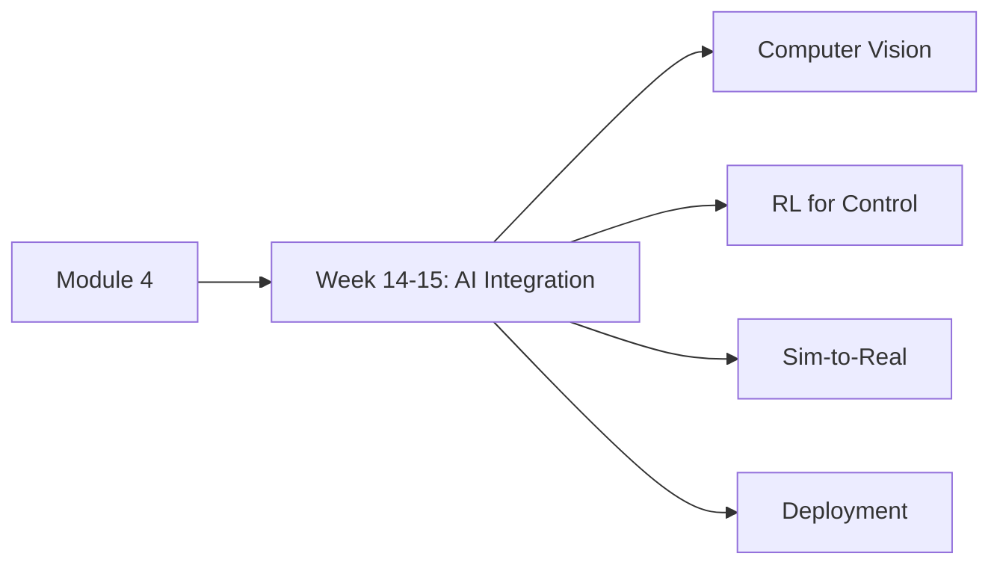
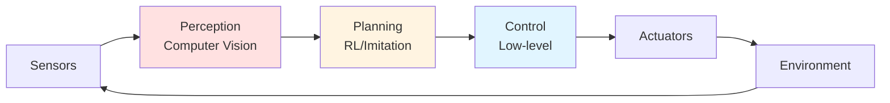

# Module 4: AI Integration

> **Summary**: Learn how to apply modern AI techniques to enable intelligent behavior in humanoid robots.

## 🎯 Module Overview

This module covers the integration of AI and machine learning into physical robot systems:

- **Computer Vision**: Object detection, pose estimation, semantic segmentation
- **Reinforcement Learning**: Learning control policies from interaction
- **Imitation Learning**: Learning from demonstrations
- **Sim-to-Real Transfer**: Bridging simulation and reality gap
- **Real-World Deployment**: Safety, robustness, and failure handling

### Learning Path



## 📅 Timeline

- **Weeks 14-15**: AI Integration & Applications (2 weeks)
- **Total Duration**: 2 weeks

## 🎓 Prerequisites

Before starting Module 4, you should have completed:
- [Module 1: Introduction to Physical AI](../module-1/) — Foundation concepts
- [Module 2: Humanoid Fundamentals](../module-2/) — Control basics
- [Module 3: Sensors & Actuators](../module-3/) — Hardware understanding
- **Recommended**: Basic machine learning knowledge (neural networks, optimization)

## 📚 Module Contents

### Week 14-15: AI Integration & Real-World Applications

**[4.1 — AI for Physical Robots](./week-14-15/)**

Apply modern AI techniques:
- Object detection and tracking (YOLO, Detectron2)
- Pose estimation (OpenPose, MediaPipe)
- RL for locomotion and manipulation
- Imitation learning from human demonstrations
- Sim-to-real techniques (domain randomization)
- Safety and failure recovery
- Edge deployment optimization

**Difficulty**: ⭐⭐⭐ Advanced  
**Time Commitment**: ~10-12 hours

## 🎯 Learning Objectives

By the end of Module 4, you will be able to:

1. **Implement computer vision** for object detection and pose estimation
2. **Apply RL algorithms** for learning control policies
3. **Use imitation learning** to bootstrap from demonstrations
4. **Bridge sim-to-real gap** using domain randomization
5. **Deploy models** on edge devices with optimization
6. **Design safety systems** for failure detection and recovery
7. **Integrate AI components** into full robot systems
8. **Evaluate performance** in real-world scenarios

## 🛠️ Tools & Libraries

Throughout this module, we'll use:

- **PyTorch/TensorFlow**: Deep learning frameworks
- **OpenCV/Detectron2**: Computer vision
- **Stable-Baselines3**: RL algorithms
- **Isaac Gym**: GPU-accelerated RL simulation
- **ONNX**: Model optimization for deployment
- **ROS**: System integration (optional)

### Installation

```bash
pip install torch torchvision
pip install stable-baselines3
pip install opencv-python detectron2
pip install onnx onnxruntime
```

## 💡 Key Concepts Preview

### AI Pipeline for Robots



### Learning Approaches

| Approach | Data Source | Best For | Example |
|----------|-------------|----------|---------|
| **Supervised** | Labeled dataset | Perception tasks | Object detection |
| **Reinforcement** | Trial and error | Control policies | Walking, grasping |
| **Imitation** | Expert demonstrations | Bootstrap RL | Human teleoperation |
| **Self-Supervised** | Unlabeled data | Feature learning | Contrastive learning |

### Sim-to-Real Strategies

1. **Domain Randomization**: Vary simulation parameters
2. **Domain Adaptation**: Learn invariant features
3. **Residual Learning**: Add real-world corrections
4. **System Identification**: Model real robot dynamics

## ➡️ Getting Started

Ready to integrate AI? Start with:

**[Week 14-15: AI Integration →](./week-14-15/)**

Learn how to apply modern AI techniques to physical robot systems.

---

## 📖 Further Reading

- **Courses**:
  - CS231n: Computer Vision (Stanford)
  - CS285: Deep RL (UC Berkeley)
- **Papers**:
  - "Deep Reinforcement Learning for Robotics" (Kober et al.)
  - "Sim-to-Real Transfer Survey" (Zhao et al., 2020)
- **Projects**:
  - OpenAI Robotics
  - Google Brain Robotics Research
