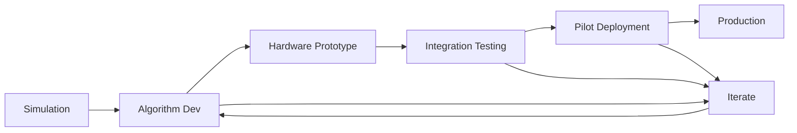

# 4.1.4 — Real-World Applications

> **Summary**: Learn from successful deployments, understand best practices, and explore the future of AI-integrated humanoid robotics.

## 🎯 Learning Objectives

- Analyze successful robot deployments
- Understand industry applications
- Learn deployment best practices
- Explore emerging trends
- Plan your own robotics project

---

## 📖 Case Studies

### 1. Boston Dynamics — Atlas

**Application:** Search and rescue, construction inspection

**AI Integration:**
- Computer vision for terrain perception
- RL-trained locomotion policies
- Whole-body motion planning

**Key Achievements:**
- Parkour (jumping, backflips)
- Autonomous navigation in rubble
- Tool manipulation (carrying boxes)

**Technical Insights:**
- Hydraulic actuation for power
- MPC + RL hybrid control
- Real-time state estimation (EKF)
- 28 DOF, 80kg, 1.5m tall

**Lessons Learned:**
✅ Robust perception critical for unstructured environments  
✅ Hybrid control (classical + learned) works best  
✅ Hardware reliability as important as algorithms

---

### 2. Tesla — Optimus

**Application:** Manufacturing automation, household tasks

**AI Integration:**
- End-to-end vision-based control
- Foundation models for task understanding
- Imitation learning from human demonstrations

**Technical Approach:**
- Uses same vision stack as Tesla vehicles
- Full-body neural network control
- Training in virtual environments
- 28 DOF, 57kg, 1.73m tall

**Key Innovations:**
- Actuator design (custom motors + gearboxes)
- Low-cost manufacturing approach
- Rapid iteration cycle

**Deployment Strategy:**
- Start with controlled factory environments
- Expand to semi-structured tasks
- Eventual consumer applications

**Lessons Learned:**
✅ Vision-first approach scales better  
✅ Manufacturing cost critical for deployment  
✅ Iterative design beats perfect first version

---

### 3. OpenAI — Dactyl (Robotic Hand)

**Application:** In-hand manipulation

**AI Integration:**
- Deep RL (PPO) with domain randomization
- Vision-based pose estimation
- Asymmetric actor-critic (privileged training)

**Achievements:**
- Solved Rubik's Cube with robot hand
- Handles significant perturbations
- Generalizes to diverse objects

**Training Details:**
- 13,000 years of simulated experience
- Domain randomization: friction, size, mass, lighting
- 384 CPU cores + 32 GPUs
- Real robot training: Zero

**Key Technical Decisions:**
- Randomize everything possible
- Use simple RL (PPO), not complex algorithms
- Vision for state estimation (no motion capture)

**Lessons Learned:**
✅ Domain randomization works for complex tasks  
✅ Sim-to-real gap can be bridged without real data  
✅ Compute investment pays off

---

### 4. Agility Robotics — Digit

**Application:** Warehouse logistics, delivery

**AI Integration:**
- Footstep planning with RL
- Vision-based obstacle avoidance
- Package handling with learned policies

**Commercial Deployment:**
- Partnered with Amazon for warehouse trials
- 200+ units deployed
- Handling up to 10kg packages

**Technical Specifications:**
- Electric actuation
- 2-4 hour battery life
- 1.75m tall, 50kg
- Navigates stairs, ramps, obstacles

**Business Model:**
- Robotics-as-a-Service (RaaS)
- Pay per task completed
- Continuous software updates

**Lessons Learned:**
✅ Focus on specific use case (logistics)  
✅ RaaS model reduces adoption barrier  
✅ Battery life is major constraint

---

## 🏭 Industry Applications

### Manufacturing & Warehousing

**Use Cases:**
- Material handling
- Quality inspection
- Assembly tasks
- Inventory management

**Requirements:**
- Repeatability (99.9%+ success rate)
- Safety certifications (ISO 10218)
- Integration with existing systems
- ROI < 2 years

**AI Components:**
- Object detection (YOLO, Mask R-CNN)
- Grasp planning
- Path planning
- Anomaly detection

### Healthcare & Assistance

**Use Cases:**
- Patient mobility assistance
- Medication delivery
- Elderly care
- Rehabilitation therapy

**Requirements:**
- Safety (soft compliance, emergency stops)
- Human interaction (gesture, voice)
- Reliability (24/7 operation)
- Privacy compliance (HIPAA)

**AI Components:**
- Human pose estimation
- Activity recognition
- Natural language processing
- Adaptive behavior

### Search & Rescue

**Use Cases:**
- Disaster response
- Hazardous environment inspection
- Victim location
- Debris removal

**Requirements:**
- Ruggedness (IP67+ rating)
- Autonomous operation (GPS-denied)
- Battery endurance (4+ hours)
- Teleoperation backup

**AI Components:**
- SLAM (simultaneous localization and mapping)
- Terrain classification
- Object recognition
- Motion planning under uncertainty

---

## 🛠️ Deployment Best Practices

### Phase 1: Proof of Concept (PoC)

**Timeline:** 3-6 months

**Goals:**
- Validate technical feasibility
- Identify blockers
- Estimate costs

**Activities:**
- Simulate target scenario
- Prototype key algorithms
- Test critical components
- Define success metrics

**Deliverables:**
- Demo video
- Technical report
- Cost-benefit analysis

### Phase 2: Pilot Deployment

**Timeline:** 6-12 months

**Goals:**
- Test in real environment
- Collect deployment data
- Refine algorithms

**Activities:**
- Deploy 1-3 robots
- Monitor performance 24/7
- Iterate on failures
- Train operators

**Deliverables:**
- Performance metrics
- Failure mode analysis
- Operator manual
- Maintenance schedule

### Phase 3: Full Deployment

**Timeline:** 12-24 months

**Goals:**
- Scale to target fleet size
- Achieve ROI
- Continuous improvement

**Activities:**
- Deploy full fleet
- Automate monitoring
- Establish support team
- Optimize operations

**Deliverables:**
- Production system
- SLA agreements
- Support documentation

---

## 📊 Evaluation Framework

### Performance Metrics

**Task Success Rate:**
$$
\text{Success Rate} = \frac{\text{Successful Tasks}}{\text{Total Tasks}} \times 100\%
$$

**Target:** > 95% for production

**Mean Time Between Failures (MTBF):**
$$
\text{MTBF} = \frac{\text{Total Operating Time}}{\text{Number of Failures}}
$$

**Target:** > 1000 hours

**Return on Investment (ROI):**
$$
\text{ROI} = \frac{\text{Net Benefit} - \text{Cost}}{\text{Cost}} \times 100\%
$$

**Target:** > 200% over 3 years

### Safety Metrics

- **Collision Rate**: < 1 per 10,000 hours
- **Emergency Stops**: < 1 per 100 hours
- **Injury Rate**: Zero (mandatory)

### Implementation Checklist

```python
class DeploymentChecklist:
    """Pre-deployment safety and readiness checklist."""
    
    def __init__(self):
        self.checks = {
            'safety': [
                'Emergency stop tested',
                'Collision detection verified',
                'Force limits configured',
                'Workspace boundaries set',
                'Safety training completed'
            ],
            'technical': [
                'State estimation validated',
                'Control loop stable',
                'Sensor calibration current',
                'Backup systems operational',
                'Network latency acceptable'
            ],
            'operational': [
                'Operators trained',
                'Maintenance schedule defined',
                'Support team available',
                'Documentation complete',
                'Monitoring dashboard active'
            ],
            'regulatory': [
                'Safety certifications obtained',
                'Insurance coverage secured',
                'Data privacy compliant',
                'Local regulations met',
                'Audit trail implemented'
            ]
        }
    
    def run_checklist(self):
        """Interactive checklist."""
        print("Deployment Readiness Checklist")
        print("=" * 50)
        
        total_checks = sum(len(items) for items in self.checks.values())
        passed = 0
        
        for category, items in self.checks.items():
            print(f"\n{category.upper()}:")
            for item in items:
                response = input(f"  {item}? (y/n): ")
                if response.lower() == 'y':
                    passed += 1
                    print("    ✅ PASS")
                else:
                    print("    ❌ FAIL - Address before deployment!")
        
        print(f"\n{'='*50}")
        print(f"Score: {passed}/{total_checks} ({passed/total_checks*100:.1f}%)")
        
        if passed == total_checks:
            print("✅ READY FOR DEPLOYMENT")
        else:
            print("⚠️  NOT READY - Complete all checks")
        
        return passed == total_checks


# Run checklist
if __name__ == '__main__':
    checklist = DeploymentChecklist()
    ready = checklist.run_checklist()
```

---

## 🔮 Future Trends

### 1. Foundation Models for Robotics

**Concept:** Pre-trained models for robot control

**Examples:**
- RT-1, RT-2 (Google): Vision-language-action models
- PaLM-E: Multimodal language model for embodied tasks
- GATO (DeepMind): Generalist agent

**Impact:**
- Reduces task-specific training time
- Enables zero-shot generalization
- Scales with data and compute

### 2. Humanoid-as-a-Platform

**Trend:** Standardized hardware, customizable software

**Benefits:**
- Lower development costs
- Faster deployment
- Software marketplace
- Modular upgrades

**Players:**
- Tesla Optimus
- Figure AI
- 1X Technologies

### 3. Human-Robot Collaboration

**Evolution:**
- Caged robots → Collaborative robots → Humanoid coworkers

**Key Technologies:**
- Intent prediction
- Shared autonomy
- Adaptive impedance control
- Natural communication (speech, gesture)

### 4. Edge AI & Onboard Compute

**Trend:** Move from cloud to robot

**Drivers:**
- Latency requirements (< 10ms)
- Privacy concerns
- Reliability (offline operation)
- Cost (bandwidth expensive)

**Hardware:**
- NVIDIA Jetson Orin (275 TOPS)
- Tesla Dojo chip
- Custom ASICs

---

## 💡 Building Your Own Project

### Project Ideas

**Beginner:**
- 🤖 Telepresence robot with obstacle avoidance
- 📦 Autonomous delivery cart
- 🏥 Medicine delivery assistant

**Intermediate:**
- 🚶 Bipedal walker with RL
- 🦾 Robotic arm with vision-based grasping
- 🏠 Home automation assistant

**Advanced:**
- 🏃 Full humanoid locomotion
- 🧗 Climbing robot with multi-contact planning
- 🤝 Collaborative manipulation

### Development Roadmap



**Phase Durations:**
- Simulation: 2-4 months
- Algorithm: 4-8 months
- Hardware: 6-12 months
- Testing: 3-6 months
- Pilot: 6-12 months
- Production: 12+ months

**Total:** 2-4 years for complex systems

---

## 🎯 Final Exercise

### 🚀 Capstone Project: Design Your Robot

**Objective:** Plan a complete humanoid robot project.

**Tasks:**
1. **Define Use Case**
   - Problem statement
   - User requirements
   - Success metrics

2. **System Design**
   - Hardware architecture
   - Software stack
   - AI components

3. **Development Plan**
   - Timeline (Gantt chart)
   - Team structure
   - Budget estimate

4. **Risk Analysis**
   - Technical risks
   - Mitigation strategies
   - Contingency plans

5. **Deployment Strategy**
   - Pilot plan
   - Scaling approach
   - Support model

**Deliverables:**
- Technical specification document
- System architecture diagram
- Project timeline
- Budget breakdown
- Risk register

**Evaluation Criteria:**
- ✅ Clear problem definition
- ✅ Realistic technical approach
- ✅ Feasible timeline & budget
- ✅ Comprehensive risk analysis
- ✅ Viable business model

---

## 🎓 Congratulations!

You've completed the comprehensive Physical AI & Humanoid Robotics curriculum!

### What You've Learned

**Module 1:** Physical AI Fundamentals  
**Module 2:** Kinematics, Dynamics, & Locomotion  
**Module 3:** Sensors, Actuators, & Fusion  
**Module 4:** AI Integration & Deployment

### Next Steps

1. **Build Something:** Start with a simple project
2. **Join Community:** Connect with roboticists
3. **Keep Learning:** Research papers, conferences
4. **Contribute:** Open-source robotics projects

### Resources

**Communities:**
- [ROS Discourse](https://discourse.ros.org/)
- [/r/robotics](https://reddit.com/r/robotics)
- [PyRobot Discord](https://discord.gg/pyrobot)

**Competitions:**
- RoboCup
- DARPA Robotics Challenge
- Humanoids Conference

**Further Learning:**
- [MIT 6.832: Underactuated Robotics](http://underactuated.mit.edu/)
- [Stanford CS 237B: Principles of Robot Autonomy II](https://web.stanford.edu/class/cs237b/)
- [ETH Zürich: Robotics](https://rsl.ethz.ch/education-students.html)

---

## 📚 References

1. Siciliano, B. et al. (2016). *Robotics: Modelling, Planning and Control*
2. Thrun, S. et al. (2005). *Probabilistic Robotics*
3. Sutton, R. & Barto, A. (2018). *Reinforcement Learning: An Introduction*
4. Recent papers from RSS, ICRA, IROS, CoRL conferences

---

## 🙏 Thank You!

Thank you for completing this journey into Physical AI and Humanoid Robotics. The field is evolving rapidly, and your contributions will shape the future of human-robot interaction.

**Remember:** The best way to learn robotics is to build robots. Start small, iterate fast, and never stop learning.

**Good luck with your robotics journey! 🤖🚀**

---

*Course developed by the Physical AI Research Group*  
*Last updated: December 2025*
