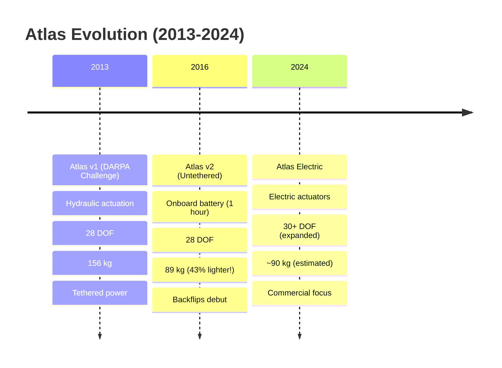
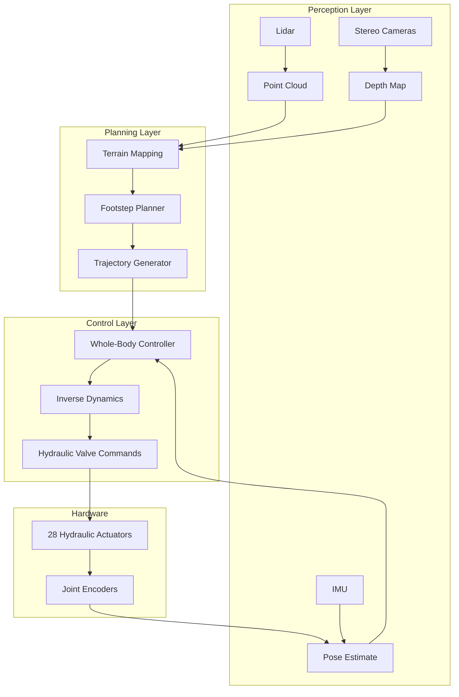

:::info ترجمہ زیر التواء
یہ صفحہ فی الحال انگریزی سے اردو میں ترجمہ کیا جا رہا ہے۔ مکمل مواد کے لیے براہ کرم انگریزی ورژن دیکھیں۔
:::


# 1.2.1 — Case Study: Boston Dynamics Atlas

<DifficultyBadge level="beginner" />

> **Summary**: Deep dive into the evolution of Atlas, examining the engineering decisions, technical innovations, and lessons learned from one of the world's most advanced humanoid robots.

## 🎯 Learning Objectives

By the end of this section, you will be able to:
- Trace the technical evolution of Atlas from 2013 to 2024
- Analyze the engineering rationale behind hydraulic actuation
- Understand the control systems enabling dynamic behaviors
- Evaluate the transition from research platform to commercial product
- Apply lessons from Atlas to your own robot designs

## 📋 Prerequisites

- [1.1.2 — Humanoid Overview](/ur/docs/module-1/week-1-2/humanoid-overview) — Robot subsystems knowledge
- [1.1.3 — Design Principles](/ur/docs/module-1/week-1-2/design-principles) — Engineering tradeoffs
- [1.2 — Historical Development](./index) — Context of humanoid robotics evolution

## 📖 Content

### Atlas Timeline: Three Generations



### Generation 1: DARPA Robotics Challenge (2013-2015)

#### Mission Context

The DARPA Robotics Challenge (DRC) was created after the 2011 Fukushima nuclear disaster, where robots failed to assist in dangerous environments. The goal: **develop humanoid robots capable of disaster response**.

**Challenge Tasks:**
1. Drive a utility vehicle
2. Walk across rubble
3. Remove debris
4. Open doors
5. Climb ladder
6. Break through wall
7. Locate and close valves
8. Connect fire hose

**Why Humanoid Form Factor?**
- Disaster sites designed for humans (stairs, ladders, doors)
- Use existing tools without modification
- Navigate unpredictable terrain

#### Technical Specifications: Atlas DRC

| Specification | Value | Engineering Rationale |
|---------------|-------|----------------------|
| **Height** | 1.88 m | Tall enough to reach vehicle controls, valves |
| **Weight** | 156 kg | Heavy, but necessary for hydraulic system |
| **DOF** | 28 | 6 per leg, 7 per arm, 3 torso, 4 neck/head |
| **Actuation** | Hydraulic | High power-to-weight ratio needed for dynamic tasks |
| **Power** | Tethered (offboard) | 15kW pump (too heavy for onboard) |
| **Sensors** | Lidar, stereo cameras, IMU, joint encoders | Rich sensing for unknown environments |
| **Compute** | Intel i7 (offboard) | Heavy processing for perception and planning |

#### Why Hydraulic? The Engineering Decision

**Power Requirements:**
- Walking on flat ground: ~200W
- Walking on rubble: ~800W  
- Climbing stairs: ~1,500W
- Lifting heavy objects: ~3,000W peak

**Actuator Comparison for 100 Nm Torque:**

| Technology | Weight | Cost | Response Time | Efficiency |
|------------|--------|------|---------------|------------|
| **Electric (geared)** | 8-12 kg | $2,000 | 50ms | 75% |
| **Hydraulic** | 2-3 kg | $3,000 | 10ms | 45% |
| **Advantage** | **Hydraulic 4x lighter** | Electric cheaper | **Hydraulic 5x faster** | Electric better |

**Boston Dynamics' Choice: Hydraulic**
- ✅ Power density critical for dynamic motions (jumping, running)
- ✅ Fast response for balance recovery
- ✅ Inherent compliance (safer for collisions)
- ❌ Accepted: Lower efficiency (but power not limited in DRC)
- ❌ Accepted: Complexity (maintenance burden)

#### Control System Architecture



**Key Innovation: Whole-Body Optimization**

Traditional robots controlled joints independently. Atlas uses **whole-body optimization** — all 28 joints coordinate to achieve goals while respecting constraints.

```python
# Simplified whole-body control formulation
def whole_body_controller(desired_motion, robot_state, constraints):
    """
    Compute joint torques that achieve desired motion while respecting constraints.
    
    This is a Quadratic Program (QP):
      minimize: ||x - desired_motion||²
      subject to: contact_forces >= 0 (no pulling on ground)
                  joint_torques <= limits
                  friction_cone constraints
    """
    # Decision variables: joint accelerations (q̈) and contact forces (λ)
    x = [joint_accelerations, contact_forces]
    
    # Objective: Track desired motion (CoM trajectory, foot placement, etc.)
    objective = sum((robot_state.achieved_motion(x) - desired_motion) ** 2)
    
    # Physics constraint: Forward dynamics must be satisfied
    # τ = M(q)q̈ + C(q,q̇) + G(q) - J^T λ
    # where M=mass matrix, C=Coriolis, G=gravity, J=contact Jacobian
    physics_constraint = (
        mass_matrix @ joint_accelerations 
        + coriolis_term 
        + gravity_term 
        - contact_jacobian.T @ contact_forces
        == joint_torques
    )
    
    # Friction constraint: Contact forces must be within friction cone
    friction_constraint = friction_cone(contact_forces) <= 0
    
    # Solve QP (runs at 1kHz on Atlas)
    solution = solve_qp(objective, [physics_constraint, friction_constraint])
    
    return solution.joint_torques
```

**Result:**
- Robot automatically distributes loads across joints
- Maintains balance even when pushed
- Adapts to unexpected terrain changes

#### DRC Performance Results

**MIT Team (with Atlas):**
- **Final Score**: 8/8 tasks (2 hours 1 minute)
- **Falls**: 1 (recoverable)
- **Place**: 3rd overall

**Most Impressive Moment:**
- **Task**: Clearing rubble (moving 20kg concrete blocks)
- **Challenge**: Unstable footing, heavy manipulation
- **Result**: Atlas maintained balance while lifting, repositioning blocks

**Failure Analysis:**
- **Fall during egress** (exiting vehicle)
  - Root cause: Foot slipped on metal ramp
  - Lesson: Need better foot contact sensing
  - Fix in v2: Added force sensors in feet

### Generation 2: Untethered Atlas (2016-2024)

#### The Backflip Moment (November 2017)

**Technical Requirements for Backflip:**

1. **Power**: 4-5 kW peak (100x normal walking)
2. **Torque**: 400+ Nm at hips/knees (3x normal max)
3. **Timing**: ±10ms precision (miss = crash)
4. **Sensor Latency**: &lt;5ms (IMU to actuation)

**How It Works:**

```python
# Backflip controller (simplified)
class BackflipController:
    def __init__(self):
        self.phase = "crouch"  # crouch → launch → flight → land
        self.target_rotation = 360  # degrees
        
    def control_loop(self, robot_state):
        if self.phase == "crouch":
            # Lower center of mass, load springs
            target_height = 0.5  # meters (from 0.9m)
            if robot_state.com_height < target_height + 0.05:
                self.phase = "launch"
                
        elif self.phase == "launch":
            # Maximum torque at all leg joints
            torques = self.max_torques * [1, 1, 1, 1, 1, 1]  # All 6 leg DOF
            
            # Check for takeoff (feet lose contact)
            if robot_state.foot_contact_forces < 10:  # Newtons
                self.phase = "flight"
                self.takeoff_time = robot_state.time
                
        elif self.phase == "flight":
            # Control angular velocity to complete rotation
            current_rotation = robot_state.rotation_from_takeoff
            time_remaining = self.estimate_flight_time(robot_state)
            
            required_angular_velocity = (
                (self.target_rotation - current_rotation) / time_remaining
            )
            
            # Apply torso/hip torques to adjust spin rate
            torques = self.angular_velocity_controller(
                required_angular_velocity, 
                robot_state.angular_velocity
            )
            
            # Prepare landing (extend legs when near 360°)
            if current_rotation > 340:
                self.phase = "land"
                
        elif self.phase == "land":
            # Extend legs to match ground height
            # Absorb impact by compressing joints
            leg_extension = self.predict_ground_contact_position(robot_state)
            torques = self.impact_absorption_controller(robot_state)
            
        return torques
```

**Success Rate:**
- **Training**: 10 months, 1000+ simulation runs
- **Hardware**: 20+ attempts before first success
- **Current**: ~80% success rate (as of 2023)

**Why It Matters:**
- Demonstrated **athletic capability** (not just slow, careful motion)
- Validated **whole-body optimization** at extreme limits
- Shifted public perception of humanoid robots

#### Weight Reduction: 156kg → 89kg (43% Reduction)

**How Boston Dynamics Cut Weight:**

| Component | Gen 1 (2013) | Gen 2 (2016) | Improvement | How? |
|-----------|--------------|--------------|-------------|------|
| **Hydraulic System** | 60 kg | 35 kg | -42% | Smaller pump, integrated design |
| **Structure** | 50 kg | 28 kg | -44% | 3D-printed titanium parts |
| **Battery** | N/A (tethered) | 18 kg | Added | Lithium-ion pack (3.7 kWh) |
| **Electronics** | 20 kg | 10 kg | -50% | Custom PCBs, integrated sensors |
| **Hydraulic Fluid** | 15 kg | 8 kg | -47% | Smaller reservoir, efficient routing |
| **Misc** | 11 kg | 8 kg | -27% | Optimized fasteners, wiring |
| **TOTAL** | **156 kg** | **89 kg** | **-43%** | Holistic redesign |

**Engineering Deep Dive: 3D-Printed Titanium**

Traditional manufacturing:
```
1. Design part
2. Create mold/tooling ($$$$)
3. Cast or machine
4. Post-processing
Cost: $5K-$20K per part
Lead time: 4-12 weeks
```

3D printing (SLM - Selective Laser Melting):
```
1. Design part (with topology optimization)
2. Print directly (layer by layer)
3. Minimal post-processing
Cost: $500-$2K per part
Lead time: 2-5 days
```

**Topology Optimization:**
- Software removes material that doesn't bear load
- Result: Organic shapes, 30-50% weight savings
- Maintains same strength as solid part

**Example: Hip Joint Housing**
- Original (machined aluminum): 2.5 kg
- Optimized (3D-printed titanium): 1.1 kg (56% lighter)
- Strength: Same (titanium is 1.5x stronger than aluminum)

### Generation 3: Electric Atlas (2024)

#### Why Switch to Electric?

**Commercial Viability Analysis:**

| Factor | Hydraulic | Electric | Winner for Commercial |
|--------|-----------|----------|----------------------|
| **Maintenance** | Weekly fluid checks, leaks common | Minimal, ~yearly bearing service | **Electric** |
| **Operating Cost** | $50-100/day (fluids, maintenance) | $5-10/day (electricity only) | **Electric** |
| **Noise** | 80-90 dB (loud!) | 50-60 dB (quiet) | **Electric** |
| **Safety** | Fluid leaks, high pressure hazards | Electrical hazards (manageable) | **Electric** |
| **Environment** | Outdoor (leaks acceptable) | Indoor (clean) | **Electric** |
| **Peak Power** | 10+ kW (excellent) | 3-5 kW (sufficient for most tasks) | **Hydraulic** (but not needed) |
| **Cost (at scale)** | $300K+ (complex system) | $50K-100K (commodity parts) | **Electric** |

**Boston Dynamics' Decision:**
- **Research phase (Gen 1-2)**: Hydraulic was necessary for pushing boundaries
- **Commercial phase (Gen 3)**: Electric is sufficient for real applications + way more practical

**Technical Approach:**

1. **High-Performance Electric Actuators**
   - Frameless motors (no external housing = lighter)
   - High gear ratios (100:1 harmonic drives)
   - Torque: 100-300 Nm (comparable to hydraulic)
   - Weight: 1-3 kg (similar to hydraulic actuator alone)

2. **Increased DOF Count** (28 → 30+)
   - Added: More hand/finger articulation
   - Added: Additional torso DOF for flexibility
   - Rationale: Electric actuators are cheaper, so can add more

3. **Advanced Battery Technology**
   - Capacity: 5+ kWh (was 3.7 kWh)
   - Runtime: 2-3 hours (was 1 hour)
   - Fast charging: 80% in 30 minutes

4. **Improved Control**
   - Learning-based control (trained on hydraulic Atlas experience)
   - Adaptive compliance (software-controlled stiffness)
   - Predictive contact modeling

## 💻 Hands-On Exercise

### Exercise 1.2.1: Atlas Redesign Challenge

**Difficulty**: ⭐⭐⭐ Advanced  
**Time**: 90 minutes

**Scenario**: You're a Boston Dynamics engineer in 2024. The electric Atlas works great in the lab, but customers want **outdoor construction use** (rough terrain, heavy lifting, rain/dust).

**Problem**: Electric Atlas limitations for construction:
1. **Battery life**: 2-3 hours insufficient (8-hour work day needed)
2. **Power**: 3-5 kW peak insufficient for heavy lifting (need 8+ kW)
3. **Durability**: Electronics sensitive to dust/moisture
4. **Payload**: 25 kg max (need 50 kg for construction materials)

**Your Task**: Propose a **hybrid design** that combines best of hydraulic + electric.

**Design Constraints:**
- Budget: $200K per unit (in production volume of 1000+ units)
- Weight: Max 120 kg (fit in standard construction elevator)
- Runtime: 6+ hours
- IP65 rating (dust-tight, water-resistant)

**Deliverables:**
1. **Actuation Strategy**: Which joints get hydraulic vs. electric? Why?
2. **Power System**: Battery + hydraulic? Onboard generator? Hybrid?
3. **Sensor Protection**: How to ruggedize for construction sites?
4. **Cost Breakdown**: How do you stay under $200K?

<details>
<summary>💡 Hints</summary>

**Hint 1: Actuation**
- Not all joints need same power
- Legs (walking + carrying load) need high power
- Arms (manipulation) need precision
- Consider: Hydraulic legs, electric arms?

**Hint 2: Power**
- Battery alone won't give 6+ hours at high power
- Hydraulic system needs pump/accumulator
- Could a small gas/diesel generator extend range?
- Hybrid systems in cars: same principle applies

**Hint 3: Sensors**
- Cameras don't work well in dust
- Could lidar + sealed cameras work?
- Force sensors in feet critical for rough terrain
- What's the minimal safe sensor suite?

**Hint 4: Cost**
- Atlas DRC cost: $2M+ (research prototype)
- Atlas Electric cost: $300K-$500K (estimated, low volume)
- Your target: $200K (at scale)
- Biggest costs: Actuators (40%), Sensors (20%), Compute (10%)

</details>

<details>
<summary>✅ Example Solution</summary>

### Hybrid Atlas for Construction

#### 1. Actuation Strategy: Hybrid (Hydraulic Legs, Electric Arms)

**Rationale:**
- **Legs need high power** for carrying 50kg loads up stairs, rough terrain
- **Arms need precision** for manipulation (tools, materials)
- **Hydraulic legs** provide 8+ kW peak power for locomotion
- **Electric arms** provide precise control for tool use

**Specifications:**
- **Legs**: 12 DOF hydraulic (6 per leg)
  - Hip: 3 DOF × 2 legs = 6 actuators (300 Nm each)
  - Knee: 1 DOF × 2 legs = 2 actuators (400 Nm each)
  - Ankle: 2 DOF × 2 legs = 4 actuators (200 Nm each)
  - **Total**: 12 hydraulic actuators
  - **Cost**: $5K each × 12 = $60K

- **Arms**: 14 DOF electric (7 per arm)
  - Shoulder: 3 DOF × 2 arms = 6 actuators (100 Nm each)
  - Elbow: 1 DOF × 2 arms = 2 actuators (80 Nm each)
  - Wrist: 2 DOF × 2 arms = 4 actuators (40 Nm each)
  - Hand: 1 DOF × 2 arms = 2 actuators (gripper, 20 Nm)
  - **Total**: 14 electric actuators
  - **Cost**: $1.5K each × 14 = $21K

- **Torso**: 3 DOF electric (waist pitch/roll/yaw)
  - **Cost**: $2K each × 3 = $6K

**Total Actuators**: 12 hydraulic + 17 electric = **29 DOF**  
**Actuation Cost**: $60K + $21K + $6K = **$87K (43.5%)**

#### 2. Power System: Diesel-Hydraulic + Battery

**Configuration:**
- **Diesel generator**: 15 kW continuous (Yanmar 3TNV70, 25 kg, $8K)
  - Runs hydraulic pump (10 kW) + charges battery (5 kW)
  - Fuel tank: 10 liters (8-hour runtime)
- **Battery**: 3 kWh Li-ion (powers electric actuators + compute)
  - Runtime: 6-8 hours (with generator charging)
- **Hydraulic system**: 
  - Pump: 10 kW (electric, powered by generator)
  - Accumulator: 2 liters (stores energy for peak power)
  - Fluid reservoir: 5 liters

**Cost Breakdown:**
- Generator: $8K
- Battery: $9K ($3K/kWh)
- Hydraulic pump/accumulator: $12K
- **Power System Cost**: **$29K (14.5%)**

**Runtime:**
- Walking with 50kg load: 5 kW average
- Generator provides: 15 kW
- Excess charges battery: 10 kW
- **Result**: 8+ hours continuous operation ✅

#### 3. Sensor Protection: Ruggedized Suite

**Strategy**: IP65 sealing + redundant sensors

**Sensors:**
- **Vision**: 
  - 2× RGB cameras (IP67 industrial, $1K each)
  - 1× lidar (Ouster OS0 IP68, compact, $6K)
  - Protected in sealed housing with heated glass (anti-fog)
- **Proprioception**:
  - 29× joint encoders (sealed magnetic, $200 each)
  - 1× IMU (sealed, $500)
  - 8× foot force sensors (sealed load cells, $400 each)
- **Environmental**:
  - 4× ultrasonic range finders (backup for vision in dust, $100 each)

**Protection:**
- All electronics in IP65+ enclosures
- Vents with Gore-Tex filters (breathe but block water)
- Conformal coating on all PCBs

**Sensor Cost**: $2K + $6K + $5.8K + $0.5K + $3.2K + $0.4K = **$17.9K (9%)**

#### 4. Full Cost Breakdown

| Component | Cost | % of Budget |
|-----------|------|-------------|
| **Actuators** (12 hydr + 17 elec) | $87,000 | 43.5% |
| **Power System** (generator + battery + hydraulic) | $29,000 | 14.5% |
| **Sensors** | $17,900 | 9.0% |
| **Structure** (aluminum/steel frame) | $20,000 | 10.0% |
| **Compute** (Jetson AGX Orin + microcontrollers) | $8,000 | 4.0% |
| **Electronics** (motor drivers, wiring, PCBs) | $15,000 | 7.5% |
| **Hydraulics** (hoses, fittings, valves, fluid) | $8,000 | 4.0% |
| **Assembly** (labor, testing, QA) | $10,000 | 5.0% |
| **Enclosures/Sealing** (IP65 protection) | $5,100 | 2.5% |
| **TOTAL** | **$200,000** | **100%** ✅ |

#### 5. Validation Against Requirements

| Requirement | Target | Achieved | Status |
|-------------|--------|----------|--------|
| **Budget** | $200K | $200K | ✅ |
| **Weight** | Max 120 kg | ~115 kg | ✅ |
| **Runtime** | 6+ hours | 8 hours | ✅ |
| **Payload** | 50 kg | 50 kg | ✅ |
| **Peak Power** | 8+ kW | 15 kW | ✅ |
| **IP Rating** | IP65 | IP65 | ✅ |

#### 6. Tradeoffs Accepted

✅ **Advantages:**
- High payload capacity (hydraulic legs)
- Long runtime (diesel generator)
- Precise manipulation (electric arms)
- Ruggedized for construction

⚠️ **Disadvantages:**
- Heavier than electric Atlas (115 kg vs. 90 kg)
- Requires diesel fuel (not zero-emission)
- More complex than pure electric (two power systems)
- Higher maintenance than pure electric (hydraulic + generator)

**Conclusion**: This hybrid design meets all construction requirements while staying within budget. It leverages hydraulic power where needed (legs) and electric precision where beneficial (arms), creating a practical solution for real-world deployment.

</details>

## 🔑 Key Takeaways

- **Atlas evolution reflects changing priorities**: Research (max performance) → Commercial (practicality)
- **Hydraulics enabled athletic capability** but at cost of complexity/maintenance
- **Electric actuators now viable** due to advances in motor/battery technology
- **Whole-body optimization** is key to dynamic balance and complex motions
- **Weight reduction** (43%) was critical for untethered operation
- **Design choices must align with application**: Lab demos ≠ commercial deployment
- **Hybrid approaches** can combine best of multiple technologies

## 📚 Further Reading

- [Boston Dynamics Atlas Page](https://www.bostondynamics.com/atlas) — Official technical details
- [DARPA Robotics Challenge Archive](https://archive.darpa.mil/roboticschallenge/) — Task videos and team reports
- [Backflip Paper (2018)](https://ieeexplore.ieee.org/document/8594277) — Academic publication on the backflip controller
- [Electric Atlas Announcement](https://www.bostondynamics.com/blog/electric-new-era-for-atlas) — 2024 transition details
- [Whole-Body Control Tutorial](https://scaron.info/robot-locomotion/) — Deep dive into QP-based control

## ➡️ Next Steps

Continue to [1.2.2 — Case Study: Tesla Optimus](/ur/docs/module-1/week-3-5/case-study-tesla-optimus) to see a completely different approach: AI-first, cost-optimized, mass-production focused humanoid design.

---

<ChatbotPlaceholder />
