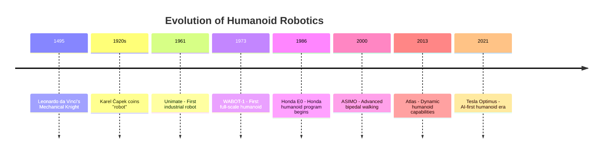

:::info ترجمہ زیر التواء
یہ صفحہ فی الحال انگریزی سے اردو میں ترجمہ کیا جا رہا ہے۔ مکمل مواد کے لیے براہ کرم انگریزی ورژن دیکھیں۔
:::

# 1.2 — Historical Development of Humanoid Robotics

<DifficultyBadge level="beginner" />

> **Summary**: Explore the fascinating journey of humanoid robotics from mechanical automatons to modern AI-powered systems, understanding key milestones and technological breakthroughs.

## 🎯 Learning Objectives

By the end of this section, you will be able to:
- Trace the evolution of humanoid robots across major historical periods
- Identify key technological breakthroughs that enabled modern humanoids
- Compare early mechanical systems with contemporary AI-powered humanoids
- Understand how past challenges shaped current design philosophies
- Recognize trends in humanoid robotics development

## 📋 Prerequisites

- [1.1.1 — What is Physical AI?](/ur/docs/module-1/week-1-2/what-is-physical-ai) - Physical AI fundamentals
- [1.1.2 — Humanoid Overview](/ur/docs/module-1/week-1-2/humanoid-overview) - Humanoid robot design principles

## 📖 Content

### This Week's Sections

1. **[1.2.1 — Case Study: Boston Dynamics Atlas](/ur/docs/module-1/week-3-5/case-study-boston-dynamics)** (90 minutes)  
   Deep dive into Atlas evolution from hydraulic research platform to commercial electric humanoid

2. **[1.2.2 — Case Study: Tesla Optimus](/ur/docs/module-1/week-3-5/case-study-tesla-optimus)** (90 minutes)  
   Analyze Tesla's AI-first, cost-optimized approach with automotive-scale manufacturing

### Timeline of Humanoid Robotics

### Era 1: Early Automatons (Pre-1960)

**1495: Leonardo da Vinci's Mechanical Knight**
- Mechanical humanoid design using gears and pulleys
- Could sit, stand, move arms, and open/close jaw
- Never built in da Vinci's lifetime (reconstructed in 2002)

**1920s: The Term "Robot" Emerges**
- Czech playwright Karel Čapek introduces "robot" in R.U.R. (Rossum's Universal Robots)
- Derived from Czech "robota" meaning forced labor
- Sparked public imagination about artificial workers

**1939: Elektro at World's Fair**
- 7-foot humanoid robot by Westinghouse
- Could walk, speak 700 words, smoke cigarettes
- Purely mechanical, no computation
- Demonstration of mechanical engineering prowess

### Era 2: Foundation Years (1960-1990)

**1973: WABOT-1 (Waseda University, Japan)**

First full-scale anthropomorphic robot:
- 🚶 Bipedal walking (0.45 seconds per step)
- 👁️ Vision system for object recognition
- 👂 Speech recognition (Japanese)
- 🤲 Hands with tactile sensors
- ⚠️ Extremely slow, limited capability

**Significance**: Proved full humanoid systems were possible

**1986: Honda E-Series Begins**

Honda's secretive humanoid program:
- E0-E6 prototypes (1986-1993)
- Focus: Stable bipedal locomotion
- Challenges: Dynamic balance, energy efficiency
- Required 10+ years before public demonstration

**1996: Honda P2**
- First autonomous bipedal humanoid (no external power/control)
- 1.82m tall, 210kg
- Could walk on uneven surfaces
- $1M+ development cost per unit

### Era 3: Advanced Bipedal Robots (2000-2010)

**2000: ASIMO (Honda)**

Breakthrough humanoid platform:

| Capability | Specification |
|------------|---------------|
| Height | 1.3m |
| Weight | 54kg |
| Walking Speed | 2.7 km/h (running: 6 km/h) |
| DOF | 34 degrees of freedom |
| Battery | 51.8V lithium-ion, 1-hour runtime |
| Features | Stair climbing, object recognition, gesture recognition |

**Innovations:**
- **Predictive movement control** — Anticipate next step before foot contact
- **i-WALK technology** — Real-time adjustment to terrain changes
- **Human interaction** — Recognize faces, respond to gestures

**Impact**: Inspired global humanoid research programs

**2004: QRIO (Sony)**

Entertainment/research humanoid:
- Advanced balance control
- Running at 0.43 m/s
- Dancing capabilities
- Voice and face recognition
- ❌ Discontinued 2006 (Sony exited robotics)

**2005: HRP-2 (AIST, Japan)**

Research platform for:
- Whole-body motion planning
- Human-robot collaboration
- Disaster response scenarios
- Open research platform (widely used)

### Era 4: Dynamic Humanoids (2010-2020)

**2013: Atlas (Boston Dynamics)**

Game-changing dynamic humanoid:

**Key Capabilities:**
- 🏃 **Dynamic mobility** — Running, jumping, backflips
- ⚖️ **Balance recovery** — Push resistance, uneven terrain
- 💪 **Manipulation** — Pick up and throw objects
- 🎯 **Parkour** — Multi-obstacle navigation

**Technical Specifications:**
- Height: 1.5m, Weight: 89kg
- Actuation: Hydraulic (28 actuated DOF)
- Sensors: Lidar, stereo cameras, IMU, joint sensors
- Computation: Real-time whole-body control at 1 kHz

**2015: Valkyrie (NASA JSC)**

Space-focused humanoid:
- Designed for Mars missions
- Modular design for in-space repair
- Fine manipulation (44 DOF hands)
- ROS-based open software

**2016: Sophia (Hanson Robotics)**

Social interaction focus:
- 50+ facial expressions
- Natural language processing
- Camera eyes for eye contact
- ⚠️ Primarily upper body, limited mobility

### Era 5: AI-Powered Humanoids (2020-Present)

**2021: Tesla Optimus**

AI-first humanoid approach:

**Design Philosophy:**
- Leverage Tesla's FSD (Full Self-Driving) AI stack
- Mass production goal (automotive manufacturing)
- Cost target: &lt;$20K/unit (vs. $100K+ for others)
- General-purpose design for real-world tasks

**Specifications (Gen 2, 2023):**
- Height: 1.73m, Weight: 73kg (closer to human)
- Actuation: Custom electric actuators
- Hands: 11-DOF with tactile sensing
- Vision: 8 cameras (no lidar)
- AI: End-to-end neural network control

**2022: Figure 01**

VC-funded commercial humanoid:
- Focus: Warehouse and logistics automation
- Teleoperation + autonomous modes
- Rapid development cycle (startup approach)

**2023: 1X Neo**

Human-like proportions:
- Biomimetic design philosophy
- Safe for home environments
- Wheeled base (practical compromise)

### Key Technological Breakthroughs

| Decade | Breakthrough | Impact |
|--------|--------------|--------|
| **1970s** | Microprocessors | Enabled onboard computation |
| **1980s** | Harmonic drives | High-torque compact actuators |
| **1990s** | Zero Moment Point (ZMP) | Stable bipedal walking theory |
| **2000s** | Real-time trajectory optimization | Dynamic motion (running, jumping) |
| **2010s** | Deep learning for vision | Robust object recognition |
| **2020s** | End-to-end neural control | Learning-based whole-body control |

### Industry Case Studies

#### Boston Dynamics: From DARPA to Hyundai

**Timeline:**
- 1992: Founded as MIT spinoff
- 2013: DARPA Robotics Challenge drives Atlas
- 2017: Acquired by SoftBank ($100M+)
- 2021: Acquired by Hyundai ($1.1B)

**Business Model Evolution:**
- Research → Product (Spot quadruped)
- Atlas remains research platform
- Focus on practical deployments

**Lessons:**
- Long-term R&D investment required (30+ years)
- Research platforms vs. commercial products
- Deep pockets needed (DARPA, corporate backing)

#### Tesla Optimus: Automotive to Humanoid

**Leverage Existing Technology:**
- FSD cameras → Robot vision
- Neural networks → Behavior policies
- Manufacturing → Mass production

**Vertical Integration:**
- Custom actuators designed in-house
- AI training infrastructure (Dojo supercomputer)
- Manufacturing at scale (Gigafactories)

**Market Strategy:**
- Labor shortage addressable market ($30T global labor)
- Start with Tesla factories (controlled environment)
- Expand to general market

## 💻 Hands-On Exercise

### Exercise 1.2.1: Historical Comparison

**Difficulty**: ⭐⭐ Intermediate  
**Time**: 30 minutes

**Task**: Compare three landmark humanoids across key dimensions:

1. **ASIMO** (2000)
2. **Atlas** (2013)
3. **Tesla Optimus** (2023)

Fill in comparison table:

| Aspect | ASIMO | Atlas | Optimus |
|--------|-------|-------|---------|
| Primary capability | ? | ? | ? |
| Actuation type | ? | ? | ? |
| Control approach | ? | ? | ? |
| Target application | ? | ? | ? |
| Development cost | ? | ? | ? |

✅ Solution

| Aspect | ASIMO (2000) | Atlas (2013) | Optimus (2023) |
|--------|--------------|--------------|----------------|
| **Primary capability** | Stable walking, human interaction | Dynamic athletics (parkour, flips) | General-purpose labor |
| **Actuation type** | Electric motors | Hydraulic actuators | Custom electric |
| **Control approach** | Pre-programmed + limited autonomy | Model-predictive control | End-to-end neural networks |
| **Target application** | Research, PR demonstrations | Disaster response, research | Manufacturing, home assistance |
| **Development cost** | $400M+ (estimated program) | $150M+ (DARPA funding) | Undisclosed (~$100M est.) |
| **Production intent** | No (discontinued 2022) | No (research only) | Yes (mass production goal) |
| **Key innovation** | Stable bipedal walking | Dynamic balance recovery | AI-first design |

## 🔑 Key Takeaways

- Humanoid robotics evolved over **50+ years** from mechanical automatons to AI-powered systems
- **ASIMO (2000)** established stable bipedal walking as achievable
- **Atlas (2013)** demonstrated dynamic capabilities (parkour, backflips)
- **Tesla Optimus (2021+)** represents AI-first era with mass production goals
- Key enablers: Computation power, sensor technology, control algorithms, deep learning
- **Business models** transitioned from pure research to commercial applications
- Next frontier: Affordable, general-purpose humanoids at scale

## 📚 Further Reading

- [Honda ASIMO: The Story](https://global.honda/innovation/robotics/ASIMO.html) — Honda's humanoid journey
- [Boston Dynamics Atlas Videos](https://www.youtube.com/user/BostonDynamics) — Dynamic humanoid capabilities
- [Tesla AI Day 2022](https://www.youtube.com/watch?v=ODSJsviD_SU) — Optimus unveiling
- [IEEE Spectrum Robotics](https://spectrum.ieee.org/robotics) — Latest humanoid news

## ➡️ Next Steps

Congratulations! You've completed Module 1: Introduction to Physical AI.

Continue to [Module 2: Humanoid Robotics Fundamentals](/ur/docs/module-2/) to dive deep into the kinematics, dynamics, and control of humanoid systems.

---

<ChatbotPlaceholder />
