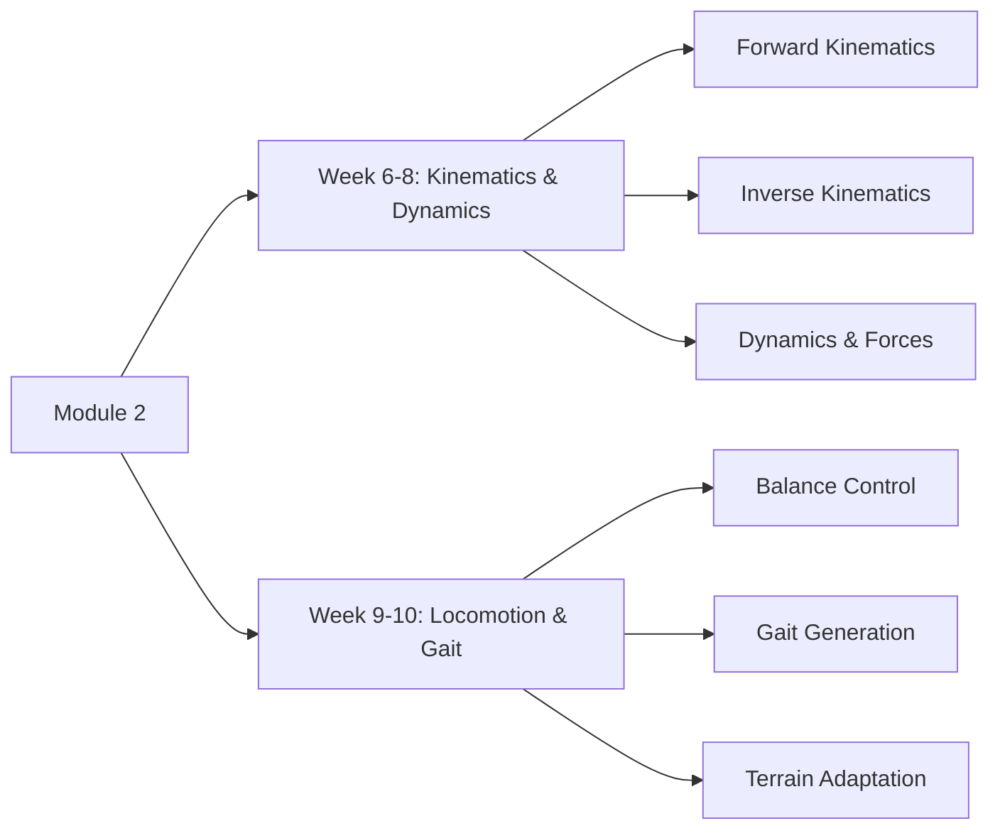

:::info ترجمہ زیر التواء
یہ صفحہ فی الحال انگریزی سے اردو میں ترجمہ کیا جا رہا ہے۔ مکمل مواد کے لیے براہ کرم انگریزی ورژن دیکھیں۔
:::


# Module 2: Humanoid Robotics Fundamentals

<DifficultyBadge level="intermediate" />

> **Summary**: Master the mathematical foundations and mechanical principles that enable humanoid robots to move, balance, and interact with their environment.

## 🎯 Module Overview

This module covers the core technical foundations of humanoid robotics, focusing on:

- **Forward and Inverse Kinematics**: Calculate joint angles to achieve desired end-effector positions
- **Robot Dynamics**: Understand forces, torques, and energy in multi-body systems
- **Locomotion Control**: Generate stable walking gaits and balance controllers
- **Gait Patterns**: Analyze different walking strategies from static to dynamic gaits

### Learning Path



## 📅 Timeline

- **Weeks 6-8**: Kinematics & Dynamics (3 weeks)
- **Weeks 9-10**: Locomotion & Gait Control (2 weeks)
- **Total Duration**: 5 weeks

## 🎓 Prerequisites

Before starting Module 2, you should have completed:
- [Module 1: Introduction to Physical AI](../module-1/) — Understanding of Physical AI concepts and humanoid design

**Recommended Background:**
- Linear algebra (vectors, matrices, transformations)
- Basic physics (forces, torques, Newton's laws)
- Trigonometry and 3D geometry
- Programming experience (Python preferred)

## 📚 Module Contents

### Week 6-8: Kinematics & Dynamics

**[2.1 — Kinematics & Dynamics Overview](./week-6-8/)**

Study the mathematical models that describe robot motion:
- Coordinate frames and transformations
- Denavit-Hartenberg parameters
- Jacobian matrices for velocity/force mapping
- Forward and inverse dynamics formulations
- Zero Moment Point (ZMP) for balance

**Difficulty**: ⭐⭐ Intermediate to Advanced  
**Time Commitment**: ~12-15 hours

### Week 9-10: Locomotion & Gait

**[2.2 — Locomotion & Gait Control](./week-9-10/)**

Learn how humanoid robots walk, run, and maintain balance:
- Static vs. dynamic stability
- Gait pattern generation (CPG, trajectory optimization)
- Footstep planning on flat and uneven terrain
- Push recovery and balance strategies
- Energy-efficient locomotion

**Difficulty**: ⭐⭐⭐ Advanced  
**Time Commitment**: ~8-10 hours

## 🎯 Learning Objectives

By the end of Module 2, you will be able to:

1. **Calculate robot poses** using forward kinematics (DH parameters)
2. **Solve for joint angles** using inverse kinematics (analytical and numerical)
3. **Compute dynamics** using Newton-Euler or Lagrangian formulations
4. **Design balance controllers** using ZMP criterion
5. **Generate walking gaits** for bipedal robots
6. **Plan footsteps** on uneven terrain
7. **Implement push recovery** strategies
8. **Optimize energy consumption** in locomotion

## 🛠️ Tools & Libraries

Throughout this module, we'll use:

- **Python**: Primary programming language
- **NumPy**: Linear algebra and numerical computation
- **SymPy**: Symbolic mathematics for deriving equations
- **PyBullet**: Physics simulation for validation
- **Matplotlib**: Visualization of trajectories and forces
- **Pinocchio**: High-performance robot kinematics/dynamics library

### Installation

```bash
pip install numpy scipy matplotlib pybullet
pip install pinocchio-robotics  # Optional: advanced dynamics
```

## 💡 Key Concepts Preview

### Forward Kinematics Chain

```
Base → Hip → Knee → Ankle → Foot
  |     |      |       |       |
  θ₁    θ₂     θ₃      θ₄      End Effector Position
```

### Inverse Kinematics Problem

Given desired foot position `(x, y, z)`, solve for joint angles `[θ₁, θ₂, θ₃, θ₄]`

### Zero Moment Point (ZMP)

The point on the ground where the sum of moments = 0
- Inside support polygon → Stable
- Outside support polygon → Falling

### Gait Cycle Phases

1. **Double Support**: Both feet on ground (stable)
2. **Single Support**: One foot on ground (dynamic)
3. **Swing Phase**: Moving foot through air
4. **Heel Strike**: Foot contacts ground

## 📊 Assessment

- **Coding Exercises**: Implement FK/IK solvers (40%)
- **Simulation Projects**: Walking controller in PyBullet (40%)
- **Problem Sets**: Derivations and calculations (20%)

## 🔗 Module Resources

- [Lecture Slides](https://example.com/slides) — Visual presentations
- [Code Repository](https://github.com/example/humanoid-robotics) — Example implementations
- [Problem Sets](https://example.com/problems) — Practice exercises with solutions
- [Simulation Files](https://example.com/simulations) — PyBullet robot models

## ➡️ Getting Started

Ready to dive in? Start with:

**[Week 6-8: Kinematics & Dynamics →](./week-6-8/)**

Learn the mathematical foundations that enable robots to know where they are and predict how they'll move.

---

## 📖 Further Reading

- **Textbooks**:
  - *Introduction to Humanoid Robotics* by Kajita et al.
  - *Robotics: Modelling, Planning and Control* by Siciliano et al.
- **Papers**:
  - "Biped Walking Pattern Generation by using Preview Control of Zero-Moment Point" (Kajita, 2003)
  - "Humanoid Robot Locomotion" (Vukobratović, 2007)
- **Online Resources**:
  - Modern Robotics Course (Northwestern University)
  - Underactuated Robotics (MIT OCW)

---

<ChatbotPlaceholder />
