:::info ترجمہ زیر التواء
یہ صفحہ فی الحال انگریزی سے اردو میں ترجمہ کیا جا رہا ہے۔ مکمل مواد کے لیے براہ کرم انگریزی ورژن دیکھیں۔
:::


# 2.2.1 — Gait Generation

<DifficultyBadge level="intermediate" />

> **Summary**: Master the art and science of creating coordinated walking patterns that keep bipedal robots balanced and efficient.

## 🎯 Learning Objectives

By the end of this section, you will be able to:
- Understand the gait cycle phases and timing parameters
- Implement Central Pattern Generators (CPG) for rhythmic motion
- Use trajectory optimization to generate efficient gaits
- Apply preview control for ZMP-based walking
- Tune gait parameters for different walking speeds
- Generate gaits for various terrain types

## 📋 Prerequisites

- [2.1.4 — Balance and ZMP](../week-6-8/04-balance-zmp) — ZMP stability criterion
- Understanding of inverse kinematics
- Python with NumPy/SciPy for optimization
- Basic control theory

## 📖 Content

### The Gait Cycle

A complete gait cycle consists of two steps (left and right). Each leg goes through:

```mermaid
gantt
    title Gait Cycle for One Leg
    dateFormat X
    axisFormat %L
    
    section Left Leg
    Stance Phase (60%)    :0, 600
    Heel Strike           :0, 50
    Flat Foot            :50, 300
    Toe Off              :550, 600
    Swing Phase (40%)     :600, 1000
    Lift Off             :600, 650
    Mid-Swing            :650, 850
    Heel Strike          :950, 1000
```



**Key Timing Parameters:**

| Parameter | Typical Value | Description |
|-----------|---------------|-------------|
| **Stride Length** | 0.4-0.8 m | Distance between consecutive heel strikes (same foot) |
| **Step Length** | 0.2-0.4 m | Distance between left and right foot |
| **Cadence** | 100-120 steps/min | Steps per minute |
| **Double Support %** | 10-20% | Both feet on ground |
| **Single Support %** | 80-90% | One foot on ground |
| **Step Height** | 0.03-0.08 m | Maximum foot clearance during swing |

### Gait Parameter Relationships

**Walking Speed:**
$$
v_{walk} = \text{stride length} \times \text{cadence}
$$

**Example:**
- Stride length: 0.6 m
- Cadence: 110 steps/min = 1.83 Hz
- Speed: 0.6 × 1.83 = 1.1 m/s (≈ 4 km/h)

**Froude Number** (dimensionless speed):
$$
Fr = \frac{v^2}{g \cdot L_{leg}}
$$

Where:
- $v$ = walking speed
- $g$ = gravity (9.81 m/s²)
- $L_{leg}$ = leg length

**Interpretation:**
- $Fr < 0.5$: Walking (slow, stable)
- $0.5 < Fr < 1.0$: Fast walking (dynamic)
- $Fr > 1.0$: Running (requires flight phase)

### Method 1: Sinusoidal Gait Pattern

**Simplest Approach:** Use sine waves for joint trajectories

```python
import numpy as np
import matplotlib.pyplot as plt

class SinusoidalGait:
    """Simple sinusoidal gait generator."""
    
    def __init__(self, stride_length=0.4, step_height=0.05, period=1.0):
        """
        Args:
            stride_length: Forward distance per stride (m)
            step_height: Maximum foot lift (m)
            period: Time for one complete stride (s)
        """
        self.stride_length = stride_length
        self.step_height = step_height
        self.period = period
        self.omega = 2 * np.pi / period  # Angular frequency
        
    def foot_trajectory(self, t, phase_offset=0):
        """
        Generate foot trajectory.
        
        Args:
            t: Time (s)
            phase_offset: Phase offset in radians (0 for right, π for left)
        
        Returns:
            (x, y, z): Foot position
        """
        # Phase angle
        phi = self.omega * t + phase_offset
        
        # X: Linear progression with sinusoidal modulation
        x = (self.stride_length / 2) * (1 - np.cos(phi))
        
        # Y: No lateral movement (for now)
        y = 0
        
        # Z: Lift during swing phase (sin > 0)
        # Use rectified sine to ensure foot doesn't go underground
        z = self.step_height * max(0, np.sin(phi))
        
        return np.array([x, y, z])
    
    def com_trajectory(self, t):
        """
        Generate Center of Mass trajectory.
        
        Simple approach: CoM oscillates laterally between feet
        and moves forward steadily.
        """
        phi = self.omega * t
        
        # X: Steady forward progression
        x = (self.stride_length / 2) * (phi / np.pi)
        
        # Y: Lateral shift (side-to-side)
        # Shift toward support leg
        lateral_amplitude = 0.03  # 3 cm lateral shift
        y = lateral_amplitude * np.sin(phi)
        
        # Z: Vertical oscillation (small)
        # CoM lowers during double support, rises during single support
        vertical_amplitude = 0.01  # 1 cm vertical oscillation
        z = 0.85 - vertical_amplitude * np.cos(2 * phi)  # Hip height ≈ 0.85m
        
        return np.array([x, y, z])

# Test the gait generator
gait = SinusoidalGait(stride_length=0.4, step_height=0.05, period=0.8)

# Generate trajectories
t_span = np.linspace(0, 2.4, 200)  # 3 strides
right_foot = np.array([gait.foot_trajectory(t, 0) for t in t_span])
left_foot = np.array([gait.foot_trajectory(t, np.pi) for t in t_span])
com = np.array([gait.com_trajectory(t) for t in t_span])

# Visualization
fig = plt.subplots(2, 2, figsize=(14, 10))

# Plot 1: Top view (X-Y)
plt.subplot(2, 2, 1)
plt.plot(right_foot[:, 0], right_foot[:, 1], 'r-', label='Right Foot', linewidth=2)
plt.plot(left_foot[:, 0], left_foot[:, 1], 'b-', label='Left Foot', linewidth=2)
plt.plot(com[:, 0], com[:, 1], 'g--', label='CoM', linewidth=2)
plt.xlabel('X (m)')
plt.ylabel('Y (m)')
plt.title('Top View')
plt.legend()
plt.grid(True)
plt.axis('equal')

# Plot 2: Side view (X-Z)
plt.subplot(2, 2, 2)
plt.plot(right_foot[:, 0], right_foot[:, 2], 'r-', label='Right Foot', linewidth=2)
plt.plot(left_foot[:, 0], left_foot[:, 2], 'b-', label='Left Foot', linewidth=2)
plt.plot(com[:, 0], com[:, 2], 'g--', label='CoM', linewidth=2)
plt.xlabel('X (m)')
plt.ylabel('Z (m)')
plt.title('Side View')
plt.legend()
plt.grid(True)

# Plot 3: Foot height over time
plt.subplot(2, 2, 3)
plt.plot(t_span, right_foot[:, 2], 'r-', label='Right Foot Height', linewidth=2)
plt.plot(t_span, left_foot[:, 2], 'b-', label='Left Foot Height', linewidth=2)
plt.xlabel('Time (s)')
plt.ylabel('Height (m)')
plt.title('Foot Clearance')
plt.legend()
plt.grid(True)

# Plot 4: CoM lateral shift
plt.subplot(2, 2, 4)
plt.plot(t_span, com[:, 1] * 1000, 'g-', linewidth=2)  # Convert to mm
plt.xlabel('Time (s)')
plt.ylabel('Lateral Position (mm)')
plt.title('CoM Lateral Oscillation')
plt.grid(True)

plt.tight_layout()
plt.savefig('sinusoidal_gait.png', dpi=150)
print("Gait visualization saved as 'sinusoidal_gait.png'")
```

**Advantages:**
- ✅ Simple to implement
- ✅ Smooth trajectories (continuous derivatives)
- ✅ Easy to tune parameters

**Disadvantages:**
- ❌ No stability guarantee (doesn't consider ZMP)
- ❌ Fixed pattern (doesn't adapt to disturbances)
- ❌ May not be energy-efficient

### Method 2: Central Pattern Generators (CPG)

**Biological Inspiration:** Animals use neural oscillators in the spinal cord to generate rhythmic motions without continuous brain intervention.

**Mathematical Model:** Coupled nonlinear oscillators

**Hopf Oscillator** (commonly used for CPG):

$$
\begin{aligned}
\dot{r} &= -\alpha (r^2 - R^2) r \\
\dot{\theta} &= \omega
\end{aligned}
$$

Where:
- $r$ = amplitude
- $\theta$ = phase
- $R$ = desired amplitude
- $\alpha$ = convergence rate
- $\omega$ = frequency

**Coupled CPG for Legs:**

```python
class HopfCPG:
    """Hopf oscillator-based CPG for gait generation."""
    
    def __init__(self, frequency=1.0, amplitude=1.0, alpha=10.0):
        """
        Args:
            frequency: Oscillation frequency (Hz)
            amplitude: Desired amplitude
            alpha: Convergence rate
        """
        self.omega = 2 * np.pi * frequency
        self.R = amplitude
        self.alpha = alpha
        
        # State: [r, theta] for each oscillator
        self.state = {
            'right_hip': np.array([amplitude, 0.0]),
            'left_hip': np.array([amplitude, np.pi]),  # 180° out of phase
            'right_knee': np.array([amplitude, 0.0]),
            'left_knee': np.array([amplitude, np.pi]),
        }
    
    def step(self, dt):
        """
        Integrate CPG for one timestep.
        
        Args:
            dt: Timestep (s)
        """
        for joint, state in self.state.items():
            r, theta = state
            
            # Hopf oscillator dynamics
            dr_dt = -self.alpha * (r**2 - self.R**2) * r
            dtheta_dt = self.omega
            
            # Euler integration
            r_new = r + dr_dt * dt
            theta_new = (theta + dtheta_dt * dt) % (2 * np.pi)
            
            self.state[joint] = np.array([r_new, theta_new])
    
    def get_joint_angles(self):
        """
        Convert CPG output to joint angles.
        
        Returns:
            dict: Joint angles in radians
        """
        angles = {}
        
        for joint, state in self.state.items():
            r, theta = state
            # Convert polar to Cartesian, then scale to joint range
            x = r * np.cos(theta)
            
            if 'hip' in joint:
                # Hip: -30° to +30° range
                angles[joint] = np.deg2rad(30) * x / self.R
            elif 'knee' in joint:
                # Knee: 0° to 60° range (always bent forward)
                angles[joint] = np.deg2rad(30) * (1 + x / self.R)
        
        return angles

# Simulate CPG
cpg = HopfCPG(frequency=1.0, amplitude=1.0, alpha=10.0)

dt = 0.01  # 10 ms timestep
duration = 3.0  # 3 seconds
t_span = np.arange(0, duration, dt)

# Record joint angles over time
history = {joint: [] for joint in cpg.state.keys()}

for t in t_span:
    cpg.step(dt)
    angles = cpg.get_joint_angles()
    
    for joint, angle in angles.items():
        history[joint].append(angle)

# Plot CPG output
fig, axes = plt.subplots(2, 2, figsize=(14, 8))

joints = list(history.keys())
for idx, joint in enumerate(joints):
    ax = axes[idx // 2, idx % 2]
    angles_deg = np.rad2deg(history[joint])
    ax.plot(t_span, angles_deg, linewidth=2)
    ax.set_xlabel('Time (s)')
    ax.set_ylabel('Angle (degrees)')
    ax.set_title(f'{joint.replace("_", " ").title()} Angle')
    ax.grid(True)

plt.tight_layout()
plt.savefig('cpg_output.png', dpi=150)
print("CPG output saved as 'cpg_output.png'")
```

**CPG Advantages:**
- ✅ Robust to perturbations (oscillators self-stabilize)
- ✅ Smooth transitions (no discontinuities)
- ✅ Bio-inspired (mimics animal locomotion)
- ✅ Modular (easy to add coupling between oscillators)

**CPG Coupling:** For coordinated motion between joints:

$$
\dot{\theta}_i = \omega_i + \sum_j K_{ij} \sin(\theta_j - \theta_i - \phi_{ij})
$$

Where:
- $K_{ij}$ = coupling strength
- $\phi_{ij}$ = desired phase difference

**Example:** Hip and knee coupling (knee flexes when hip extends)

### Method 3: Preview Control with ZMP

**State-of-the-Art Approach** (used in ASIMO, HRP-2, many modern humanoids)

**Key Idea:** Plan CoM trajectory that keeps ZMP inside support polygon, using preview of future reference ZMP.

**Simplified Problem:**

Given desired ZMP trajectory $\mathbf{p}_{ZMP}^{ref}(t)$, find CoM trajectory $\mathbf{x}_{CoM}(t)$ such that:

$$
\mathbf{p}_{ZMP}(t) = \mathbf{x}_{CoM}(t) - \frac{h}{g} \ddot{\mathbf{x}}_{CoM}(t) \approx \mathbf{p}_{ZMP}^{ref}(t)
$$

Where:
- $h$ = CoM height
- $g$ = gravity

**This is a linear system!** Can use optimal control.

**Simplified 1D Preview Controller:**

```python
from scipy import linalg

class ZMPPreviewController:
    """Preview controller for ZMP-based walking."""
    
    def __init__(self, com_height=0.85, preview_steps=100, dt=0.01):
        """
        Args:
            com_height: Height of CoM above ground (m)
            preview_steps: Number of future steps to preview
            dt: Control timestep (s)
        """
        self.h = com_height
        self.g = 9.81
        self.dt = dt
        self.N_preview = preview_steps
        
        # State space model (1D, for simplicity)
        # State: [x_com, v_com, a_com]
        # Output: x_zmp = x_com - (h/g)*a_com
        
        self.A = np.array([
            [1, dt, dt**2/2],
            [0, 1,  dt],
            [0, 0,  1]
        ])
        
        self.B = np.array([[dt**3/6], [dt**2/2], [dt]])
        
        self.C = np.array([[1, 0, -self.h/self.g]])
        
        # Compute preview control gains (LQR with preview)
        self.compute_gains()
    
    def compute_gains(self):
        """Compute optimal preview control gains."""
        # Augmented system for tracking
        A_aug = np.vstack([
            np.hstack([self.A, self.B]),
            np.hstack([self.C @ self.A, self.C @ self.B])
        ])
        
        B_aug = np.vstack([self.B, self.C @ self.B])
        
        # LQR weights
        Q = np.diag([0, 0, 0, 1e6])  # Heavily penalize ZMP error
        R = np.array([[1]])  # Control effort
        
        # Solve Riccati equation
        P = linalg.solve_continuous_are(A_aug, B_aug, Q, R)
        
        # Compute feedback gain
        self.K = linalg.inv(R) @ B_aug.T @ P
        
        print(f"Preview controller gains computed:")
        print(f"  State feedback: {self.K[0, :3]}")
        print(f"  Integral gain: {self.K[0, 3]}")
    
    def generate_com_trajectory(self, zmp_ref_trajectory):
        """
        Generate CoM trajectory from reference ZMP.
        
        Args:
            zmp_ref_trajectory: Array of reference ZMP positions
        
        Returns:
            com_trajectory: Array of CoM positions
        """
        N = len(zmp_ref_trajectory)
        
        # Initialize state
        x = np.array([zmp_ref_trajectory[0], 0, 0])  # Start at rest
        com_trajectory = [x[0]]
        
        # Integral of ZMP error
        zmp_error_integral = 0
        
        for k in range(N - 1):
            # Current ZMP
            zmp_current = self.C @ x
            
            # ZMP error
            zmp_error = zmp_ref_trajectory[k] - zmp_current[0]
            zmp_error_integral += zmp_error * self.dt
            
            # Preview future ZMP references
            preview_error = 0
            for i in range(min(self.N_preview, N - k - 1)):
                preview_error += zmp_ref_trajectory[k + i + 1] - zmp_ref_trajectory[k]
            
            # Control input (jerk = rate of change of acceleration)
            augmented_state = np.append(x, zmp_error_integral)
            u = -self.K @ augmented_state + preview_error / self.N_preview
            
            # State update
            x = self.A @ x + self.B.flatten() * u
            com_trajectory.append(x[0])
        
        return np.array(com_trajectory)

# Test preview controller
controller = ZMPPreviewController(com_height=0.85, preview_steps=50, dt=0.01)

# Create reference ZMP trajectory (simulating footsteps)
duration = 3.0
dt = 0.01
t = np.arange(0, duration, dt)

# ZMP alternates between left and right foot
# Simplified: rectangular wave
zmp_ref = np.zeros_like(t)
step_duration = 0.6  # seconds per step
foot_separation = 0.1  # meters between feet

for i, time in enumerate(t):
    step_num = int(time / step_duration)
    if step_num % 2 == 0:
        zmp_ref[i] = foot_separation / 2  # Right foot
    else:
        zmp_ref[i] = -foot_separation / 2  # Left foot

# Generate CoM trajectory
com_trajectory = controller.generate_com_trajectory(zmp_ref)

# Compute actual ZMP from generated CoM
com_vel = np.gradient(com_trajectory, dt)
com_acc = np.gradient(com_vel, dt)
zmp_actual = com_trajectory - (controller.h / controller.g) * com_acc

# Plot results
plt.figure(figsize=(12, 8))

plt.subplot(3, 1, 1)
plt.plot(t, zmp_ref, 'r--', label='Reference ZMP', linewidth=2)
plt.plot(t, zmp_actual, 'b-', label='Actual ZMP', linewidth=1.5)
plt.ylabel('ZMP Position (m)')
plt.title('Preview Control: ZMP Tracking')
plt.legend()
plt.grid(True)

plt.subplot(3, 1, 2)
plt.plot(t, com_trajectory, 'g-', linewidth=2)
plt.ylabel('CoM Position (m)')
plt.title('Generated CoM Trajectory')
plt.grid(True)

plt.subplot(3, 1, 3)
plt.plot(t, zmp_ref - zmp_actual, 'k-', linewidth=1.5)
plt.ylabel('ZMP Error (m)')
plt.xlabel('Time (s)')
plt.title('Tracking Error')
plt.grid(True)

plt.tight_layout()
plt.savefig('preview_control.png', dpi=150)
print(f"Preview control result saved")
print(f"RMS ZMP error: {np.sqrt(np.mean((zmp_ref - zmp_actual)**2)):.4f} m")
```

## 💻 Hands-On Exercise

### Exercise 2.2.1: Complete Walking Gait Generator

**Difficulty**: ⭐⭐⭐ Advanced  
**Time**: 90 minutes

**Task**: Implement a complete 3D walking gait generator with ZMP stability.

**Requirements:**
1. Generate foot trajectories for both legs (swing phase)
2. Generate CoM trajectory that keeps ZMP stable
3. Handle transitions between double and single support
4. Implement variable walking speed (0.5-1.5 m/s)
5. Add lateral shifting for dynamic balance

**Specifications:**
- Robot height: 1.7 m
- Leg length: 0.85 m
- Foot size: 0.25 m × 0.15 m
- CoM height: 0.85 m
- Step frequency: 0.8-2.0 Hz

<details>
<summary>💡 Hints</summary>

1. Use cubic splines for smooth foot trajectories
2. Shift CoM toward support foot during single support
3. ZMP should stay within foot polygon (with safety margin)
4. Add preview control for smoother CoM motion
5. Test in PyBullet simulation before real robot

</details>

<details>
<summary>✅ Solution Framework</summary>

```python
import numpy as np
from scipy.interpolate import CubicSpline

class CompleteGaitGenerator:
    """Complete 3D gait generator with ZMP stability."""
    
    def __init__(self, robot_params):
        self.params = robot_params
        self.reset()
    
    def reset(self):
        """Reset gait state."""
        self.time = 0
        self.phase = 'double_support'
        self.support_foot = 'right'
        self.step_count = 0
    
    def plan_footstep_sequence(self, target_velocity, duration):
        """
        Plan sequence of footsteps.
        
        Returns:
            footsteps: List of (foot, position, time) tuples
        """
        # Implementation here
        pass
    
    def generate_foot_trajectory(self, start_pos, end_pos, duration):
        """Generate smooth foot swing trajectory."""
        # Use cubic spline with constraints
        pass
    
    def generate_com_trajectory(self, footsteps):
        """Generate ZMP-stable CoM trajectory."""
        # Use preview control
        pass
    
    def get_joint_angles(self, com_pos, left_foot_pos, right_foot_pos):
        """
        Solve IK for all joints.
        
        Returns:
            joint_angles: Dictionary of joint angles
        """
        # Use IK from Module 2.1.2
        pass
    
    def step(self, dt):
        """Update gait for one timestep."""
        self.time += dt
        
        # Update phase and support foot
        # Generate trajectories
        # Solve IK
        # Return joint commands
        pass

# Usage
gait_gen = CompleteGaitGenerator(robot_params={
    'leg_length': 0.85,
    'foot_length': 0.25,
    'foot_width': 0.15,
    'com_height': 0.85,
})

# Simulate walking
for t in np.arange(0, 10, 0.01):
    joint_commands = gait_gen.step(0.01)
    # Send to robot or simulator
```

</details>

## 🔑 Key Takeaways

- **Gait generation** requires balancing stability, efficiency, and smoothness
- **Sinusoidal patterns** are simple but don't guarantee stability
- **CPG methods** are robust and bio-inspired
- **Preview control** with ZMP is state-of-the-art for stable walking
- **Parameter tuning** significantly affects walking quality
- **Real-time adaptation** is essential for robust locomotion

## 📚 Further Reading

- **Paper**: "Biped Walking Pattern Generation by using Preview Control of Zero-Moment Point" (Kajita et al., 2003)
- **Paper**: "A simple 3D biped walking control using passive dynamics" (Morisawa et al., 2009)
- **Video**: [ASIMO Walking Evolution](https://www.youtube.com/watch?v=ASoCJTYgYB0)
- **Code**: [Simple Humanoid Gait](https://github.com/mayataka/simple_humanoid_gait)

## ➡️ Next Steps

Continue to [2.2.2 — Balance Control](./02-balance-control) to learn how to maintain stability when pushed or disturbed.

---

<ChatbotPlaceholder />
