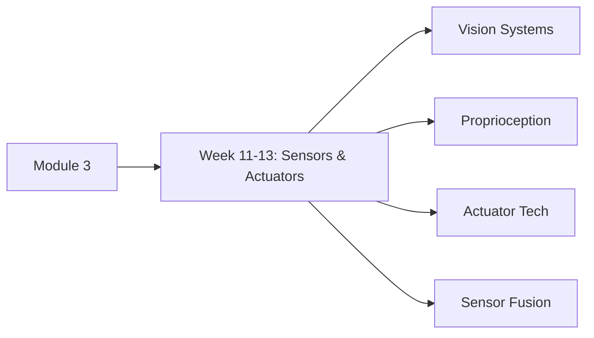

:::info ترجمہ زیر التواء
یہ صفحہ فی الحال انگریزی سے اردو میں ترجمہ کیا جا رہا ہے۔ مکمل مواد کے لیے براہ کرم انگریزی ورژن دیکھیں۔
:::


# Module 3: Sensors & Actuators

<DifficultyBadge level="intermediate" />

> **Summary**: Understand the hardware systems that enable robots to perceive their environment and interact physically with the world.

## 🎯 Module Overview

This module covers the sensor and actuator technologies essential for humanoid robotics:

- **Vision Systems**: Cameras, depth sensors, lidar for environmental perception
- **Proprioceptive Sensors**: Encoders, IMUs, force/torque sensors for self-awareness
- **Actuator Technologies**: Electric motors, hydraulics, pneumatics, and emerging technologies
- **Sensor Fusion**: Combining multiple sensor modalities for robust perception

### Learning Path



## 📅 Timeline

- **Weeks 11-13**: Sensors & Actuators Deep Dive (3 weeks)
- **Total Duration**: 3 weeks

## 🎓 Prerequisites

Before starting Module 3, you should have completed:
- [Module 1: Introduction to Physical AI](../module-1/) — Humanoid design principles
- [Module 2: Humanoid Fundamentals](../module-2/) — Kinematics and control basics

## 📚 Module Contents

### Week 11-13: Sensors & Actuators

**[3.1 — Sensors & Actuators Overview](./week-11-13/)**

Deep dive into hardware systems:
- RGB cameras, depth cameras (stereo, ToF, structured light)
- Lidar and radar for ranging
- IMUs, encoders, force/torque sensors
- Electric motors (brushless DC, servos)
- Hydraulic and pneumatic actuators
- Series elastic actuators (SEA)
- Sensor fusion algorithms (Kalman filter, complementary filter)

**Difficulty**: ⭐⭐ Intermediate  
**Time Commitment**: ~12-15 hours

## 🎯 Learning Objectives

By the end of Module 3, you will be able to:

1. **Select appropriate sensors** for different perception tasks
2. **Understand camera models** (pinhole, distortion, calibration)
3. **Process depth data** from stereo and ToF sensors
4. **Implement sensor fusion** for robust state estimation
5. **Compare actuator technologies** (electric, hydraulic, pneumatic)
6. **Design actuation systems** based on power, speed, and precision requirements
7. **Analyze force control** using force/torque sensors
8. **Optimize sensor placement** for maximum coverage

## 🛠️ Tools & Libraries

Throughout this module, we'll use:

- **OpenCV**: Computer vision and camera calibration
- **Open3D**: Point cloud processing
- **PyBullet**: Sensor simulation
- **NumPy/SciPy**: Signal processing and filtering
- **ROS (optional)**: Sensor integration framework

### Installation

```bash
pip install opencv-python open3d numpy scipy matplotlib
pip install pyrealsense2  # For Intel RealSense depth cameras (optional)
```

## 💡 Key Concepts Preview

### Sensor Categories

| Type | Examples | Purpose | Typical Data Rate |
|------|----------|---------|-------------------|
| **Vision** | RGB cameras, depth cameras | Object detection, navigation | 30-60 Hz |
| **Ranging** | Lidar, ultrasonic, radar | Distance measurement | 10-100 Hz |
| **Proprioceptive** | Encoders, IMU, force sensors | Self-state awareness | 100-1000 Hz |
| **Tactile** | Pressure sensors, skin sensors | Contact detection | 100-500 Hz |

### Actuator Comparison

| Type | Power Density | Speed | Precision | Cost | Maintenance |
|------|---------------|-------|-----------|------|-------------|
| **Electric** | Medium | Fast | Excellent | Low | Minimal |
| **Hydraulic** | Very High | Fast | Good | High | High |
| **Pneumatic** | High | Very Fast | Fair | Medium | Medium |
| **SEA** | Medium | Medium | Excellent | Medium | Minimal |

## ➡️ Getting Started

Ready to explore hardware? Start with:

**[Week 11-13: Sensors & Actuators →](./week-11-13/)**

Learn about the physical components that enable robots to sense and act.

---

## 📖 Further Reading

- **Textbooks**:
  - *Computer Vision: Algorithms and Applications* by Szeliski
  - *Robotics: Modelling, Planning and Control* (Chapters 2, 6)
- **Resources**:
  - OpenCV Tutorials
  - Intel RealSense Documentation
  - Boston Dynamics Actuator Papers

---

<ChatbotPlaceholder />
